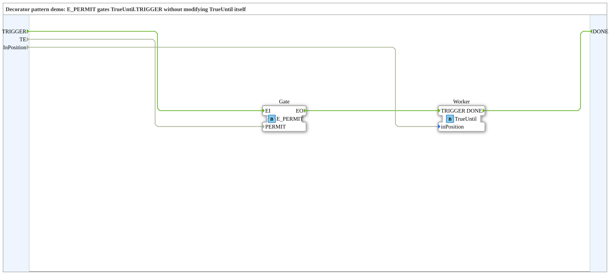

# Design Pattern: Decorator

* * * * * * * * * *

## Einleitung

Ein bestehender Baustein (hier: [`TrueUntil`](ChainOfActionsPattern.md))
soll manchmal übersprungen werden können ("führe diesen Schritt nur
aus, wenn Bedingung X gilt"), ohne den Baustein selbst zu verändern –
klassischer Decorator-Gedanke aus der objektorientierten Welt: Verhalten
per Umverdrahtung/Ummantelung hinzufügen statt die Originalklasse
anzufassen.

## Bezug zur Kursfolie

Folie 68 – *"Decorator"* (Kategorie: Structural, Problem:
"Conditional execution of FBs"). Die Folie zeigt zwei Varianten:
**intern** (`TrueUntil` bekommt selbst einen zweiten BOOL-Eingang `TE`,
verändert den Baustein) und **extern** (ein generischer Gate-Baustein
wird vor den unveränderten Baustein geschaltet). Umgesetzt wird hier
ausschließlich die externe Variante – der eigentliche
Decorator-Gedanke, passend zum bereits bestehenden, unveränderten
`TrueUntil.fbt`.

## Baustein: `E_PERMIT`

`E_PERMIT` ist ein **Standardbaustein** der 4diac-Standardbibliothek
(`iec61499::events::E_PERMIT`), kein eigener, neu entworfener Baustein:

- **Eventeingang:** `EI` (mit Qualifier `PERMIT`)
- **Eventausgang:** `EO`
- **BOOL-Eingang:** `PERMIT`

Ist `PERMIT` `FALSE`, wenn `EI` eintrifft, gibt es keine passende
Transition – das Event wird laut Standard-ECC-Semantik einfach
verworfen (kein `EO`, kein Zustandswechsel). `E_PERMIT` ist generisch
und wiederverwendbar über den Decorator hinaus – dasselbe Muster
verwendet auch das [Start/Stop-Pattern](StartStopPattern.md).

## Demo: `DecoratorDemo`

Ein `TrueUntil`-Baustein (unverändert wiederverwendet aus dem
[Chain-of-Actions-Pattern](ChainOfActionsPattern.md)), dessen `TRIGGER`
über `E_PERMIT` gegatet wird: `TRIGGER` → `E_PERMIT.EI`, `TE` (BOOL) →
`E_PERMIT.PERMIT`, `E_PERMIT.EO` → `TrueUntil.TRIGGER`. Ist `PERMIT`
`FALSE`, wird das Event verschluckt, `TrueUntil` bekommt gar keinen
`TRIGGER` und tut nichts. `TE` ist an der Subapp-Schnittstelle
exponiert, sodass sich das Gaten beim Testen manuell steuern lässt.

## Zusammenfassung

Der Decorator-Gedanke wird hier ohne einen einzigen neuen,
Anwendungsfall-spezifischen Baustein umgesetzt – der generische
`E_PERMIT` reicht aus, solange er unverändert vor dem zu gatenden
Baustein sitzt. Noch nicht in 4diac getestet.
