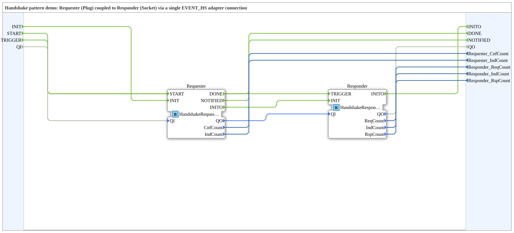

# Design Pattern: Handshake




* * * * * * * * * *

## Einleitung

Wenn zwei Function Blocks (oder Subapplications, oder Geräte) eine
Anfrage/Antwort-Beziehung haben – A fragt bei B etwas an, B bestätigt
oder meldet unaufgefordert etwas zurück, A quittiert das wiederum –
braucht man dafür im einfachsten Fall vier einzelne
Event-Verbindungen (`REQ`, `CNF`, `IND`, `RSP`). Bei mehreren solchen
Beziehungen zwischen vielen Bausteinen entsteht schnell eine
"Spaghetti connections"-Problematik. Die Lösung: Man bündelt die vier
Events (und optionale Nutzdaten) in einem **Adapter-Typ**. Die
Verbindung zwischen den beiden Kommunikationspartnern wird dann durch
eine einzige Adapterverbindung (Socket ↔ Plug) hergestellt statt durch
vier einzelne Event-Linien.

## Bezug zur Kursfolie

Folie 72 – *"The handshake pattern"* (Kategorie: Behavioural), Teil
einer Dreiergruppe mit Start/Stop- und Reset-Pattern, die zusammen an
einem Cylinder↔NextSystem-Beispiel gezeigt werden. Zusätzlich liefert
Folie 48 ("Implementation of Adapters") die generische
Adapter-Typ-Deklaration, auf der die datentragende Variante hier
basiert, und Folien 41–47 ("Message exchange between services") ein
ausführliches, mehrstufiges Anwendungsbeispiel desselben Vokabulars.

## Das REQ/CNF/IND/RSP-Vokabular

Klassisches Request/Indication/Response/Confirm-Servicemodell, das auch
IEC-61499-Service-Interface-Function-Blocks zugrunde liegt:

- **REQ** – Anfrage vom Requester an den Responder: *"Bitte tu X."*
- **CNF** – Bestätigung vom Responder zurück, synchron zur Anfrage.
- **IND** – unaufgeforderte Meldung vom Responder: *"Es ist etwas
  passiert."*
- **RSP** – Antwort des Requesters auf eine `IND`.

Adaptertyp `EVENT_HS` (Ablageort:
`.lib/adapter-3.0.0/typelib/types/bidirectional/Handshake/EVENT_HS.adp`),
minimale/kanonische Form ohne Nutzdaten:

```
EVENT_HS
  Eventeingänge:  CNF, IND
  Eventausgänge:  REQ, RSP
```

## Socket vs. Plug

Wie bei jedem IEC-61499-Adapter gilt (real gegen 4diac verifiziert):
**Plug** behält die deklarierte Richtung bei, **Socket** spiegelt sie.
Damit ist der **Requester der Plug** (`REQ`/`RSP` feuerbar, `CNF`/`IND`
abfragbar) und der **Responder der Socket** (`CNF`/`IND` feuerbar,
`REQ`/`RSP` abfragbar) – die übliche, natürlichere Leserichtung
(Requester links/initiierend, Responder rechts/antwortend).

**Wichtiger Stolperstein:** Die 4diac-XSD-/ECC-Validierung prüft bei
`HS.<Name>` nur, ob `<Name>` überhaupt am Adapter deklariert ist – nicht,
ob die Richtung an dieser Socket-/Plug-Seite Sinn ergibt. Ein Baustein
mit vertauschter Richtung kompiliert trotzdem fehlerfrei; die Logik
muss man selbst korrekt zusammenbauen.

## Bausteine: `HandshakeRequester` / `HandshakeResponder`

Zwei generische, vom Zylinder-Beispiel losgelöste Demo-Bausteine
(Basic FBs):

- **`HandshakeRequester`** – nutzt `EVENT_HS` als Plug. Sendet auf
  `START` ein `REQ`, meldet `DONE` bei `CNF`, reagiert auf `IND` mit
  `RSP` und meldet `NOTIFIED`.
- **`HandshakeResponder`** – nutzt `EVENT_HS` als Socket. Beantwortet
  ein eingehendes `REQ` mit `CNF`, sendet auf `TRIGGER` ein
  unaufgefordertes `IND`, nimmt die passende `RSP` entgegen.

**Wichtiger Stolperstein (INIT-Sequenz):** Die INIT-Behandlung darf
nicht als Entry-Action des Idle-Zustands eingebaut werden – sonst
feuert `INITO` (und ein Reset der Zähler) bei jedem Rücksprung in den
Idle-Zustand erneut. Richtig ist ein eigener `Init`-Zustand, nur über
eine mit dem Qualifier bewachte Transition erreichbar, danach eine
unbedingte Transition in einen separaten `Initialized`-Idle-Zustand.

## Demo: `HandshakePatternDemo`

Koppelt beide Bausteine über eine einzige `AdapterConnections`-
Verbindung (Requester=Plug als Source, Responder=Socket als
Destination), mit Init-Kette und an die Subapp-Schnittstelle
durchgereichten Test-Triggern/Zählern.

## Datentragende Variante: `EVENT_HS_WSTRING`

Entspricht 1:1 dem generischen "service"-Adapter der Folie
(EventInputs `REQ`/`RSP`, EventOutputs `CNF`/`IND`, dazu `REQD`/`RSPD`
als WSTRING-Eingänge und `CNFD`/`INDD` als WSTRING-Ausgänge). Passt zum
textbasierten Nachrichtenstil aus den Message-Sequence-Beispielen der
Folie (z. B. `"push,100"`). Bausteine `HandshakeRequesterWSTRING`/
`HandshakeResponderWSTRING` und Demo `HandshakePatternDemoWSTRING`
folgen demselben Init/Initialized/DeInit-Muster wie die Basisvariante.

## Reduzierte Varianten

Vier zusätzliche Adaptertypen reduzieren das volle Vier-Event-
Vokabular gezielt: **`EVENT_HS_UNI`** (nur `REQ`, kein echter
Handshake – reines Fire-and-Forget), **`EVENT_HS_UNI_WSTRING`** (wie
UNI, plus Payload), **`EVENT_HS_ACK`** (`REQ`/`CNF`, echter aber
einseitiger Handshake, kein `IND`/`RSP` nötig), **`EVENT_HS_ACK_WSTRING`**
(wie ACK, plus Payload). Alle folgen demselben Socket/Plug-Rollenschema.

## Erweitertes Beispiel: `MessageExchangeDemo`

Vollständige Umsetzung eines SoA-Beispiels (Folie 47) mit vier
zusammenspielenden Bausteinen: `WorkpieceSensor` (vereint Sensor- und
Orchestrator-Anstoß), `CylinderOrchestrator` (Socket zum Sensor, zwei
Plugs zu Zylinder-Service und Drop-Sink-Service – wartet auf die
Drop-Bestätigung, bevor der Zylinder einfahren darf), `CylinderService`
(simulierte Zylinderbewegung mit Start-/Endpositions-Events),
`DropSinkService` (bestätigt jede Anfrage unbedingt). Zeigt alle drei
Adapter-Reduktionsstufen der `EVENT_HS`-Familie im Zusammenspiel: volles
`EVENT_HS_WSTRING`, wo eine echte Zwischenmeldung nötig ist, reduziertes
`EVENT_HS_ACK_WSTRING`, wo nur Anfrage+Bestätigung gebraucht werden.

## Zusammenfassung

Der Handshake-Mechanismus (`EVENT_HS` und seine Varianten) ist
unabhängig von jedem konkreten Anwendungsfall generisch implementiert
und wird an anderer Stelle in dieser Sammlung wiederverwendet: das
[TokenRing-Beispiel](TokenRingPattern.md) zeigt in seiner zweiten
Fundstelle (SoA-Beispiel) denselben Service-Adapter neben einem
TokenRing-Adapter im selben Baustein. Noch nicht in 4diac getestet.
