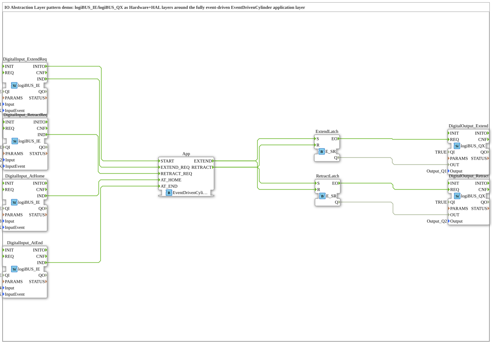

# Design Pattern: IO Abstraction Layer

* * * * * * * * * *

## Einleitung

Wenn Anwendungslogik direkt auf rohe Hardware-BOOL-Signale zugreift
(kontinuierlich gelesene digitale Ein-/Ausgänge), vermischen sich zwei
Zuständigkeiten: "wie wird ein Signal physisch gelesen/geschrieben" und
"was bedeutet ein Signalwechsel fachlich". Das erschwert
Wiederverwendung (dieselbe Anwendungslogik auf anderer Hardware) und
macht die Anwendungslogik unnötig BOOL-daten-lastig – genau das
Problem, das auch das
[Purely-Event-Driven-Pattern](PurelyEventDrivenPattern.md) löst.

## Bezug zur Kursfolie

Folie 63 – *"Input/Output (IO) abstraction layer"* (Kategorie:
Architectural). Zeigt eine 5-Schichten-Architektur: Hardware Layer
(Input) → Input HAL → Application Layer → Output HAL → Hardware Layer
(Output). Die Folie nennt dafür `SYMLINKMULTIVARDST`/
`SYMLINKMULTIVARSRC` – geprüft: weder ein Standard-4diac-Baustein noch
im Repo vorhanden, wahrscheinlich ein fortiss-Forschungsbaustein außerhalb
der Standard-Distribution.

## Umsetzung: repo-eigener Mechanismus statt der Folien-Bausteine

Statt einer unbestätigten Nachbildung von
`SYMLINKMULTIVARDST`/`SRC` nutzt dieses Repo für exakt dasselbe Problem
(rohes Hardware-BOOL ↔ Event) einen bereits vorhandenen, echten
Mechanismus:

- **Hardware Layer (Input) + Input HAL, kombiniert:** `logiBUS_IE`
  (liest einen digitalen Eingang und feuert dabei direkt ein Event –
  kein separater Flankendetektor nötig). Vier Instanzen für
  `EXTEND_REQ`, `RETRACT_REQ`, `AT_HOME`, `AT_END`.
- **Application Layer:** [`EventDrivenCylinder`](PurelyEventDrivenPattern.md)
  (unverändert wiederverwendet), komplett event-getrieben, kein
  BOOL-Datenpin.
- **Output HAL:** zwei `E_SR`-Latches, die je durch das jeweils andere
  Kommando-Event zurückgesetzt werden – wandeln ein Kommando-Event
  (`EXTEND`, `RETRACT`) in ein persistentes BOOL-Signal für den
  Aktuator um.
- **Hardware Layer (Output):** `logiBUS_QX`, schreibt einen digitalen
  Ausgang, per Event getriggert.

Eine der `logiBUS_IE`-Instanzen liefert über ihr eigenes,
beim Deployment automatisch feuerndes `INITO` den `START`-Trigger für
`EventDrivenCylinder`.

## Zusammenfassung

Damit sind alle acht in dieser Sammlung dokumentierten Muster
umgesetzt, keines bisher in 4diac gebaut/getestet.
`IOAbstractionDemo` zeigt, wie sich die Folien-Architektur (5 Schichten)
mit repo-eigenen, real funktionierenden Bausteinen (`logiBUS_IE`/`QX`,
`E_SR`) statt der nicht verfügbaren Folien-Bausteine umsetzen lässt,
ohne die eigentliche Anwendungslogik (`EventDrivenCylinder`) anzufassen.
