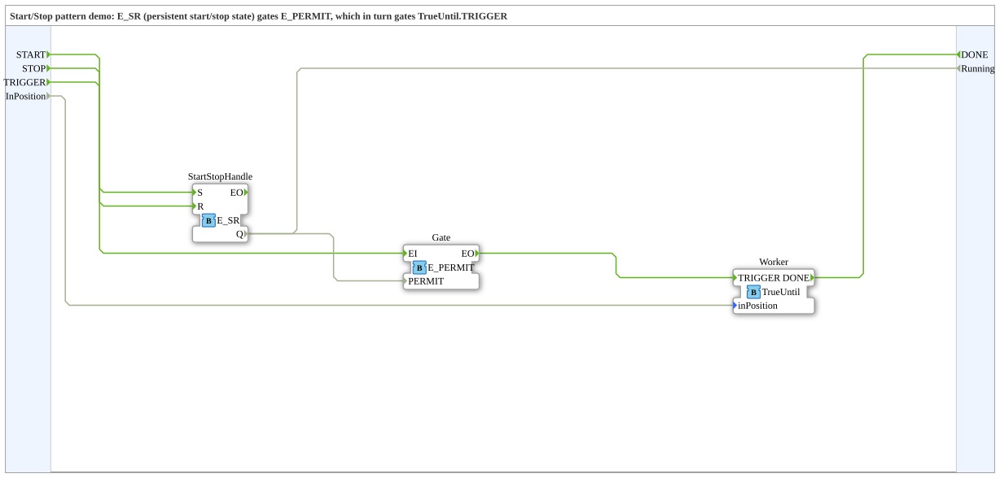

# Design Pattern: Start/Stop



* * * * * * * * * *

## Einleitung

Eine Anlage soll über ein separates HMI-Bedienfeld (Start-/Stopp-Taste)
insgesamt ein- und ausgeschaltet werden können, unabhängig davon, was
die eigentliche Steuerlogik gerade tut. Verdrahtet man diese
Start/Stop-Freigabe direkt in die Kernlogik hinein, vermischen sich
zwei Zuständigkeiten (Bedien-Zustand vs. fachliche Ablaufsteuerung), die
eigentlich unabhängig voneinander änderbar sein sollten.

## Bezug zur Kursfolie

Folie 70 – *"The Start/Stop pattern"* (Kategorie: Compositional /
Architectural, Problem: "Separate start-stop logic implied by HMI
console from the main control logic").

## Bausteine (beide Standard)

Der Start/Stop-Zustand wird als eigener, persistenter Zustand
(`E_SR`-Latch) modelliert und über ein Freigabe-Gate (`E_PERMIT`, siehe
[Decorator-Pattern](DecoratorPattern.md)) vor die eigentliche
Trigger-Logik geschaltet:

```
E_SR (iec61499::events::E_SR)
  Eventeingänge:  S (Set), R (Reset)
  Eventausgang:   EO
  BOOL-Ausgang:   Q

E_PERMIT (iec61499::events::E_PERMIT)
  Eventeingang:   EI (mit Qualifier PERMIT)
  Eventausgang:   EO
  BOOL-Eingang:   PERMIT
```

Verdrahtung: `START` → `E_SR.S`, `STOP` → `E_SR.R`; `E_SR.Q` →
`E_PERMIT.PERMIT` (das Gate ist offen, solange die Anlage gestartet
ist); das eigentliche Auslöse-Event läuft durch `E_PERMIT.EI` → `EO`
und erreicht die Steuerlogik nur, solange `Q=TRUE` ist – exakt derselbe
`E_PERMIT`-Mechanismus wie beim Decorator-Pattern, nur dass die
Freigabebedingung hier nicht eine beliebige externe Bedingung ist,
sondern speziell ein persistenter Start/Stop-Zustand.

## Demo: `StartStopDemo`

**Keine neuen Bausteine** – nur die beiden Standardbausteine oben.
`START`/`STOP` setzen/löschen ein `E_SR`; dessen `Q` gibt ein
`E_PERMIT` frei, das ein `TRIGGER`-Event zur (aus dem
[Chain-of-Actions-Pattern](ChainOfActionsPattern.md) wiederverwendeten,
unveränderten) `TrueUntil`-Instanz durchlässt – nur während die Anlage
"gestartet" ist, kommt der `TRIGGER` überhaupt an. Strukturell fast
identisch zur Decorator-Demo, nur mit `E_SR` als Quelle der
Freigabebedingung statt einer beliebigen externen `TE`-Variable.

## Zusammenfassung

Start/Stop trennt Bedienzustand von Fachlogik, indem es genau denselben
`E_PERMIT`-Gate-Mechanismus wie der Decorator nutzt – nur mit einem
persistenten `E_SR`-Zustand statt einer beliebigen Bedingung als
Freigabe-Quelle. Das [Reset-Pattern](ResetPattern.md) baut direkt auf
diesem Aufbau auf und ergänzt ihn um einen ungegateten Reset-Pfad.
Noch nicht in 4diac getestet.
