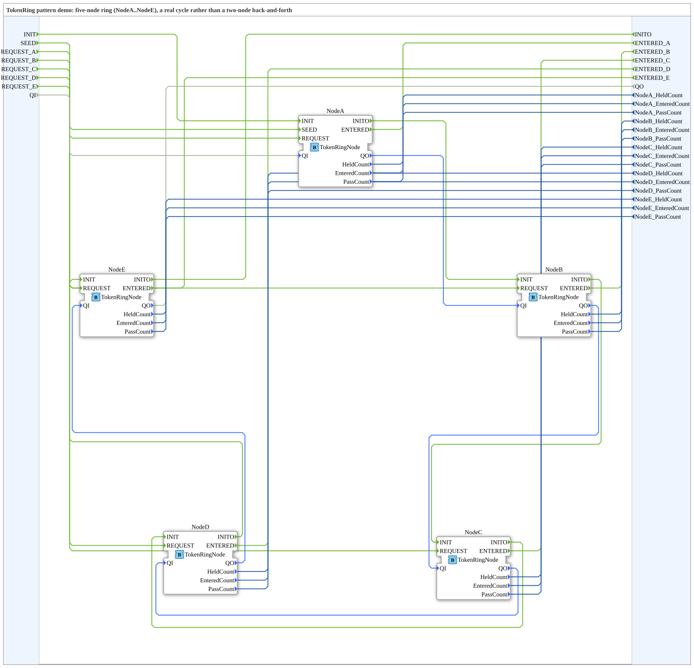

# Design Pattern: TokenRing / Mutual Exclusion




* * * * * * * * * *

## Einleitung

Zwei (oder mehr) Controller teilen sich eine physische Ressource, auf
die immer nur einer zugreifen darf. Statt die Interlocking-Logik hart
zwischen den Controllern zu verdrahten, wird ein
**Token-Ring-Protokoll** verwendet: Ein "Token" (eine Berechtigungsmarke)
zirkuliert reihum zwischen den Controllern; nur wer gerade das Token
hält, darf die geteilte Ressource benutzen; ist er fertig, reicht er
das Token an den nächsten Controller im Ring weiter. Wie beim
[Handshake-Pattern](HandshakePattern.md) wird dieser Mechanismus als
eigener, wiederverwendbarer **Adapter-Typ** gekapselt.

## Bezug zur Quelle

Anders als die anderen Muster dieser Sammlung taucht TokenRing
**nicht** in der offiziellen Pattern-Taxonomie (Folie 62/69) auf,
sondern nur als Beispiel auf Folie 15 im Kapitel "Modelling PLC
systems", zusätzlich bestätigt durch zwei unabhängige Fachpaper: W.
Dai, V. Vyatkin, J. H. Christensen, V. Dubinin, *"Function Block
Implementation of Service Oriented Architecture: Case Study,"* IEEE
INDIN 2014, sowie R. Sinha, V. Vyatkin, Z. Salcic, H. J. Park,
*"Competitors or Cousins? Studying the Parallels between Distributed
Programming Languages SystemJ and IEC61499"*. Beide beschreiben
dasselbe Zwei-Zylinder-Beispiel (`CylH`/`CylV`), das sich eine
gemeinsame Achse teilt.

## GIVE/RCV-Semantik

Aus dem INDIN14-Paper direkt bestätigt: *"an adapter **input** MTXIN
and **output** MTXOUT are reserved"* – `MTXIN` = Input-Adapter =
Socket, `MTXOUT` = Output-Adapter = Plug (deckt sich mit dem am
Handshake-Pattern real gegen 4diac verifizierten Socket/Plug-Verhalten).

```
TokenRing
  Eventeingänge:  RCV   – Bestätigung vom Empfänger, Token angekommen
  Eventausgänge:  GIVE  – Token an den Nachbarn weiterreichen
```

- **Plug** (`MTXOUT`, "Geber"): feuert `GIVE`, reagiert auf `RCV`.
- **Socket** (`MTXIN`, "Empfänger"): reagiert auf `GIVE`, feuert `RCV`.

Jeder Controller hat also **zwei** Adapterinstanzen: `MTXOUT` (Richtung
zum nächsten Controller) und `MTXIN` (Richtung vom vorherigen
Controller).

## Wo wird das Token tatsächlich übergeben?

Es werden gar keine Daten übergeben – **das Token IST das Event**.
`TokenRing.adp` ist bewusst datenlos (kein `VarDeclaration`, keine
Nutzlast). Die Semantik ist: das Feuern von `GIVE` selbst ist die
Übergabe. Wer gerade zwischen den ECC-Zuständen `HANDLE_GIVE` und
`PASS_ON` steht, "hat" das Token – nicht weil eine Variable das sagt,
sondern weil der Baustein gerade in dieser Phase seiner
Zustandsmaschine steckt. Analog zu echten Token-Ring-Netzwerken, wo das
Token auch nur ein bestimmtes Bitmuster ist. Schwachstelle: Es gibt
keine Möglichkeit, ein dupliziertes oder verlorenes Token zu erkennen
(anders als bei der datentragenden Handshake-Variante).

## Baustein: `TokenRingNode`

Ein Controller im Ring, mit `MTXIN` (Socket) und `MTXOUT` (Plug),
Init/Initialized/DeInit-Muster wie bei den Handshake-Bausteinen,
`REQUEST`-Event zum Anfordern des kritischen Abschnitts und
`SEED`-Event zum einmaligen Bootstrappen des Rings. Implementiert das
Verzweigungsverhalten aus den Quellenpapieren: Der Token-Halter
arbeitet (falls eine Anfrage wartet) und reicht das Token danach
weiter – oder reicht es sofort weiter, falls keine Anfrage wartet.

## Demo: `TokenRingPatternDemo`

5-Knoten-Ring (`NodeA`…`NodeE`, `NodeE.MTXOUT` schließt zurück auf
`NodeA.MTXIN`) – bewusst mehr als 2 Knoten, damit es ein echter Ring
ist und nicht nur ein Zwei-Knoten-Hin-und-Her wie im Papier-Beispiel.

## Zweite Fundstelle

`TokenRing` taucht auch in Vyatkins SoA-Beispiel (Folie 47, siehe
[Handshake-Pattern](HandshakePattern.md)) auf: Dort dient der Adapter
nicht dem gegenseitigen Ausschluss zweier gleichberechtigter
Controller, sondern dem reihum-Ansprechen mehrerer nachgeschalteter
Service-Teilnehmer – derselbe Adaptertyp, eine zweite, andersartige
Anwendung.

## Zusammenfassung

TokenRing kapselt ein klassisches Mutual-Exclusion-Protokoll komplett
event-basiert, ohne jede Nutzlast – der Kontrollfluss selbst trägt den
Zustand. Noch nicht in 4diac getestet.
