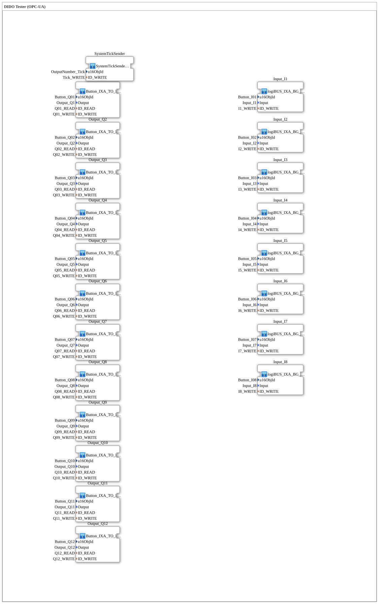

# InputOutputTesterButton_DIDO_OPC_UA: DIDO Tester (OPC-UA)

* * * * * * * * * *

## Einleitung

`InputOutputTesterButton_DIDO_OPC_UA` ist das grundlegende Trainingsbeispiel für **8 digitale Eingänge und 12 digitale Ausgänge**, steuerbar sowohl über den ISOBUS-Virtual-Terminal als auch über OPC-UA (Web-Client). Es ist das rein digitale Gegenstück zum späteren PWM-Beispiel [`InputOutputTesterButton_PWM_OPC_UA`](../Button_PWM_OPC_UA/InputOutputTesterButton_PWM_OPC_UA.md) — dessen 8 Eingänge unverändert aus diesem DIDO-Beispiel übernommen wurden, während die 12 rein digitalen Ausgänge dort durch 12 PWM-Kanäle ersetzt sind.

Die Übung ist ein reines Top-Level-Composite: Sie instanziiert 8 Eingangs-Bausteine, 12 Ausgangs-Bausteine und einen `SystemTickSender`, ohne selbst Logik zu enthalten — die eigentliche Verdrahtung (VT-Anzeige, OPC-UA-Publish/Subscribe, Rückkopplungs-Entkopplung) steckt vollständig in den wiederverwendbaren Sub-Bausteinen.

## Verwendete Funktionsbausteine (FBs)

| SubApp-Instanz | Typ | Zweck |
|---|---|---|
| `Input_I1` … `Input_I8` | `MyLib::sys::logiBUS_IXA_BG_OPC` | Digitaler Eingang mit VT-Statusanzeige (Grün/Weiß) und OPC-UA-Publish |
| `Output_Q1` … `Output_Q12` | `MyLib::sys::Button_IXA_TO_logiBUS_QXA_BG_OPC` | Digitaler Ausgang, bidirektional über VT-Taster UND OPC-UA schaltbar |
| `SystemTickSender` | `MyLib::sys::SystemTickSender` | Zyklischer Zähler für die VT-Statusanzeige (`OutputNumber_Tick`) |

### Sub-Baustein: [logiBUS_IXA_BG_OPC](../../../../../Bibliotheken/ExternalLibraries/MyLib_AX/sys/logiBUS_IXA_BG_OPC.md) (Eingänge)

- **Typ**: SubAppType (`MyLib::sys`)
- **Funktionsweise**: Liest einen physischen digitalen Eingang (`logiBUS_IXA`) und verzweigt das Adapter-Signal über `AX_SPLIT_2` in zwei Richtungen: an `GreenWhiteBackground1_AX` (VT-Hintergrundfarbe Grün/Weiß je nach Zustand) und an `AX_PUBLISH_1` (OPC-UA-Publish an den Web-Client). Reiner Einweg-Datenfluss physisch → VT/Web, keine Rückschreibmöglichkeit vom Web aus (Eingänge sind nicht extern schaltbar).

### Sub-Baustein: [Button_IXA_TO_logiBUS_QXA_BG_OPC](../../../../../Bibliotheken/ExternalLibraries/MyLib_AX/sys/Button_IXA_TO_logiBUS_QXA_BG_OPC.md) (Ausgänge)

- **Typ**: SubAppType (`MyLib::sys`)
- **Funktionsweise**: Anders als bei den Eingängen kann ein Ausgang **von zwei Seiten** geschaltet werden — per VT-Taster (`Button_IXA`) oder per OPC-UA-Schreibzugriff (`AX_SUBSCRIBE_1`). Beide Quellen laufen über je einen `AX_RF_TRIG` (Flankenerkennung) auf ein gemeinsames `AX_SR`-Flipflop (Set/Reset), dessen Ausgang über `AX_SPLIT_3` dreifach verteilt wird: an den physischen Ausgang (`logiBUS_QXA`), an die VT-Statusfarbe (`GreenWhiteBackground1_AX`) und zurück an `AX_PUBLISH_1` (OPC-UA-Echo, damit der Web-Client den tatsächlichen Zustand sieht).
- **Bekannte Falle bei der OPC-UA-Rückkopplung**: Da `AX_PUBLISH_1` und `AX_SUBSCRIBE_1` denselben OPC-UA-Knoten bedienen, würde eine naive Verdrahtung einen Event-Storm erzeugen (jede eigene Veröffentlichung löst beim eigenen Subscribe erneut eine Indikation aus). Das `AX_SR`-Flipflop entkoppelt diese Rückkopplung, indem es nur echte Zustandswechsel (Set/Reset statt direkter Durchleitung) weiterreicht. Details siehe `NOTIZ_RSP_und_EventStorm.md` im Quell-Repository — dort auch der Befund, dass `SUBSCRIBE_1`s `RSP`-Event-Eingang aus FORTE-Quellcode-Sicht ein kompletter No-Op ist (nur aus der gemeinsamen `CCommFB`-Basisklasse geerbt, aber für den Service-Typ *Subscriber* nie wirksam).

## OPC-UA-Adressraum

Im Gegensatz zum späteren, verschachtelten PWM-Adressraum verwendet DIDO flache, nach Signalart getrennte Knoten:

| Node-Pfad | Node-ID | Bedeutung |
|---|---|---|
| `/Objects/DigitalInput/In` | `s=In` | Eingang n (n=1–8), nur Publish (Read-only für den Client) |
| `/Objects/DigitalOutput/Qnn` | `s=Qnn` | Ausgang nn (nn=01–12), Read (Subscribe) + Write (Publish/Echo) |

## Programmablauf und Verbindungen

Die Übung selbst enthält **keine Verbindungen** (`SubAppNetwork` besteht nur aus SubApp-Instanzen mit Parametern) — analog zum PWM-Beispiel ist die gesamte Logik in die Sub-Bausteine ausgelagert:

1. **8 Eingänge**: `Input_I1`…`Input_I8` lesen `Input_I1`…`Input_I8` und spiegeln sie per VT-Statusfarbe und OPC-UA-Publish (`I1_WRITE`…`I8_WRITE`).
2. **12 Ausgänge**: `Output_Q1`…`Output_Q12` verbinden je einen physischen Ausgang (`Output_Q1`…`Output_Q12`) mit VT-Taster, VT-Statusfarbe und bidirektionalem OPC-UA-Zugriff (`Q01_READ`…`Q12_READ` zum Schreiben vom Web, `Q01_WRITE`…`Q12_WRITE` als Echo).
3. **Zeitgeber**: `SystemTickSender` zählt zyklisch hoch und speist das VT-Zahlenfeld `OutputNumber_Tick` sowie den OPC-UA-Knoten `Tick_WRITE`.

**Registrierung im Trainingssystem**: Wie bei allen Übungen in diesem System kein eigenes `Application`-Element nötig — Auswahl per "Change Type" im 4diac IDE auf den einen `Control`-Slot des `System`.

## Lernziele

- Grundmuster für digitale Ein-/Ausgänge mit VT- **und** OPC-UA-Anbindung, bevor analoge Kanäle (PWM) hinzukommen.
- Unterschied zwischen reinem Publish (Eingänge, nur eine Datenquelle) und bidirektionalem Subscribe/Publish (Ausgänge, zwei konkurrierende Schreibquellen: VT-Taster und Web).
- Vermeidung von OPC-UA-Feedback-Loops bei gleichzeitigem Publish und Subscribe desselben Knotens — ein Muster, das in jedem bidirektional angebundenen Baustein dieses Trainingssystems wiederkehrt (vgl. `RampLimitFS_TO_logiBUS_QDA_PWM_OPC` im PWM-Beispiel, das dieselbe Herausforderung für den Kanal-Schalter löst).

**Schwierigkeitsgrad**: Einsteiger bis Mittel
**Vorkenntnisse**: Grundlagen der logiBUS-Digital-I/O-Bausteine (`logiBUS_IXA`, `logiBUS_QXA`), OPC-UA-Adapter (`AX_SUBSCRIBE_1`/`AX_PUBLISH_1`).

## Zusammenfassung

`InputOutputTesterButton_DIDO_OPC_UA` demonstriert das Grundmuster für digitale I/O mit paralleler VT- und OPC-UA-Bedienung: Eingänge als reiner Publish-Pfad, Ausgänge als bidirektionaler Subscribe/Publish-Pfad mit sauberer Entkopplung der Rückkopplungsschleife über ein Set/Reset-Flipflop. Dieses Muster — insbesondere die Feedback-Loop-Vermeidung — ist die Vorlage für alle späteren, komplexeren Trainingsbeispiele dieses Systems (DIDO → PWM → AI).

---

### 🌐 Passende Themen-Unterseiten auf ms-muc-docs.de

- [🌐 Eclipse 4diac IDE & Farb-Referenz auf ms-muc-docs.de](https://www.ms-muc-docs.de/iec-61499/eclipse-4diac/)
