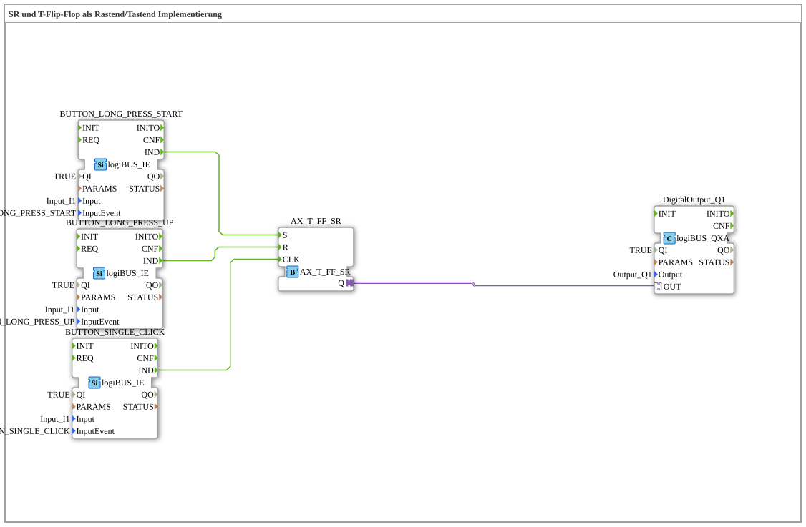

# Uebung_006a5_AX: SR und T-Flip-Flop als Rastend/Tastend-Implementierung

* * * * * * * * * *
## Einleitung

Die Übung `Uebung_006a5_AX` zeigt, wie sich mit **einem einzigen physischen Taster** (`Input_I1`) sowohl ein **rastendes** (schaltendes) als auch ein **tastendes** (umschaltendes) Bedienverhalten realisieren lässt. Anders als `Uebung_006a_AX`, die für Set, Reset und Toggle drei getrennte Taster (`I1`, `I2`, `I3`) benötigt, wertet diese Übung an einem einzigen Eingang unterschiedliche Tasten-Gesten aus – langes Drücken, Loslassen nach langem Drücken und kurzer Klick – und speist diese in den Baustein `AX_T_FF_SR` ein.

Damit lässt sich mit einem einzigen Taster ein Ausgang:

* **fest einschalten** (Halten/lange drücken → *rastend* wie ein Schalter),
* **fest ausschalten** (Loslassen nach langem Drücken),
* **umschalten** (kurzer Klick → *tastend* wie ein klassischer Taster).

## Verwendete Funktionsbausteine (FBs)

| FB-Name | Typ | Parameter |
|---------|-----|-----------|
| `BUTTON_LONG_PRESS_START` | `logiBUS::io::DI::logiBUS_IE` | Input = `Input_I1`, InputEvent = `BUTTON_LONG_PRESS_START` |
| `BUTTON_LONG_PRESS_UP` | `logiBUS::io::DI::logiBUS_IE` | Input = `Input_I1`, InputEvent = `BUTTON_LONG_PRESS_UP` |
| `BUTTON_SINGLE_CLICK` | `logiBUS::io::DI::logiBUS_IE` | Input = `Input_I1`, InputEvent = `BUTTON_SINGLE_CLICK` |
| `AX_T_FF_SR` | `adapter::events::unidirectional::AX_T_FF_SR` | (keine Parameter) |
| `DigitalOutput_Q1` | `logiBUS::io::DQ::logiBUS_QXA` | Output = `Output_Q1` |

- **`logiBUS_IE`**: Event-Eingangsbaustein, der aus dem rohen Tastersignal von `Input_I1` erkannte Tastengesten (z. B. Klick, Doppelklick, langer Druck) als Events ausgibt. Über den Parameter `InputEvent` wird festgelegt, auf welche konkrete Geste der jeweilige FB reagiert. Der Ausgang `IND` feuert, sobald die konfigurierte Geste erkannt wurde. Alle drei FBs in dieser Übung hören auf **denselben** physischen Eingang `Input_I1`, filtern aber jeweils eine andere Geste heraus.
- **`AX_T_FF_SR`**: Vereint Set (`S`), Reset (`R`) und Toggle (`CLK`) in einem einzigen Baustein mit Adapter-Ausgang `Q`. `S` setzt den Ausgang fest auf `TRUE`, `R` setzt ihn fest auf `FALSE`, `CLK` toggelt den aktuellen Zustand.
- **`logiBUS_QXA`**: Digitaler Ausgang, der das Adapter-Signal `Q` an den physischen Ausgang `Output_Q1` weiterleitet.

Zusätzlich enthält das Netzwerk einen reinen Kommentar-Block ("Universal Eingang: so können wir mit einem Taster ODER einem Schalter arbeiten.") als Hinweis, dass dieselbe Verschaltung sowohl mit einem tastenden Taster als auch mit einem rastenden Schalter am physischen Eingang funktioniert.

## Programmablauf und Verbindungen

1. **Gestenerkennung**: Die drei `logiBUS_IE`-Bausteine lesen alle denselben Eingang `Input_I1`, erkennen aber jeweils eine eigene Geste:
   - `BUTTON_LONG_PRESS_START` → feuert, sobald der Taster lange genug gehalten wurde (Beginn des Langdrucks).
   - `BUTTON_LONG_PRESS_UP` → feuert, wenn der Taster nach einem langen Druck losgelassen wird.
   - `BUTTON_SINGLE_CLICK` → feuert bei einem kurzen, einzelnen Klick.
2. **Verschaltung mit dem Flip-Flop** (`EventConnections`):
   - `BUTTON_LONG_PRESS_START.IND` → `AX_T_FF_SR.S` (Langer Druck **beginnt** → Ausgang wird gesetzt)
   - `BUTTON_LONG_PRESS_UP.IND` → `AX_T_FF_SR.R` (Loslassen nach langem Druck → Ausgang wird zurückgesetzt)
   - `BUTTON_SINGLE_CLICK.IND` → `AX_T_FF_SR.CLK` (Kurzer Klick → Ausgang wird umgeschaltet)
3. **Ausgabe** (`AdapterConnections`): `AX_T_FF_SR.Q` → `DigitalOutput_Q1.OUT` → physischer Ausgang `Output_Q1`.

## Funktionsweise des AX_T_FF_SR

Der Baustein `AX_T_FF_SR` besitzt intern die Zustände `START`, `SET` und `RESET`:

- Im Zustand `SET` ist `Q = TRUE`, im Zustand `RESET` ist `Q = FALSE`.
- Ein `S`-Event schaltet immer in den Zustand `SET` (`Q := TRUE`).
- Ein `R`-Event schaltet immer in den Zustand `RESET` (`Q := FALSE`).
- Ein `CLK`-Event **toggelt** zwischen `SET` und `RESET` (aus `SET` wird `RESET` und umgekehrt).

Übertragen auf die Bedienung mit **einem** Taster ergibt das:

- **Halten (lange drücken)** → `S` → Ausgang geht sicher auf `TRUE` (funktioniert wie ein *rastender* Schalter, der "Ein" einrastet).
- **Loslassen nach langem Halten** → `R` → Ausgang geht sicher auf `FALSE`.
- **Kurz klicken** → `CLK` → Ausgang wechselt seinen Zustand (funktioniert wie ein klassischer *tastender* Umschalter).

Damit lassen sich mit ein und demselben Taster sowohl ein eindeutiges "Ein"/"Aus" (über langen Druck) als auch ein bequemes Umschalten (über kurzen Klick) erreichen, ohne dass dafür mehrere Taster nötig sind.

## Anwendungsbeispiel

**Smart-Home-Lichtsteuerung mit nur einem Taster:**

- Kurzer Klick an der Wand: Licht ein-/ausschalten (Toggle über `CLK`).
- Taster lange gedrückt halten: Licht garantiert einschalten, unabhängig vom vorherigen Zustand (`S`) – z. B. für Besucher, die den aktuellen Zustand nicht kennen.
- Loslassen nach langem Halten: Licht garantiert ausschalten (`R`) – z. B. beim Verlassen des Raums.

## Lernziele

- Verständnis, wie unterschiedliche Tastengesten (`BUTTON_LONG_PRESS_START`, `BUTTON_LONG_PRESS_UP`, `BUTTON_SINGLE_CLICK`) aus **einem** physischen Eingang mehrere logische Events erzeugen.
- Verständnis des kombinierten Set/Reset/Toggle-Verhaltens von `AX_T_FF_SR`.
- Erkennen des Vorteils gegenüber `Uebung_006a_AX`: identisches Set/Reset/Toggle-Verhalten, aber mit nur einem statt drei physischen Tastern.
- Unterscheidung zwischen *rastendem* (haltendem) und *tastendem* (impulsartigem) Bedienverhalten an ein und demselben Taster.

**Schwierigkeitsgrad**: Mittel
**Vorkenntnisse**: `Uebung_006a_AX` (SR/T-Flip-Flop mit drei Tastern), Grundlagen der logiBUS-Tastenereignisse (`logiBUS_IE`).

## Zusammenfassung

Die Übung `Uebung_006a5_AX` zeigt, wie der Alles-Könner-Baustein `AX_T_FF_SR` mit einem einzigen Taster bedient werden kann, indem drei `logiBUS_IE`-Bausteine dieselbe physische Eingangsquelle `Input_I1` auf unterschiedliche Gesten hin auswerten. Langer Druck setzt und dessen Loslassen setzt zurück, ein kurzer Klick toggelt – damit vereint ein Taster rastendes und tastendes Verhalten in einem Bauteil.

---

### 🌐 Passende Themen-Unterseiten auf ms-muc-docs.de

* [🌐 Eclipse 4diac IDE & Farb-Referenz auf ms-muc-docs.de](https://www.ms-muc-docs.de/iec-61499/eclipse-4diac/)
