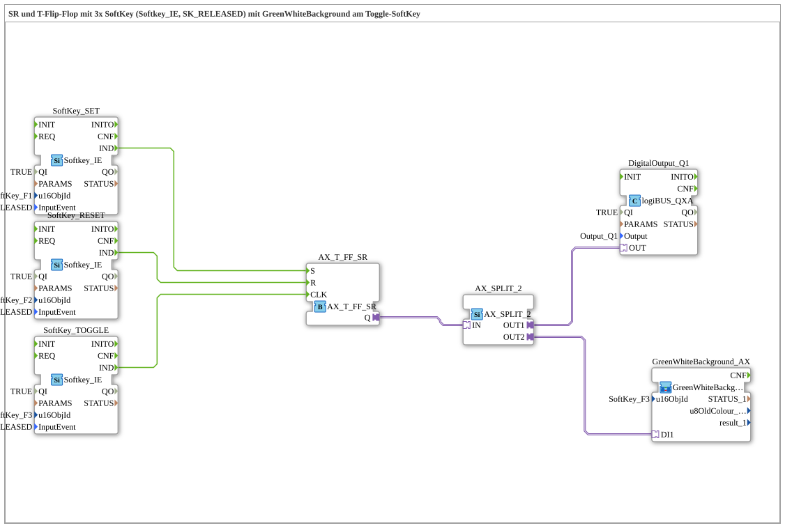

# Uebung_010e_AX: SR+Toggle-Flipflop mit 3x SoftKey und GreenWhiteBackground

Dieser Artikel beschreibt die logiBUS®-Übung `Uebung_010e_AX`.

----

## Ziel der Übung

Ein Ausgang soll über drei getrennte SoftKeys gesteuert werden können: gezielt Setzen, gezielt Rücksetzen, oder Umschalten (Toggle).

-----

## Beschreibung und Komponenten

Die Subapplikation `Uebung_010e_AX.SUB` erweitert das reine Toggle-Flipflop aus `Uebung_010d_AX` um ein kombiniertes SR+Toggle-Flipflop mit drei SoftKeys.

### Funktionsbausteine (FBs)

  - **`SoftKey_SET`**: `isobus::UT::io::Softkey::Softkey_IE` auf `SoftKey_F1`, Ereignis `SK_RELEASED`.
  - **`SoftKey_RESET`**: dasselbe auf `SoftKey_F2`.
  - **`SoftKey_TOGGLE`**: dasselbe auf `SoftKey_F3`.
  - **`AX_T_FF_SR`**: SR+Toggle-Flipflop-Adapter mit den Eingängen `S` (Set), `R` (Reset) und `CLK` (Toggle).
  - **`AX_SPLIT_2`**: Verteilt das Adaptersignal von `AX_T_FF_SR.Q` sowohl an den Ausgang `Q1` als auch an den Feedback-Baustein.
  - **`DigitalOutput_Q1`**: Ausgabe (Lampe), `Output_Q1`.
  - **`GreenWhiteBackground_AX`**: SubApp aus `MyLib::sys`, an `SoftKey_F3` (den Toggle-SoftKey) gebunden — nur dieser zeigt die aktuelle Hintergrundfarbe.

-----

## Funktionsweise

1.  `SoftKey_SET.IND` → `AX_T_FF_SR.S`: setzt den Zustand `Q` fest auf AN, unabhängig vom vorherigen Zustand.
2.  `SoftKey_RESET.IND` → `AX_T_FF_SR.R`: setzt den Zustand `Q` fest auf AUS.
3.  `SoftKey_TOGGLE.IND` → `AX_T_FF_SR.CLK`: kehrt den aktuellen Zustand `Q` um.
4.  `AX_SPLIT_2` verteilt den neuen Zustand an `DigitalOutput_Q1` (physischer Ausgang) und `GreenWhiteBackground_AX` (Hintergrundfarbe des Toggle-SoftKeys `F3`).

Set und Reset wirken also unabhängig vom aktuellen Zustand, während Toggle ihn umkehrt — alle drei SoftKeys steuern denselben internen Flipflop-Zustand.
