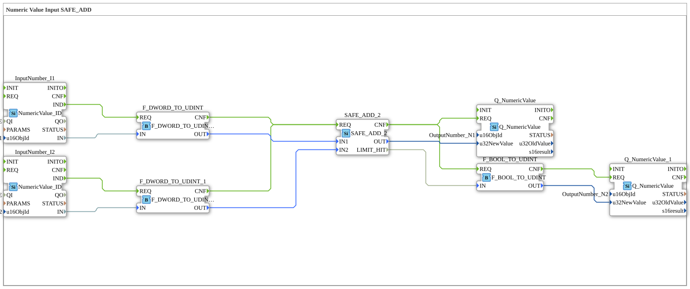

# Übung_011b4: Numeric Value Input SAFE_ADD

* * * * * * * * * *
## Einleitung

Übung **Uebung_011b4** führt eine Addition zweier über das ISOBUS-Netzwerk eingelesener
numerischer Werte durch, unter Verwendung von
[SAFE_ADD_2](../../../Bibliotheken/ExternalLibraries/SafeArithmetic/arithmetic/SAFE_ADD_2.md)
statt des normalen `ADD_2`/`F_ADD`. Anders als die vorherigen Übungen dieser Reihe zeigt sie
einen zweiten Ausgang: `SAFE_ADD_2.LIMIT_HIT` wird nach `UDINT` konvertiert und auf
`OutputNumber_N2` geschrieben, sodass ein Overflow direkt auf dem ISOBUS-Netzwerk sichtbar wird
als `1` (geklemmt) oder `0` (normal) — nicht nur still in einer übergelaufenen Summe auf
`OutputNumber_N1` verborgen.

## Verwendete Funktionsbausteine (FBs)

- **InputNumber_I1** / **InputNumber_I2** (Typ: `isobus::UT::io::NumericValue::NumericValue_ID`)
  - Lesen die aktuellen numerischen Werte der ISOBUS-Objekte "InputNumber_I1"/"InputNumber_I2".
- **F_DWORD_TO_UDINT** / **F_DWORD_TO_UDINT_1** (Typ: `iec61131::conversion::F_DWORD_TO_UDINT`)
  - Konvertieren die eingehenden DWORD-Werte nach UDINT.
- **SAFE_ADD_2** (Typ: `SafeArithmetic::arithmetic::SAFE_ADD_2`)
  - Daten-Eingänge: `IN1`, `IN2` (beide UDINT). Daten-Ausgänge: `OUT` (UDINT, geklemmte Summe),
    `LIMIT_HIT` (BOOL, TRUE wenn die Addition übergelaufen ist).
- **Q_NumericValue** (Typ: `isobus::UT::Q::Q_NumericValue`, `u16ObjId` = `OutputNumber_N1`)
  - Schreibt `SAFE_ADD_2.OUT` zurück auf das ISOBUS-Netzwerk.
- **F_BOOL_TO_UDINT** (Typ: `iec61131::conversion::F_BOOL_TO_UDINT`)
  - Konvertiert `SAFE_ADD_2.LIMIT_HIT` (BOOL) nach `UDINT` (`1`/`0`).
- **Q_NumericValue_1** (Typ: `isobus::UT::Q::Q_NumericValue`, `u16ObjId` = `OutputNumber_N2`)
  - Schreibt das konvertierte `LIMIT_HIT` zurück auf das ISOBUS-Netzwerk.

## Programmablauf und Verbindungen

1. **Ereignissteuerung**: `InputNumber_I1.IND`/`InputNumber_I2.IND` lösen das `REQ` ihrer
   Konverter aus. Beide `CNF`-Ausgänge lösen `SAFE_ADD_2.REQ` aus. `SAFE_ADD_2.CNF` löst sowohl
   `Q_NumericValue.REQ` (die Summe) als auch `F_BOOL_TO_UDINT.REQ` (das Grenzwert-Flag) aus, und
   `F_BOOL_TO_UDINT.CNF` löst `Q_NumericValue_1.REQ` aus.
2. **Datenfluss**: die konvertierten `IN1`/`IN2` (UDINT) gehen an `SAFE_ADD_2.IN1`/`IN2`.
   `SAFE_ADD_2.OUT` geht an `Q_NumericValue.u32NewValue`. `SAFE_ADD_2.LIMIT_HIT` geht an
   `F_BOOL_TO_UDINT.IN`, dessen `OUT` an `Q_NumericValue_1.u32NewValue` geht.

## Erwartetes Verhalten

- Normalfall (z.B. `InputNumber_I1 = 100`, `InputNumber_I2 = 200`): `OutputNumber_N1 = 300`,
  `OutputNumber_N2 = 0`.
- Overflow-Fall (z.B. `InputNumber_I1 = UDINT#4294967290`, `InputNumber_I2 = 100`): die wahre
  Summe überschreitet den `UDINT`-Bereich, daher `OutputNumber_N1 = UDINT#4294967295` (auf max
  geklemmt) und `OutputNumber_N2 = 1` — der Overflow ist jetzt sichtbar, statt still auf eine
  kleine, plausibel aussehende (aber falsche) Zahl überzulaufen.

## Zusammenfassung

Diese Übung zeigt `SAFE_ADD_2` als Drop-in-Ersatz für `ADD_2`/`F_ADD`, der aus einem stillen,
schwer bemerkbaren Wraparound ein explizites, beobachtbares `LIMIT_HIT`-Signal macht.
