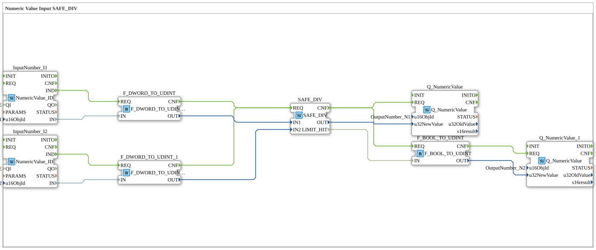

# Übung_011b7: Numeric Value Input SAFE_DIV



* * * * * * * * * *
## Einleitung

Übung **Uebung_011b7** führt eine Division zweier über das ISOBUS-Netzwerk eingelesener
numerischer Werte durch, unter Verwendung von
[SAFE_DIV](https://docs.ms-muc-docs.de/projects/4diac-library-reference-docs/en/latest/ExternalLibraries/SafeArithmetic/arithmetic/SAFE_DIV/). Es
gibt in dieser Reihe keine normale, nicht-sichere `F_DIV`-Vorgänger-Übung — Integer-Division
durch Null ist in reinem C++ undefiniertes Verhalten und würde ein natives `F_DIV` zum Absturz
bringen, daher existiert diese Übung ausschließlich, um das Division-durch-Null-Verhalten von
`SAFE_DIV` direkt zu zeigen. `SAFE_DIV.LIMIT_HIT` wird nach `UDINT` konvertiert und auf
`OutputNumber_N2` geschrieben.

## Verwendete Funktionsbausteine (FBs)

- **InputNumber_I1** / **InputNumber_I2** (Typ: `isobus::UT::io::NumericValue::NumericValue_ID`)
  - Lesen die aktuellen numerischen Werte der ISOBUS-Objekte "InputNumber_I1"/"InputNumber_I2".
- **F_DWORD_TO_UDINT** / **F_DWORD_TO_UDINT_1** (Typ: `iec61131::conversion::F_DWORD_TO_UDINT`)
  - Konvertieren die eingehenden DWORD-Werte nach UDINT.
- **SAFE_DIV** (Typ: `SafeArithmetic::arithmetic::SAFE_DIV`)
  - Daten-Eingänge: `IN1` (Dividend), `IN2` (Divisor), beide UDINT. Daten-Ausgänge: `OUT`
    (UDINT, Quotient, `0` wenn `IN2` gleich `0` ist), `LIMIT_HIT` (BOOL, TRUE bei Overflow oder
    Division durch Null).
- **Q_NumericValue** (Typ: `isobus::UT::Q::Q_NumericValue`, `u16ObjId` = `OutputNumber_N1`)
  - Schreibt `SAFE_DIV.OUT` zurück auf das ISOBUS-Netzwerk.
- **F_BOOL_TO_UDINT** (Typ: `iec61131::conversion::F_BOOL_TO_UDINT`)
  - Konvertiert `SAFE_DIV.LIMIT_HIT` (BOOL) nach `UDINT` (`1`/`0`).
- **Q_NumericValue_1** (Typ: `isobus::UT::Q::Q_NumericValue`, `u16ObjId` = `OutputNumber_N2`)
  - Schreibt das konvertierte `LIMIT_HIT` zurück auf das ISOBUS-Netzwerk.

## Programmablauf und Verbindungen

1. **Ereignissteuerung**: `InputNumber_I1.IND`/`InputNumber_I2.IND` lösen das `REQ` ihrer
   Konverter aus. Beide `CNF`-Ausgänge lösen `SAFE_DIV.REQ` aus. `SAFE_DIV.CNF` löst sowohl
   `Q_NumericValue.REQ` (den Quotienten) als auch `F_BOOL_TO_UDINT.REQ` (das Grenzwert-Flag) aus,
   und `F_BOOL_TO_UDINT.CNF` löst `Q_NumericValue_1.REQ` aus.
2. **Datenfluss**: die konvertierten `IN1`/`IN2` (UDINT) gehen an `SAFE_DIV.IN1`/`IN2`.
   `SAFE_DIV.OUT` geht an `Q_NumericValue.u32NewValue`. `SAFE_DIV.LIMIT_HIT` geht an
   `F_BOOL_TO_UDINT.IN`, dessen `OUT` an `Q_NumericValue_1.u32NewValue` geht.

## Hardware-Ergebnis

`InputNumber_I1 = UDINT#12`, `InputNumber_I2 = UDINT#0`:

```
SAFE_DIV.OUT = 0           (geklemmt: Division durch Null, statt Absturz)
SAFE_DIV.LIMIT_HIT = TRUE  ->  OutputNumber_N1 = 0, OutputNumber_N2 = 1
```

`InputNumber_I1 = UDINT#12`, `InputNumber_I2 = UDINT#4` (Normalfall):

```
SAFE_DIV.OUT = 3, SAFE_DIV.LIMIT_HIT = FALSE  ->  OutputNumber_N1 = 3, OutputNumber_N2 = 0
```

## Zusammenfassung

Diese Übung zeigt, wie `SAFE_DIV` eine Division durch Null als explizite, beobachtbare
Klemm-Bedingung behandelt, statt des undefinierten Verhaltens, das eine native
Integer-Division durch Null sonst wäre.
