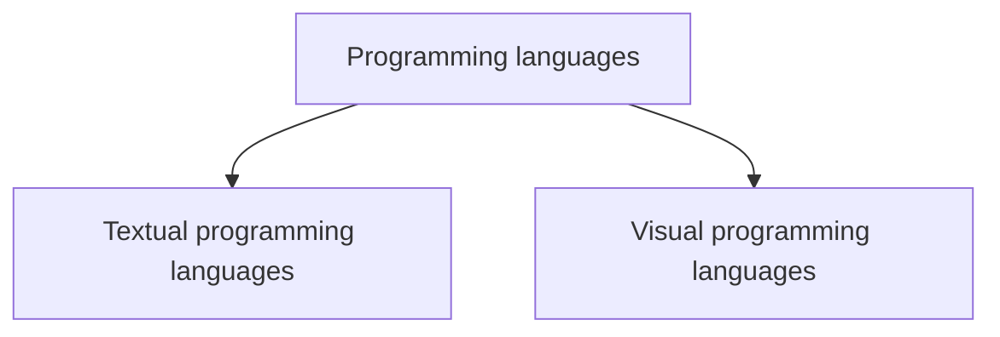
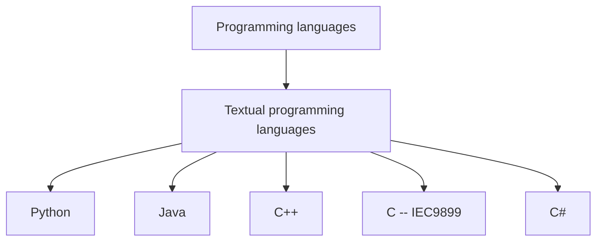
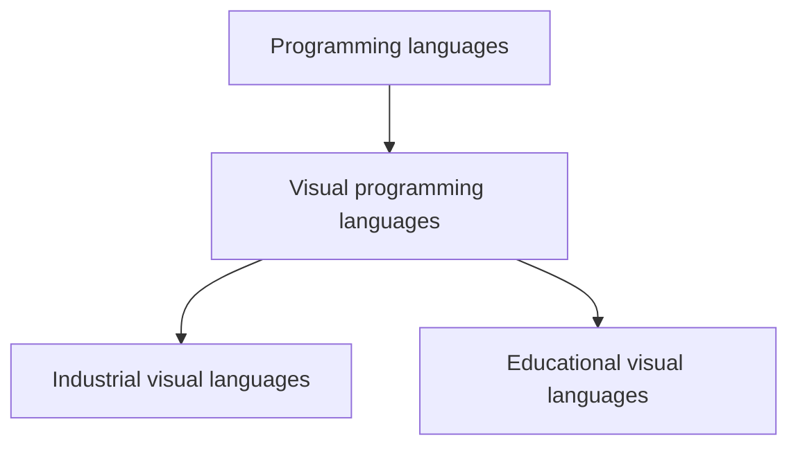
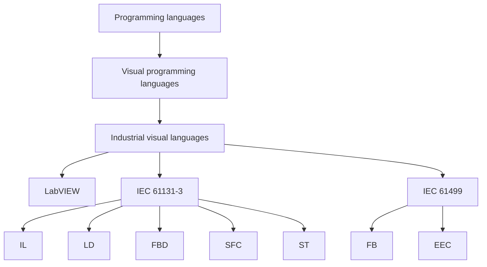

# Definition and Classification
To understand the specifics of IEC 61499, it is helpful to place it within the broader landscape of programming languages. Programming languages can generally be divided into two main groups based on their notation: **textual** and **visual** languages.
## Differentiation between Visual and Textual Programming Languages
The key difference lies in how a program's logic is formulated. While textual languages are based on sequential code, visual languages use graphical elements to represent relationships and data flows.

Textual Programming Languages
In textual languages, the algorithm is described by a sequence of strings (keywords, operators, variables). These languages are often very powerful and abstract, but require a precise knowledge of the syntax.

### Textual Programming Languages

In textual languages, the algorithm is described by a sequence of character strings (keywords, operators, variables). These languages are often very powerful and abstract, but require precise knowledge of the syntax.

Typical examples are:

* **C / C++:** Low-level programming, high performance.
* **Python:** Very popular for data science and automation due to its simple syntax.
* **Java / C#:** Object-oriented languages, widely used in enterprise software.

### Visual Programming Languages
Visual programming languages (VPLs) use graphical symbols, blocks, or icons that are linked together by lines (connections). This often makes it possible to represent complex relationships (such as signal flows in electrical engineering) more intuitively.

* **Java / C#:** Object-oriented languages, widely used in enterprise software.

A common distinction is made between programming languages based on their intended use:

1. **Educational Languages:** These are primarily used for learning programming concepts without syntax hurdles. Well-known examples include **Scratch** and **Blockly**.

2. **Industrial Visual Languages:** These are designed for professional use in automation technology.

---

## Focus: Industrial Visual Programming Languages

Visual programming has a long tradition in industry, as it is closely related to the representation of circuit diagrams and process flows.

### IEC 61131-3 (The Classic Standard)
IEC 61131-3 is the globally established standard for programmable logic controllers (PLCs). It offers both textual and visual languages:

* **LD (Ladder Diagram):** Based on electrical circuit diagrams.
* **FBD (Function Block Diagram):** Representation of logic as linked blocks.
* **SFC (Sequential Function Chart):** Modeling of sequences of steps.
* **ST (Structured Text) & IL (Instruction List):** The textual representatives within the standard.

### IEC 61499 (The Standard for Distributed Systems)
**IEC 61499** goes a step further. It consistently uses the concept of **Function Blocks (FB)** for modeling the entire system. A key difference is event-driven execution, which is controlled by **Event Execution Control (ECC)** within the building blocks.

---

## Summary: Why Program Visually?

| Characteristic | Textual Languages | Visual Languages |
| :--- | :--- | :--- |
**Learning Curve** | Often steeper (memorizing syntax) | Flatter (intuitive symbols) |
**Abstraction** | Very high possible | Good for data and signal flows |
**Error Proneness** | Syntax errors frequent | Syntax errors often impossible with GUI |
**Areas of Application** | Web, Desktop, System-level | Automation, Teaching, Workflow Design |

**Learning Curve**
### Literature and Sources

* [Wikipedia: Visual Programming Language ](https://de.wikipedia.org/wiki/Visuelle_Programmiersprache)
* [YouTube: Visual vs. Textual Programming (Concise Summary) ](https://www.youtube.com/watch?v=MxJcdqOX9V0)
* [Comparison using Print2Forms ](https://wiki.print2forms.de/doku.php?id=print2forms:skripte:textuellvsvisuell)]
