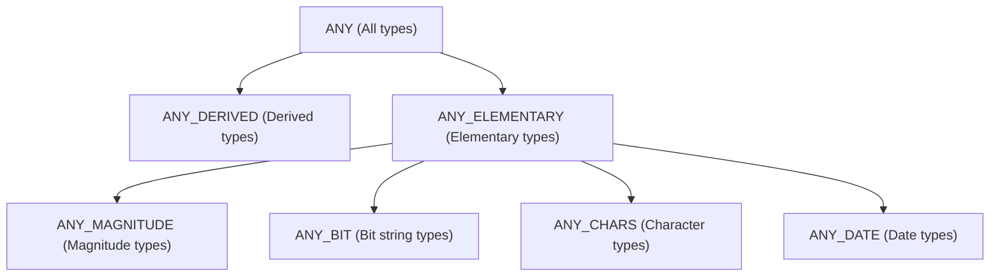
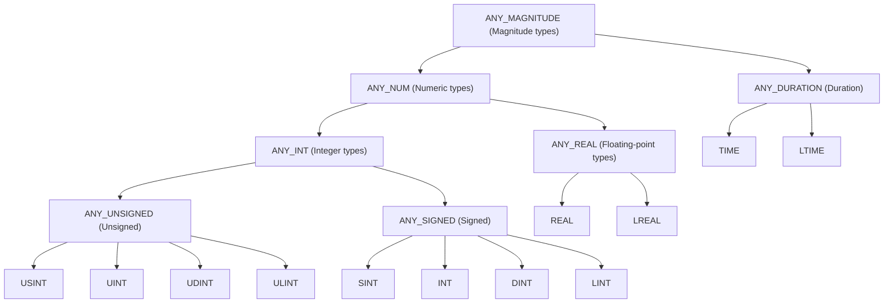
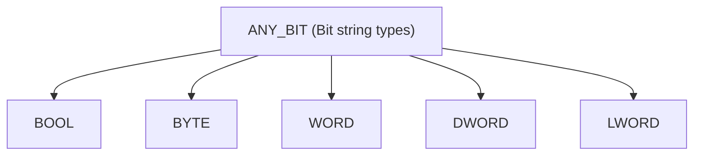
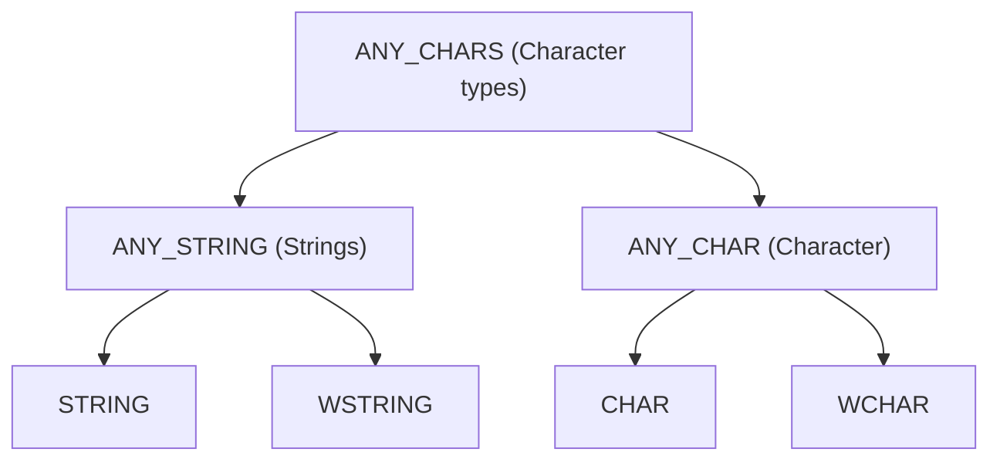
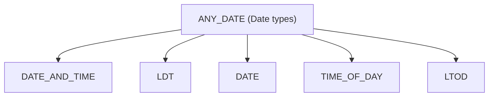

# Generic Data Types (ANY Types)

The DIN EN 61131-3 standard uses generic data types (also called "generic" data types) to define functions and function blocks that can work with different but related data types (overloading). These types are identified by the prefix `ANY`.

## Hierarchy of ANY Types

The following graphic illustrates the top-level inheritance hierarchy of generic data types according to the standard.

## Group Descriptions

### ANY_ELEMENTARY

This group includes all predefined standard data types of the standard.

#### ANY_MAGNITUDE (Magnitude Types)

Types that represent a magnitude and are suitable for arithmetic operations. A further distinction is made between numeric types and time durations.

* **ANY_NUM**: Numeric types (integers and floating-point numbers).
* **ANY_DURATION**: Duration types (`TIME`, `LTIME`).

#### ANY_BIT (Bit String Types)

Types for representing bit strings.

#### ANY_CHARS (Character Types)

Types for characters and strings.

#### ANY_DATE (Date Types)

Types for date and time values.

### ANY_DERIVED

This group includes all user-defined data types (e.g., `STRUCT`, `ENUM`, `ARRAY`) that are not directly derived from an elementary type.

## Usage

Generic data types are primarily used in standard libraries. An example is the `ADD` function, which accepts the type `ANY_NUM` as an input and can therefore add both two `INT` and two `REAL` values.

In user-defined program organizational units (POEs), the use of `ANY` types is not provided for in the standard and remains reserved for manufacturer-specific extensions.
