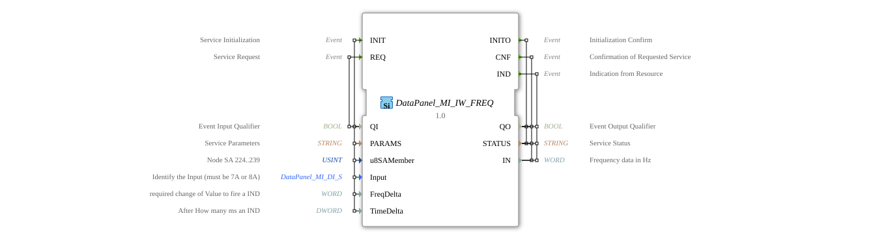

# DataPanel_MI_IW_FREQ

*No image available.*

* * * * * * * * * *

## Introduction

The function block **DataPanel_MI_IW_FREQ** is a service interface function block (SIFB) that encapsulates access to a frequency input of a data panel (type 7A/8A). It is used for initialization, cyclic or event-driven querying, and asynchronous notification of frequency changes. The FB is part of a modular control environment for agricultural machinery (MI – machine interface).

## Interface Structure

### **Event Inputs**

| Event | Description | With |
| ---------- | --------------- | ----- |
| **INIT** | Service Initialization | `QI`, `PARAMS`, `u8SAMember`, `Input`, `FreqDelta`, `TimeDelta` |
| **REQ** | Service Request (Read Current Frequency) | `QI` |

### **Event Outputs**

| Event | Description | With |
| ---------- | -------------- | ----- |
| **INITO** | Initialization Confirmation | `QO`, `STATUS` |
| **CNF** | Confirmation of a requested query | `QO`, `STATUS`, `IN` |
| **IND** | Asynchronous indication (frequency change or time elapsed) | `QO`, `STATUS`, `IN` |

### **Data Inputs**

| Name | Type | Initial Value | Description |
| ------ | ----- | -------------- | -------------- |
| `QI` | BOOL | – | Event input qualifier (controls processing) |
| `PARAMS` | STRING | – | Service parameter (device-specific configuration) |
| `u8SAMember` | USINT | `MI::MI_00` | Node address (SA) of the data collection module (value range 224…239) |
| `Input` | `DataPanel::io::MI::DI::DataPanel_MI_DI_S` | `Invalid` | Identifies the physical input (must be `7A` or `8A`) |
| `FreqDelta` | WORD | – | Frequency change threshold [Hz] that triggers a `IND` |
| `TimeDelta` | DWORD | – | Time interval [ms] after which a `IND` is sent (even without changes) |

### **Data Outputs**

| Name | Type | Description |
|------|-----|--------------|
| `QO` | BOOL | Event output qualifier (indicates successful execution) |
| `STATUS` | STRING | Service status (e.g., error messages or confirmation texts) |
| `IN` | WORD | Current frequency in Hz |

### **Adapters**

None available.

## Functionality

1. **Initialization** – The event `INIT` establishes the connection to the configured frequency input. The parameters `PARAMS`, `u8SAMember`, `Input`, `FreqDelta`, and `TimeDelta` are adopted. After successful initialization, the output event `INITO` is triggered with `QO = TRUE` and a positive `STATUS`.
2. **Query (REQ/CNF)** – An event `REQ` requests the current frequency value. The function block (FB) sends the request to the data panel and, upon response, returns the event `CNF` with the current value in `IN`. `QO` indicates whether the query was successful.
3. **Asynchronous Indication (IND)** – The FB continuously monitors the frequency input. An event `IND` is triggered when:

- the frequency value changes by at least `FreqDelta` [Hz], or
- the time interval specified in `TimeDelta` [ms] has elapsed since the last event `IND`.

This enables both threshold-based and time-based updates.

The events `INIT` and `REQ` are only executed if the corresponding qualifier `QI` has the value `TRUE`. The output qualifier `QO` signals successful execution.

## Technical Features

- **Type Dependency**: The function block uses special types from the package `DataPanel::io::MI::DI`, which enable type-safe configuration of the input (e.g., `DataPanel_MI_DI_S`) as well as constants (`MI::MI_00`).

- **Input Initialization**: The data input `Input` is set to `Invalid` by default. Before the first `INIT`, this must be set to a valid value (`7A` or `8A`), otherwise initialization will fail.

- **Frequency Display**: The measured frequency is output as a 16-bit value (`WORD`) in Hz.
- **Event-Driven Retrieval**: The `INIT` service must be successfully executed once before using `REQ` or receiving `IND`.
- **Attribute Hash**: A `eclipse4diac::core::TypeHash` attribute exists but is not set – this is used for runtime optimization in 4diac.

## State Overview

The function block (FB) internally cycles through the following logical states:

| State | Description |
| --------- | -------------- |
| **IDLE** | Waiting for `INIT` – no connection |
| **INIT** | Establish connection to input and apply parameters |
| **RUN** | Ready for operation – waiting for `REQ` or sending `IND` upon change/expiration |
| **ERROR** | Error state (e.g., incorrect `Input`, communication error) – `STATUS` contains an error message |

A transition to the error state occurs when initialization fails. The only way to return from the error state is by sending `INIT` again.

## Application Scenarios

- **Speed measurement** on an agricultural machine: A frequency sensor (e.g., a magnetic transducer) provides pulses that are recorded via the data panel. Using `FreqDelta = 5 Hz` and `TimeDelta = 100 ms`, the controller receives current values both during significant speed changes and at regular intervals.
- **Monitoring a constant frequency**: With a low change threshold (`FreqDelta = 1 Hz`) and a short time interval (`TimeDelta = 50 ms`), the function block (FB) is suitable for real-time monitoring of critical processes.
- **Redundant frequency acquisition**: Two parallel instances of the FB on different inputs (7A and 8A) allow for plausibility checks of the measured values.

## Comparison with similar function blocks

| Function block | Type | Special feature |
| ---------------- | ----- | -------------- |
| `DataPanel_MI_IW_FREQ` | Frequency input (SIFB) | Event-driven, asynchronous IND, configurable thresholds and time values |
| `DataPanel_MI_DI` | Digital input (SIFB) | Binary states only, no frequency-dependent triggers |
| Generic `SIFB`with INIT/REQ/IND | General | No built-in frequency functions, must be developed in-house |

The **DataPanel_MI_IW_FREQ** is specifically optimized for processing frequency signals, while other modules provide either only discrete states or generic interfaces.

## Conclusion

The **DataPanel_MI_IW_FREQ** is a powerful and flexible service interface module for acquiring frequency data via a data panel (Type 7A/8A). Its combination of threshold-based and time-based indication makes it suitable for both simple measurement tasks and safety-critical monitoring. The type-safe configuration and clear event interface facilitate integration into agricultural automation solutions.

The **DataPanel_MI_IW_FREQ** is a powerful and flexible service interface module for acquiring frequency data via a data panel (Type 7A/8A). ---

### 🌐 Related topic subpages on ms-muc-docs.de

- [🌐 Eclipse 4diac IDE & Color Reference on ms-muc-docs.de](https://www.ms-muc-docs.de/iec-61499/eclipse-4diac/)

]
