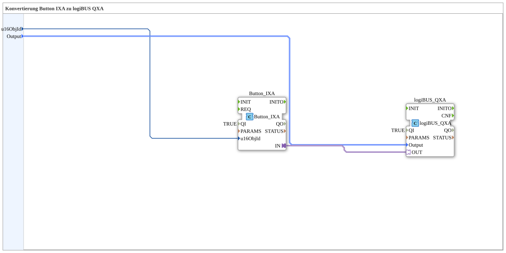

# Button_IXA_TO_logiBUS_QXA

* * * * * * * * * *

## Introduction

`Button_IXA_TO_logiBUS_QXA` connects a VT button (`Button_IXA`) directly to a physical digital output (`logiBUS_QXA`) — the simplest form of a VT-switchable output, with no status display and no OPC-UA. For the variant with a VT status color, see [`Button_IXA_TO_logiBUS_QXA_BG`](./Button_IXA_TO_logiBUS_QXA_BG.md).

## Function Blocks (FBs) Used

### Sub-blocks: Button_IXA_TO_logiBUS_QXA

- **Type**: SubAppType
- **Internal FBs used**:
    - **Button_IXA**: `isobus::UT::io::Button::Button_IXA` — VT button adapter, `QI=TRUE`, `u16ObjId` identifies the VT button.
    - **logiBUS_QXA**: `logiBUS::io::DQ::logiBUS_QXA` — physical digital output, `QI=TRUE`.
- **Functionality**: The button's adapter output is wired directly to the physical output's adapter input — no intermediate logic.

## Program Flow and Connections

1. `u16ObjId` → `Button_IXA.u16ObjId`; `Output` → `logiBUS_QXA.Output`.
2. `Button_IXA.IN` (adapter) → `logiBUS_QXA.OUT` (adapter) — direct pass-through.

## Application Scenarios

- Minimal VT-button-to-output block for exercises that don't yet need a status display or remote control.

## Summary

The simplest block variant in this family: a VT button wired directly to a physical output, with no additional function.

---

### 🌐 Related topic subpages on ms-muc-docs.de

- [🌐 Eclipse 4diac IDE & color reference on ms-muc-docs.de](https://www.ms-muc-docs.de/iec-61499/eclipse-4diac/)
