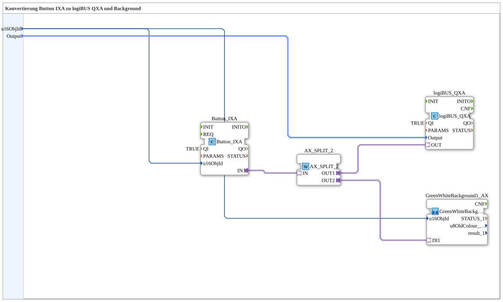

# Button_IXA_TO_logiBUS_QXA_BG

* * * * * * * * * *

## Introduction

`Button_IXA_TO_logiBUS_QXA_BG` extends [`Button_IXA_TO_logiBUS_QXA`](./Button_IXA_TO_logiBUS_QXA.md) with a VT status color: the button state not only switches the physical output but also the button's own background color (green/white). The OPC-UA-capable follow-up is [`Button_IXA_TO_logiBUS_QXA_BG_OPC`](Button_IXA_TO_logiBUS_QXA_BG_OPC.md).

## Function Blocks (FBs) Used

### Sub-blocks: Button_IXA_TO_logiBUS_QXA_BG

- **Type**: SubAppType
- **Internal FBs used**:
    - **Button_IXA**: `isobus::UT::io::Button::Button_IXA` — VT button adapter.
    - **logiBUS_QXA**: `logiBUS::io::DQ::logiBUS_QXA` — physical digital output.
    - **AX_SPLIT_2**: `adapter::events::unidirectional::AX_SPLIT_2` — splits the button signal.
    - **GreenWhiteBackground1_AX** (SubApp, `MyLib::sys`): sets the VT background color to match the state (see [Background Color Blocks](./Background-Color-Blocks.md)).
- **Functionality**: `Button_IXA.IN` is distributed via `AX_SPLIT_2` to both `logiBUS_QXA.OUT` (physical output) and `GreenWhiteBackground1_AX.DI1` (status color).

## Program Flow and Connections

1. `u16ObjId` → `Button_IXA.u16ObjId` and `GreenWhiteBackground1_AX.u16ObjId`; `Output` → `logiBUS_QXA.Output`.
2. `Button_IXA.IN` → `AX_SPLIT_2.IN` → `AX_SPLIT_2.OUT1` → `logiBUS_QXA.OUT`, `AX_SPLIT_2.OUT2` → `GreenWhiteBackground1_AX.DI1`.

## Application Scenarios

- VT button with direct visual feedback (status color) but no OPC-UA remote control.

## Summary

Adds a VT status color to the simple button-to-output wiring — the precursor to the OPC-UA-capable variant.

---

### 🌐 Related topic subpages on ms-muc-docs.de

- [🌐 Eclipse 4diac IDE & color reference on ms-muc-docs.de](https://www.ms-muc-docs.de/iec-61499/eclipse-4diac/)
