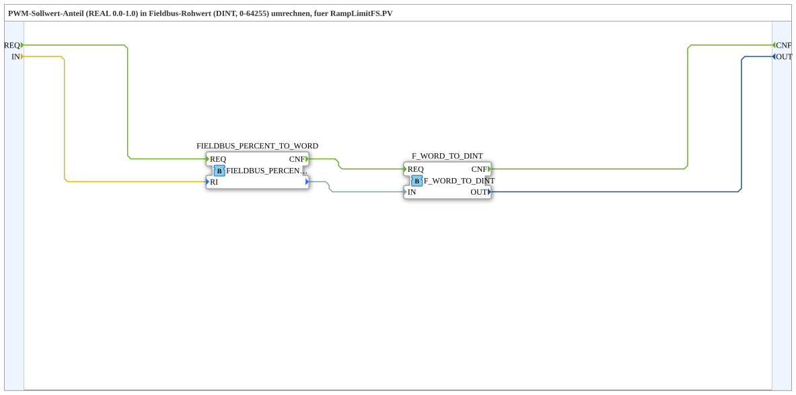

# F_PWM_PERCENT_TO_RAW

* * * * * * * * * *

## Introduction

`F_PWM_PERCENT_TO_RAW` converts a **PWM setpoint fraction (REAL 0.0–1.0)** into the **fieldbus raw value (DINT, 0–64255)** expected by `RampLimitFS.PV`. Despite its name, the block does not expect a percent value (0–100) but a fraction (0.0–1.0) — the percent-to-fraction conversion is handled upstream by `logiBUS::signalprocessing::fieldbus::F_PERCENT_TO_FRACTION`.

## Function Blocks (FBs) Used

### Sub-blocks: F_PWM_PERCENT_TO_RAW

- **Type**: SubAppType
- **Internal FBs used**:
    - **FIELDBUS_PERCENT_TO_WORD**: `eclipse4diac::signalprocessing::FIELDBUS_PERCENT_TO_WORD`
        - Data input: `RI` (fraction 0.0-1.0)
        - Event output: `CNF`
    - **F_WORD_TO_DINT**: `iec61131::conversion::F_WORD_TO_DINT`
        - Data input: `IN`, data output: `OUT`
- **Functionality**: The standard 4diac block `FIELDBUS_PERCENT_TO_WORD` already delivers the fieldbus raw value as a `WORD` (16-bit); `F_WORD_TO_DINT` then converts it to `DINT`, since that is the type `RampLimitFS.PV` expects.

## Program Flow and Connections

1. `REQ` (SubApp event input) → `FIELDBUS_PERCENT_TO_WORD.REQ`
2. `IN` (fraction 0.0-1.0) → `FIELDBUS_PERCENT_TO_WORD.RI`
3. `FIELDBUS_PERCENT_TO_WORD.CNF` → `F_WORD_TO_DINT.REQ`, its data output → `F_WORD_TO_DINT.IN`
4. `F_WORD_TO_DINT.OUT` → `OUT` (fieldbus raw value 0-64255)
5. `F_WORD_TO_DINT.CNF` → `CNF` (SubApp event output)

## Technical Details

- Uses the standard 4diac block `FIELDBUS_PERCENT_TO_WORD` (`eclipse4diac::signalprocessing`) instead of a custom formula — consistent with the SAE J1939/ISO 11783 convention `VALID_SIGNAL_W`.
- Expects a **fraction 0.0-1.0**, not percent 0-100 — easy to confuse with the similarly named `F_PERCENT_TO_FRACTION` (percent → fraction), which must be placed upstream.

## Application Scenarios

- Any exercise that needs to map an analog 0-100 % setpoint onto a `RampLimitFS` or other fieldbus raw-value input (0-64255).

## Summary

`F_PWM_PERCENT_TO_RAW` is a thin adapter around the standard block `FIELDBUS_PERCENT_TO_WORD` that brings the fraction-to-fieldbus-raw-value conversion to the `DINT` type expected by `RampLimitFS.PV`.

## 🛠️ Related Exercises

- [RampLimitFS_TO_logiBUS_QDA_PWM_OPC](./RampLimitFS_TO_logiBUS_QDA_PWM_OPC.md)
- [F_PWM_RAW_TO_PERCENT](./F_PWM_RAW_TO_PERCENT.md) (counterpart)
- [InputOutputTesterButton_PWM_OPC_UA](../../../../Uebungen/test_AX/Meins/InputOutputTester/Button_PWM_OPC_UA/InputOutputTesterButton_PWM_OPC_UA.md)

---

### 🌐 Related topic pages on ms-muc-docs.de

- [🌐 Eclipse 4diac IDE & color reference on ms-muc-docs.de](https://www.ms-muc-docs.de/iec-61499/eclipse-4diac/)
