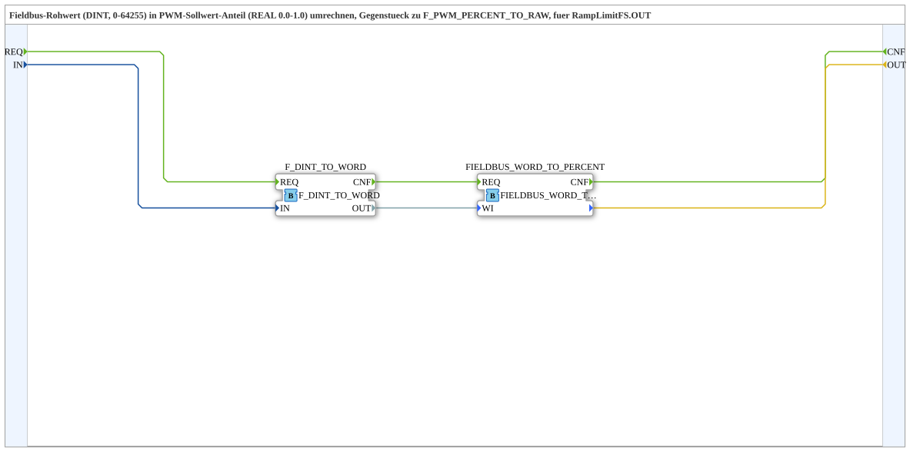

# F_PWM_RAW_TO_PERCENT

* * * * * * * * * *

## Introduction

`F_PWM_RAW_TO_PERCENT` is the counterpart to [`F_PWM_PERCENT_TO_RAW`](./F_PWM_PERCENT_TO_RAW.md): it converts the **fieldbus raw value (DINT, 0–64255)** from `RampLimitFS.OUT` back into a **fraction (REAL 0.0–1.0)**. Despite its name, the block does not produce a percent value — the fraction-to-percent conversion is handled downstream by `logiBUS::signalprocessing::fieldbus::F_FRACTION_TO_PERCENT`.

## Function Blocks (FBs) Used

### Sub-blocks: F_PWM_RAW_TO_PERCENT

- **Type**: SubAppType
- **Internal FBs used**:
    - **F_DINT_TO_WORD**: `iec61131::conversion::F_DINT_TO_WORD`
        - Data input: `IN`, data output: `OUT`
    - **FIELDBUS_WORD_TO_PERCENT**: `eclipse4diac::signalprocessing::FIELDBUS_WORD_TO_PERCENT`
        - Data input: `WI` (fieldbus raw value as `WORD`)
        - Event output: `CNF`
- **Functionality**: `RampLimitFS.OUT` delivers the raw value as `DINT`; `F_DINT_TO_WORD` converts it back to `WORD`, since the standard 4diac block `FIELDBUS_WORD_TO_PERCENT` expects that type and computes the fraction (0.0-1.0) from it.

## Program Flow and Connections

1. `REQ` (SubApp event input) → `F_DINT_TO_WORD.REQ`
2. `IN` (fieldbus raw value 0-64255, DINT) → `F_DINT_TO_WORD.IN`
3. `F_DINT_TO_WORD.CNF` → `FIELDBUS_WORD_TO_PERCENT.REQ`, its data output → `FIELDBUS_WORD_TO_PERCENT.WI`
4. `FIELDBUS_WORD_TO_PERCENT` (data output) → `OUT` (fraction 0.0-1.0)
5. `FIELDBUS_WORD_TO_PERCENT.CNF` → `CNF` (SubApp event output)

## Technical Details

- Uses the standard 4diac block `FIELDBUS_WORD_TO_PERCENT` (`eclipse4diac::signalprocessing`) — consistent with the SAE J1939/ISO 11783 convention `VALID_SIGNAL_W`.
- Delivers a **fraction 0.0-1.0**, not percent — for a percent display, the caller must still multiply by 100.0 or place `F_FRACTION_TO_PERCENT` downstream.

## Application Scenarios

- Any exercise that needs to convert a `RampLimitFS` or other fieldbus raw value (0-64255) back into an analog 0-100 % setpoint for display or forwarding (e.g. OPC-UA publish).

## Summary

`F_PWM_RAW_TO_PERCENT` is a thin adapter around the standard block `FIELDBUS_WORD_TO_PERCENT` that brings the fieldbus-raw-value-to-fraction conversion to the `DINT` type delivered by `RampLimitFS.OUT`.

## 🛠️ Related Exercises

- [RampLimitFS_TO_logiBUS_QDA_PWM_OPC](./RampLimitFS_TO_logiBUS_QDA_PWM_OPC.md)
- [F_PWM_PERCENT_TO_RAW](./F_PWM_PERCENT_TO_RAW.md) (counterpart)
- [InputOutputTesterButton_PWM_OPC_UA](../../../../Uebungen/test_AX/Meins/InputOutputTester/Button_PWM_OPC_UA/InputOutputTesterButton_PWM_OPC_UA.md)

---

### 🌐 Related topic pages on ms-muc-docs.de

- [🌐 Eclipse 4diac IDE & color reference on ms-muc-docs.de](https://www.ms-muc-docs.de/iec-61499/eclipse-4diac/)
