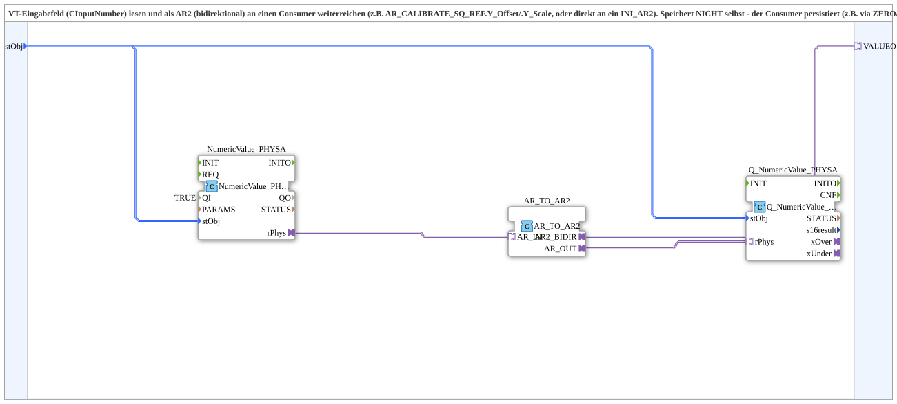

# NumericValue_TO_AR2

* * * * * * * * * *

## Introduction

`NumericValue_TO_AR2` reads a VT input field (`NumericValue_PHYSA`) and forwards the value bidirectionally as an AR2 adapter (`VALUEO`) to a consumer - unlike [`INI_IN_AND_STORE_AR2`](./INI_IN_AND_STORE_AR2.md), this block itself stores **nothing**: persistence is the consumer's responsibility (e.g. `AR_CALIBRATE_SQ_REF.Y_Offset`/`.Y_Scale`, or directly an `INI_AR2`). Whatever the consumer echoes back over the same AR2 plug is written back to the VT field - even at boot, so the input field and the actually active value stay in sync.

## Technical notes

- Pure VT-to-AR2 bridge: no storage FB in the network, unlike the INI/NVS family.
- Historical note: per the source comment, renamed from `INI_IN_AND_STORE_AR2` when the block changed from a self-contained storage function to a pure bridge.

## Summary

Bidirectional VT-input-field-to-AR2 bridge with no storage of its own - the consumer persists, this block only displays and forwards.

---

### 🌐 Related topic subpages on ms-muc-docs.de

- [🌐 Eclipse 4diac IDE & color reference on ms-muc-docs.de](https://www.ms-muc-docs.de/iec-61499/eclipse-4diac/)
