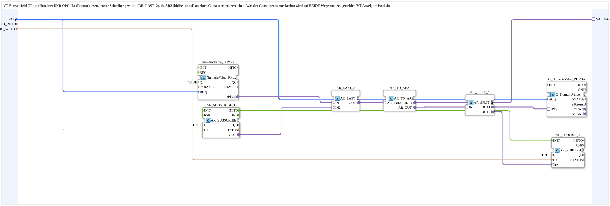

# NumericValue_TO_AR2_OPC

* * * * * * * * * *

## Introduction

`NumericValue_TO_AR2_OPC` is the VT+OPC-UA sibling of [`NumericValue_TO_AR2`](./NumericValue_TO_AR2.md) (VT only) and [`OPC_TO_AR2`](./OPC_TO_AR2.md) (OPC only): both the VT input field and a remotely-written OPC-UA value (`AR_SUBSCRIBE_1`) feed `AR_LAST_2` - "last writer wins". The result goes to the consumer as an AR2 adapter (`VALUEO`); whatever the consumer echoes back is reported both ways: VT display (`Q_NumericValue_PHYSA`) and OPC-UA publish (`AR_PUBLISH_1`).

## Function blocks used

- **NumericValue_PHYSA**: VT input field, local value.
- **AR_SUBSCRIBE_1**: subscribes to a remotely-written REAL value under `ID_READ`.
- **AR_LAST_2**: merges both sources, last writer wins.
- **AR_TO_AR2**: converts the merged plain-AR value into the bidirectional AR2 adapter for the consumer.
- **AR_SPLIT_2**: splits the consumer's echo to the VT display and the OPC publish.
- **AR_PUBLISH_1**: publishes the current/persisted value under `ID_WRITE` (triggered by `AR_SUBSCRIBE_1.INITO`, so the initial value is published immediately too).

## Technical notes

- Merge strategy identical to the VT/web merge already proven in `RampLimitFS_TO_logiBUS_QDA_PWM_OPC.SUB` (per the source comment).

## Summary

VT and OPC-UA input for the same AR2 consumer, with last-writer-wins merging and echo feedback on both paths.

---

### 🌐 Related topic subpages on ms-muc-docs.de

- [🌐 Eclipse 4diac IDE & color reference on ms-muc-docs.de](https://www.ms-muc-docs.de/iec-61499/eclipse-4diac/)
