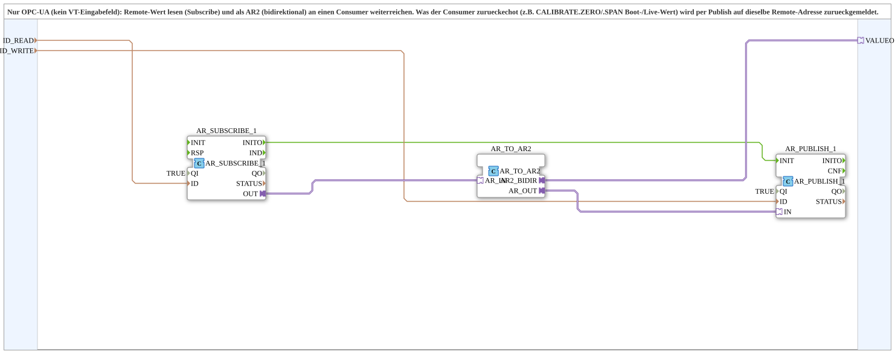

# OPC_TO_AR2

* * * * * * * * * *

## Introduction

`OPC_TO_AR2` is the pure OPC-UA sibling of [`NumericValue_TO_AR2`](./NumericValue_TO_AR2.md) - no VT input field involved. A remotely-written value is subscribed via `AR_SUBSCRIBE_1` and forwarded to a consumer as an AR2 adapter (`VALUEO`), e.g. `CALIBRATE.ZERO`/`.SPAN`. Whatever the consumer echoes back (current/persisted value) is reported back to the same remote address via `AR_PUBLISH_1`.

## Technical notes

- `AR_PUBLISH_1` is triggered by `AR_SUBSCRIBE_1.INITO` so the boot value is published immediately, not only on the first change.

## Summary

Purely remote (OPC-UA) driven AR2 bridge with no VT involvement at all - for consumers parameterized exclusively from a control room.

---

### 🌐 Related topic subpages on ms-muc-docs.de

- [🌐 Eclipse 4diac IDE & color reference on ms-muc-docs.de](https://www.ms-muc-docs.de/iec-61499/eclipse-4diac/)
