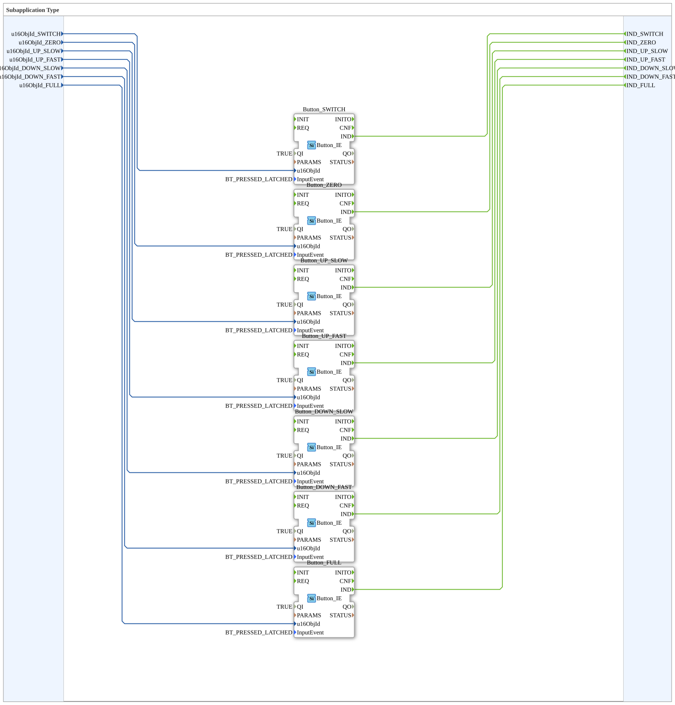

# Ramp6Buttons

* * * * * * * * * *

## Introduction

`Ramp6Buttons` encapsulates the **7 VT buttons of a PWM channel** — the 6 ramp buttons (`0 -- - + ++ F`) plus the channel enable/disable switch — as its own reusable SubApp. It was extracted from [`RampLimitFS_TO_logiBUS_QDA_PWM_OPC`](./RampLimitFS_TO_logiBUS_QDA_PWM_OPC.md) to declutter that block's network and make the button logic independently reusable.

## Function Blocks (FBs) Used

### Sub-blocks: Ramp6Buttons

- **Type**: SubAppType
- **Internal FBs used**:
    - **Button_SWITCH**, **Button_ZERO**, **Button_UP_SLOW**, **Button_UP_FAST**, **Button_DOWN_SLOW**, **Button_DOWN_FAST**, **Button_FULL**: each `isobus::UT::io::Button::Button_IE`
        - Parameters: `QI=TRUE`, `InputEvent=BT_PRESSED_LATCHED` (a latched press/release event, no adapter bridging via `AX_RF_TRIG` needed)
        - Data input: `u16ObjId` (object ID of the respective VT button)
        - Event output: `IND` (button pressed)
- **Functionality**: Seven identical `Button_IE` instances, each bound to its own VT object ID, pass their `IND` event straight through as their own SubApp output event — a pure 1:1 pass-through with no additional logic.

## Program Flow and Connections

The same pattern applies to all 7 buttons (`u16ObjId_<NAME>` → `Button_<NAME>.u16ObjId`, `Button_<NAME>.IND` → `IND_<NAME>`):

- `u16ObjId_SWITCH` → `Button_SWITCH.u16ObjId`; `Button_SWITCH.IND` → `IND_SWITCH` (toggles channel enable)
- `u16ObjId_ZERO` → `Button_ZERO.u16ObjId`; `Button_ZERO.IND` → `IND_ZERO` (`RampLimitFS.ZERO`)
- `u16ObjId_UP_SLOW` → `Button_UP_SLOW.u16ObjId`; `Button_UP_SLOW.IND` → `IND_UP_SLOW` (`RampLimitFS.UP_SLOW`, ~1 %)
- `u16ObjId_UP_FAST` → `Button_UP_FAST.u16ObjId`; `Button_UP_FAST.IND` → `IND_UP_FAST` (`RampLimitFS.UP_FAST`, ~10 %)
- `u16ObjId_DOWN_SLOW` → `Button_DOWN_SLOW.u16ObjId`; `Button_DOWN_SLOW.IND` → `IND_DOWN_SLOW` (`RampLimitFS.DOWN_SLOW`, ~1 %)
- `u16ObjId_DOWN_FAST` → `Button_DOWN_FAST.u16ObjId`; `Button_DOWN_FAST.IND` → `IND_DOWN_FAST` (`RampLimitFS.DOWN_FAST`, ~10 %)
- `u16ObjId_FULL` → `Button_FULL.u16ObjId`; `Button_FULL.IND` → `IND_FULL` (`RampLimitFS.FULL`, 100 %)

The calling block wires `IND_ZERO`/`IND_UP_SLOW`/`IND_UP_FAST`/`IND_DOWN_SLOW`/`IND_DOWN_FAST`/`IND_FULL` directly to the like-named event inputs of `RampLimitFS`, and `IND_SWITCH` to the channel enable flip-flop.

## Technical Details

- **`BT_PRESSED_LATCHED` instead of `Button_IXA`+`AX_RF_TRIG`**: a simpler pattern with no adapter bridging, since `Button_IE` outputs the press event directly as `IND`.
- **Event order aligned with `RampLimitFS`**: The output events (`SWITCH, ZERO, UP_SLOW, UP_FAST, DOWN_SLOW, DOWN_FAST, FULL`) deliberately follow the order in which `RampLimitFS` declares its own event inputs, to make wiring easier.

## Application Scenarios

- Any exercise with a ramped setpoint (`RampLimitFS` or similar) that should be operated via 6 buttons plus one enable switch.

## Summary

`Ramp6Buttons` bundles seven identical `Button_IE` instances into a single reusable SubApp, keeping the button wiring out of the actual PWM channel block.

## 🛠️ Related Exercises

- [RampLimitFS_TO_logiBUS_QDA_PWM_OPC](./RampLimitFS_TO_logiBUS_QDA_PWM_OPC.md)
- [InputOutputTesterButton_PWM_OPC_UA](../../../../Uebungen/test_AX/Meins/InputOutputTester/Button_PWM_OPC_UA/InputOutputTesterButton_PWM_OPC_UA.md)

---

### 🌐 Related topic pages on ms-muc-docs.de

- [🌐 Eclipse 4diac IDE & color reference on ms-muc-docs.de](https://www.ms-muc-docs.de/iec-61499/eclipse-4diac/)
