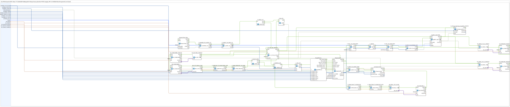

# RampLimitFS_TO_logiBUS_QDA_PWM_OPC

* * * * * * * * * *

## Introduction

`RampLimitFS_TO_logiBUS_QDA_PWM_OPC` is the reusable block for **a single PWM output channel (0–100 % duty cycle)** with a VT number field, bar graph, 6 ramp buttons, channel enable/disable switch, 3-color status indicator, and bidirectional OPC-UA connectivity. It is instantiated 12× with different parameters in [`InputOutputTesterButton_PWM_OPC_UA`](../../../../Uebungen/test_AX/Meins/InputOutputTester/Button_PWM_OPC_UA/InputOutputTesterButton_PWM_OPC_UA.md) and is the PWM counterpart of the simpler, purely digital `RampLimitFS_TO_logiBUS_QDA_OPC`.

## Function Blocks (FBs) Used

### Sub-blocks: RampLimitFS_TO_logiBUS_QDA_PWM_OPC

- **Type**: SubAppType
- **Internal FBs used**:
    - **RampLimitFS**: `eclipse4diac::signalprocessing::RampLimitFS`
        - Parameters: `VAL_ZERO=DINT#0`, `SLOW=DINT#643` (~1 %), `FAST=DINT#6426` (~10 %), `VAL_FULL=DINT#64255`
        - Data input: `PV` (setpoint mux output), event inputs: `ZERO`/`UP_SLOW`/`UP_FAST`/`DOWN_SLOW`/`DOWN_FAST`/`FULL`/`LOAD`
        - Data output: `OUT` (0–64255)
    - **Ramp6Buttons** (SubApp, `MyLib::sys`): encapsulates the 7 VT buttons (6 ramp buttons + channel switch), see [its own documentation](./Ramp6Buttons.md)
    - **F_PWM_PERCENT_TO_RAW** / **F_PWM_RAW_TO_PERCENT** (SubApp, `MyLib::sys`): conversion between fraction 0.0-1.0 and fieldbus raw value, see [F_PWM_PERCENT_TO_RAW](./F_PWM_PERCENT_TO_RAW.md) / [F_PWM_RAW_TO_PERCENT](./F_PWM_RAW_TO_PERCENT.md)
    - **F_PERCENT_TO_FRACTION_SUB** / **F_FRACTION_TO_PERCENT_PUB**: `logiBUS::signalprocessing::fieldbus::F_PERCENT_TO_FRACTION`/`F_FRACTION_TO_PERCENT` — percent 0-100 ↔ fraction 0.0-1.0
    - **E_RS_PV** (`iec61499::events::E_RS`) + **F_SEL_PV** (`iec61131::selection::F_SEL`): two-source merge (VT number field and web setpoint) onto the single data input `RampLimitFS.PV`, since the 4diac IDE does not allow multiple connections into one data input
    - **E_T_FF_SR_SYM_INIT** (`E_T_FF_SR_SWITCH`): channel enable state, set/reset by the VT button (`CLK`, a real toggle) and by web writes (`S`/`R`, an edge change detected via `AX_RF_TRIG`, not a toggle)
    - **F_MUL_TO_PWM13BIT**/**F_DIV_TO_PWM13BIT** (`iec61131::arithmetic::F_MUL`/`F_DIV`): convert `RampLimitFS.OUT` (0-64255) via `×8191 ÷ 64255` into the 13-bit raw value (0-8191) for `logiBUS_QD_PWM.OUT`
    - **logiBUS_QD_PWM**: physical PWM output (the `Output` parameter identifies `Output_Q1`..`Q12`)
    - **F_SEL_OK_FAULT**/**F_SEL_STATUS** (`iec61131::selection::F_SEL`) + **Q_BackgroundColour**: 3-color status logic (white=disabled, green=active+`QO`=TRUE, red=active+`QO`=FALSE)
    - **AR_SUBSCRIBE_1**/**AR_PUBLISH_1**, **AX_SUBSCRIBE_1**/**AX_PUBLISH_1** (×2): OPC-UA adapters for setpoint (REAL), switch (BOOL), and status (BOOL)

- **Functionality**: Two independent setpoint sources — the VT number field/ramp buttons and a web percent value received via OPC-UA subscribe — are muxed onto the same `RampLimitFS` ramp block via `E_RS`+`F_SEL` (whichever source was most recently active wins). The ramp output (0-64255) feeds three destinations: the 13-bit raw value going to the physical `logiBUS_QD_PWM` output, a percent value going back to the VT number field/bar graph, and a percent value published via OPC-UA to the web client. In parallel, a VT button press or a web write toggles the channel enable state (`E_T_FF_SR_SWITCH`), which arms/disarms the physical output via `logiBUS_QD_PWM.QI` and feeds into the 3-color status display.

## Program Flow and Connections

1. **VT setpoint path**: `NumericValue_Duty.IND` (number field changed) → `F_DWORD_TO_UDINT_VT` → `F_UDINT_TO_DINT_VT` → `E_SPLIT_VT` → on one branch `E_RS_PV.R` (reset: "web takes precedence until VT becomes active again" — see below), on the other `E_MERGE_SEL` → `F_SEL_PV.REQ`.
2. **Web setpoint path**: `AR_SUBSCRIBE_1` (OPC-UA subscribe, percent REAL) → `AR_R_TO_REAL_SUB` → `F_PERCENT_TO_FRACTION_SUB` (percent → fraction) → `F_PWM_PERCENT_TO_RAW` (fraction → fieldbus raw value) → `E_SPLIT_WEB` → on one branch `E_RS_PV.S` (set: web source active), on the other `E_MERGE_SEL` → `F_SEL_PV.REQ`.
3. **Mux and ramp**: `E_RS_PV.Q` drives `F_SEL_PV.G` (0=VT value `IN0`, 1=web value `IN1`); `F_SEL_PV.OUT` loads `RampLimitFS.PV` via the `LOAD` event. `Ramp6Buttons` additionally supplies the 6 ramp events directly to `RampLimitFS` (`ZERO`/`UP_SLOW`/`UP_FAST`/`DOWN_SLOW`/`DOWN_FAST`/`FULL`).
4. **Physical output**: `RampLimitFS.OUT` (0-64255) → `F_MUL_TO_PWM13BIT` (×8191) → `F_DIV_TO_PWM13BIT` (÷64255) → `F_DINT_TO_DWORD_OUT` → `logiBUS_QD_PWM.OUT`.
5. **VT display**: `RampLimitFS.OUT` → `F_DINT_TO_UDINT_DISP` → `Q_NumericValue.REQ` (updates the number field + the bar graph sharing the same variable).
6. **OPC-UA publish**: `RampLimitFS.OUT` → `F_PWM_RAW_TO_PERCENT` (raw value → fraction) → `F_FRACTION_TO_PERCENT_PUB` (fraction → percent) → `AR_REAL_TO_R_PUB` → `AR_PUBLISH_1`.
7. **Channel switch**: `Ramp6Buttons.IND_SWITCH` (VT button) → `E_T_FF_SR_SWITCH.CLK` (toggles). `AX_SUBSCRIBE_SWITCH` (web write, BOOL) → `AX_RF_TRIG_SWITCH` detects a real edge change → `ER`→`S` / `EF`→`R` (sets instead of toggling, so two identical web writes cannot accidentally invert the state). `bDefaultEnabled` feeds `E_T_FF_SR_SWITCH.Q_INIT` for the initial state.
8. **Status chain**: `E_T_FF_SR_SWITCH.Q` → `logiBUS_QD_PWM.QI` (armed/disarmed) and → `F_SEL_STATUS.G`. `logiBUS_QD_PWM.INITO`/`.QO` feed `F_SEL_OK_FAULT` (red/green based on `QO`), whose result goes through `F_SEL_STATUS` (white if disabled) to `Q_BackgroundColour_STATUS`. In addition, `AX_BOOL_TO_X_SWITCH`/`AX_PUBLISH_SWITCH` and `AX_BOOL_TO_X_STATUS`/`AX_PUBLISH_STATUS` mirror the enable state and `QO` to the web client via OPC-UA publish.
9. **Boot sequence**: The five OPC-UA adapters are initialized in a strict chain (`AR_SUBSCRIBE_1.INITO → AR_PUBLISH_1.INIT → AX_SUBSCRIBE_SWITCH.INIT → AX_PUBLISH_SWITCH.INIT → AX_PUBLISH_STATUS.INIT`); only afterward does `AX_PUBLISH_STATUS.INITO` fire `E_T_FF_SR_SWITCH.INIT`, so the first published enable state is not dropped by an adapter that is not yet ready.

## Technical Details

- **Value range**: Consistently uses the SAE J1939/ISO 11783 fieldbus convention `VALID_SIGNAL_W` (0-64255) internally, not percent — avoids rounding errors and stays consistent with `RampLimitFS`.
- **13-bit PWM raw value**: `logiBUS_QD_PWM.OUT` was empirically confirmed to expect 0-8191 (not 0-64255) — hence the additional `×8191÷64255` conversion chain.
- **Multi-connection workaround**: `E_RS`+`F_SEL` instead of a (disallowed in the 4diac IDE) duplicate data connection into `RampLimitFS.PV`.
- **No PERMIT gating**: The channel switch wires `QI` directly as a data connection (the pattern from `Uebung_094a`), no `E_PERMIT` blocks.
- **Set/reset instead of toggle for web writes**: `AX_RF_TRIG` + `E_T_FF_SR_SYM_INIT` instead of a pure toggle flip-flop, so repeated writes with the same value do not randomly invert the state.

## Application Scenarios

- Training example for analog (PWM) outputs with remote control via OPC-UA/web, alongside classic VT operation.
- Template for any further multi-channel analog output exercise with setpoint ramping and per-channel enable.

## Comparison with Similar Blocks

Compared to the simpler, purely digital counterpart `RampLimitFS_TO_logiBUS_QDA_OPC`, `RampLimitFS_TO_logiBUS_QDA_PWM_OPC` differs in its analog setpoint (a ramp instead of a bit), the additional scaling chain (percent ↔ fraction ↔ fieldbus raw value ↔ 13-bit PWM), and the 3-color instead of 2-color status logic.

## Summary

`RampLimitFS_TO_logiBUS_QDA_PWM_OPC` encapsulates a complete PWM channel — setpoint ramping, two-source mux between VT and web, scaling down to the physical 13-bit PWM output, a channel enable switch with robust set/reset behavior, and 3-color status feedback — in a single block that is reused 12 times.

## 🛠️ Related Exercises

- [InputOutputTesterButton_PWM_OPC_UA](../../../../Uebungen/test_AX/Meins/InputOutputTester/Button_PWM_OPC_UA/InputOutputTesterButton_PWM_OPC_UA.md)

---

### 🌐 Related topic pages on ms-muc-docs.de

- [🌐 Eclipse 4diac IDE & color reference on ms-muc-docs.de](https://www.ms-muc-docs.de/iec-61499/eclipse-4diac/)
