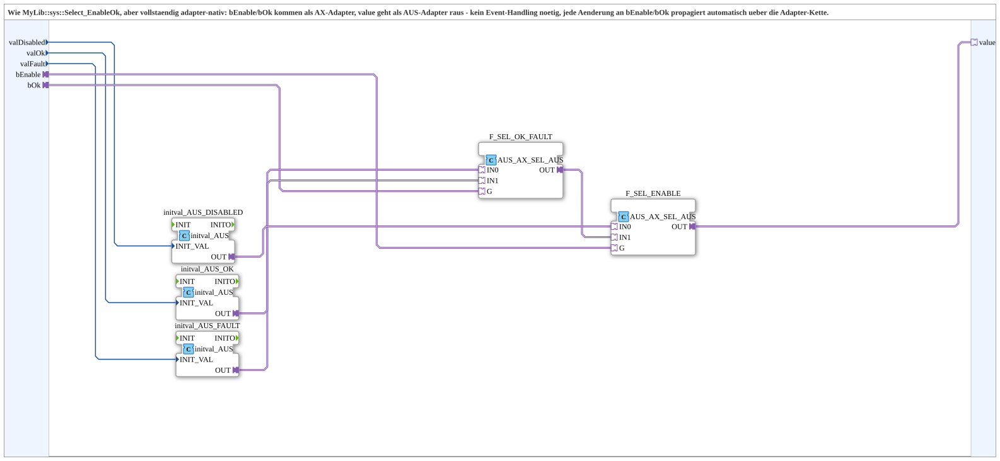

# Select_EnableOk_AX

* * * * * * * * * *

## Introduction

`Select_EnableOk_AX` is the adapter-native variant of `Select_EnableOk`: `bEnable`/`bOk` arrive as AX adapters (instead of plain BOOL), `value` leaves as an AUS adapter. No event handling needed - any change to `bEnable`/`bOk` propagates automatically through the adapter chain.

## Function blocks used

- **initval_AUS_DISABLED / initval_AUS_OK / initval_AUS_FAULT** (`adapter::types::unidirectional::AUS::initval::initval_AUS`): feed the 3 parameter values (`valDisabled`/`valOk`/`valFault`) in as AUS adapters, once at instantiation.
- **F_SEL_OK_FAULT** (`adapter::iec61131::selection::AUS_AX_SEL_AUS`): selects between the fault/ok adapter based on `bOk` (adapter gate instead of an event selector).
- **F_SEL_ENABLE** (`adapter::iec61131::selection::AUS_AX_SEL_AUS`): selects between the disabled adapter/intermediate result based on `bEnable`.

## Technical notes

- Two-stage like the event variant `Select_EnableOk`, but with no `REQ`/`CNF` at this level - the adapter connections themselves propagate every change.

## Summary

Fully adapter-native variant of [`Select_EnableOk`](../../MyLib_B/sys/Select_EnableOk.md), matching the GreenBlueBackground1_AX/GreenRedBackground1_AX family's style.

---

### 🌐 Related topic subpages on ms-muc-docs.de

- [🌐 Eclipse 4diac IDE & color reference on ms-muc-docs.de](https://www.ms-muc-docs.de/iec-61499/eclipse-4diac/)
