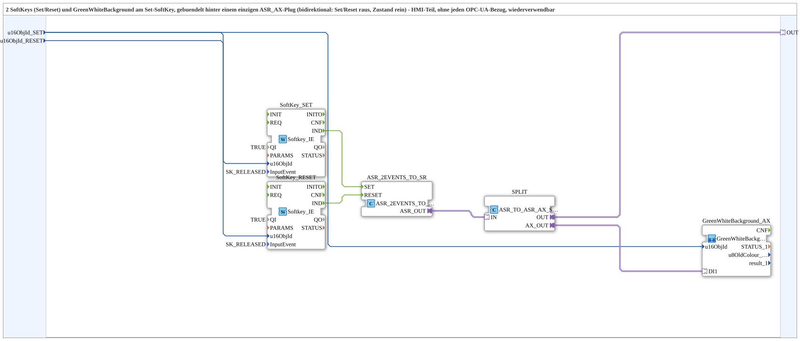

# SoftKeySR_ASR_AX

* * * * * * * * * *

## Introduction

`SoftKeySR_ASR_AX` bundles 2 softkeys (set/reset) and a `GreenWhiteBackground1_AX` (on the set softkey) behind a single `ASR_AX` plug (bidirectional: set/reset go out, state comes in). A pure HMI block with no OPC-UA involvement.

## Function blocks used

- **SoftKey_SET / SoftKey_RESET** (`isobus::UT::io::Softkey::Softkey_IE`, `InputEvent=SK_RELEASED`): the two physical softkeys.
- **ASR_2EVENTS_TO_SR** (`adapter::conversion::unidirectional::ASR_2EVENTS_TO_SR`): converts the 2 softkey events into an ASR adapter event pair.
- **SPLIT** (`adapter::events::bidirectional::ASR_TO_ASR_AX_SPLIT`): splits the bidirectional `ASR_AX` traffic to `OUT` and to the background element.
- **GreenWhiteBackground_AX** (SubApp, type `MyLib::sys::GreenWhiteBackground1_AX`): status color on the set softkey.

## Summary

Reusable set/reset-with-status block, bundled behind an `ASR_AX` adapter - the HMI counterpart of [`SoftKeySR_PC_A_OPC_Adapter`](./SoftKeySR_PC_A_OPC_Adapter.md)/[`SoftKeySR_PC_B_OPC_Adapter`](./SoftKeySR_PC_B_OPC_Adapter.md).

---

### 🌐 Related topic subpages on ms-muc-docs.de

- [🌐 Eclipse 4diac IDE & color reference on ms-muc-docs.de](https://www.ms-muc-docs.de/iec-61499/eclipse-4diac/)
