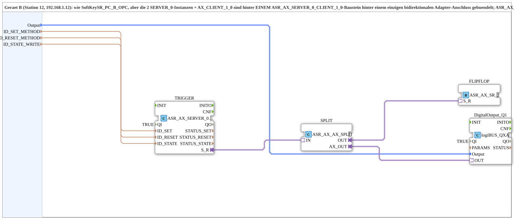

# SoftKeySR_PC_B_OPC_Adapter

* * * * * * * * * *

## Introduction

`SoftKeySR_PC_B_OPC_Adapter` is the adapter-bundled variant of [`SoftKeySR_PC_B_OPC`](./SoftKeySR_PC_B_OPC.md) (device B, station 12): the 2 `SERVER_0` instances + `AX_CLIENT_1_0` are bundled behind a SINGLE `ASR_AX_SERVER_0_CLIENT_1_0` block behind one bidirectional adapter connection; `ASR_AX_AX_SPLIT` feeds both `DigitalOutput_Q1` and the pure SR flip-flop logic (`ASR_AX_SR_2`, no toggle). Counterpart: [`SoftKeySR_PC_A_OPC_Adapter`](./SoftKeySR_PC_A_OPC_Adapter.md).

## Function blocks used

- **TRIGGER** (`adapter::net::ASR_AX_SERVER_0_CLIENT_1_0`): bundles server reception (`ID_SET_METHOD`/`ID_RESET_METHOD`) and state feedback (`ID_STATE_WRITE`).
- **SPLIT** (`adapter::events::bidirectional::ASR_AX_AX_SPLIT`): splits to the physical output + the flip-flop logic.
- **FLIPFLOP** (`adapter::events::bidirectional::ASR_AX_SR_2`): pure SR flip-flop logic as an adapter block, no toggle.
- **DigitalOutput_Q1** (`logiBUS::io::DQ::logiBUS_QXA`): physical output.

## Summary

Adapter-bundled variant of `SoftKeySR_PC_B_OPC`: network protocol and SR flip-flop logic as reusable adapter blocks.

---

### 🌐 Related topic subpages on ms-muc-docs.de

- [🌐 Eclipse 4diac IDE & color reference on ms-muc-docs.de](https://www.ms-muc-docs.de/iec-61499/eclipse-4diac/)
