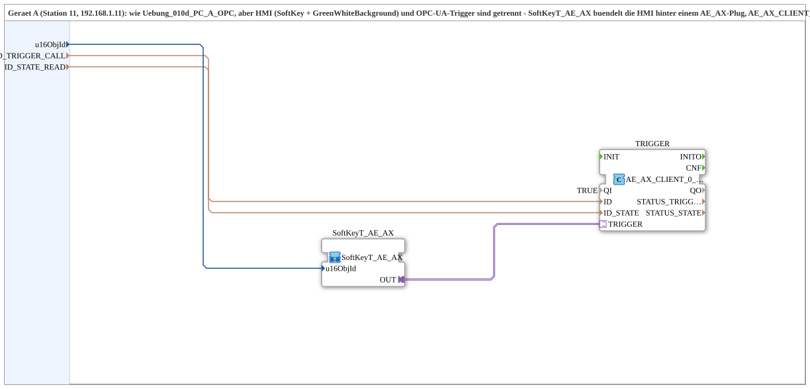

# SoftKeyT_PC_A_OPC_Adapter

* * * * * * * * * *

## Introduction

`SoftKeyT_PC_A_OPC_Adapter` is the adapter-bundled variant of [`Uebung_010d_PC_A_OPC`](./Uebung_010d_PC_A_OPC.md) (device A, station 11): HMI (softkey + `GreenWhiteBackground`) and OPC-UA trigger are separated. [`SoftKeyT_AE_AX`](./SoftKeyT_AE_AX.md) bundles the HMI behind an `AE_AX` plug; `AE_AX_CLIENT_0_SUBSCRIBE_1` bundles `CLIENT_0` + `AX_SUBSCRIBE_1` behind an `AE_AX` socket. "SUB style": the protocol still lives in the `MyLib::sys` composite. Counterpart: [`SoftKeyT_PC_B_OPC_Adapter`](./SoftKeyT_PC_B_OPC_Adapter.md).

## Function blocks used

- **SoftKeyT_AE_AX** (SubApp, type `MyLib::sys::SoftKeyT_AE_AX`): softkey + status display, bundled behind an `AE_AX` plug.
- **TRIGGER** (`adapter::net::AE_AX_CLIENT_0_SUBSCRIBE_1`): bundles the method call (`ID_TRIGGER_CALL`) and state subscription (`ID_STATE_READ`) behind a single `AE_AX` socket.

## Program flow and connections

`SoftKeyT_AE_AX.OUT` -> `TRIGGER.TRIGGER` (bidirectional: trigger out, state back to the HMI SubApp).

## Summary

Adapter-bundled variant of `Uebung_010d_PC_A_OPC`: the same function, but HMI and network protocol are cleanly separated into 2 reusable blocks instead of being wired in a single composite.

---

### 🌐 Related topic subpages on ms-muc-docs.de

- [🌐 Eclipse 4diac IDE & color reference on ms-muc-docs.de](https://www.ms-muc-docs.de/iec-61499/eclipse-4diac/)
