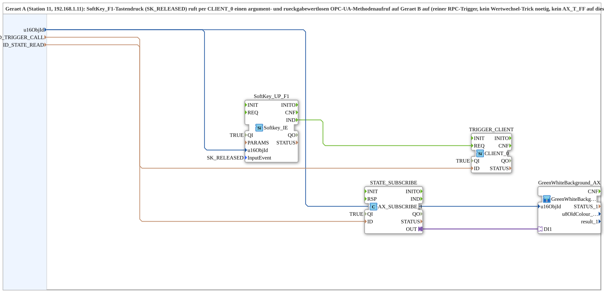

# Uebung_010d_PC_A_OPC

* * * * * * * * * *

## Introduction

`Uebung_010d_PC_A_OPC` is the device-A side (station 11, 192.168.1.11) of the PC-to-PC OPC-UA variant of exercise 010d (toggle flip-flop via softkey): a softkey press calls an argument- and return-value-less OPC-UA method on device B via `CLIENT_0` (a pure RPC trigger, no value-change trick needed, no toggle logic on this device). `GreenWhiteBackground1_AX` shows the flip-flop state locally monitored from device B. "SUB style": the protocol lives in the `MyLib::sys` composite, not in the device's resource - counterpart: [`Uebung_010d_PC_B_OPC`](./Uebung_010d_PC_B_OPC.md).

## Function blocks used

- **SoftKey_UP_F1** (`isobus::UT::io::Softkey::Softkey_IE`): physical softkey (F1), `InputEvent=SK_RELEASED`.
- **TRIGGER_CLIENT** (`iec61499::net::CLIENT_0`): calls the argument-less remote method under `ID_TRIGGER_CALL`.
- **STATE_SUBSCRIBE** (`adapter::net::AX_SUBSCRIBE_1`): subscribes to the flip-flop state written by device B, under `ID_STATE_READ`.
- **GreenWhiteBackground_AX** (SubApp, type `MyLib::sys::GreenWhiteBackground1_AX`): displays the subscribed state at the softkey.

## Summary

Device-A side of a PC-to-PC toggle trigger: the softkey calls a remote method, the actual flip-flop state is reported back from device B.

---

### 🌐 Related topic subpages on ms-muc-docs.de

- [🌐 Eclipse 4diac IDE & color reference on ms-muc-docs.de](https://www.ms-muc-docs.de/iec-61499/eclipse-4diac/)
