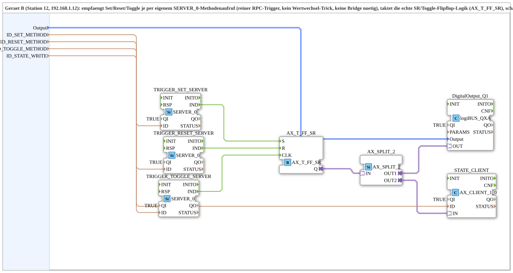

# Uebung_010e_PC_B_OPC

* * * * * * * * * *

## Introduction

`Uebung_010e_PC_B_OPC` is the device-B side (station 12, 192.168.1.12): receives set/reset/toggle each via its own `SERVER_0` method call (a pure RPC trigger, no value-change trick, no bridge needed), clocks the actual SR/toggle flip-flop logic (`AX_T_FF_SR`), drives `DigitalOutput_Q1`, and actively writes the new state back to device A via `AX_CLIENT_1_0`. Counterpart: [`Uebung_010e_PC_A_OPC`](./Uebung_010e_PC_A_OPC.md).

## Function blocks used

- **TRIGGER_SET_SERVER / TRIGGER_RESET_SERVER / TRIGGER_TOGGLE_SERVER** (`iec61499::net::SERVER_0`): each receives its own method call.
- **AX_T_FF_SR** (`adapter::events::unidirectional::AX_T_FF_SR`): combined set/reset/toggle flip-flop logic.
- **AX_SPLIT_2** (`adapter::events::unidirectional::AX_SPLIT_2`): splits the state to the physical output + the echo.
- **DigitalOutput_Q1** (`logiBUS::io::DQ::logiBUS_QXA`): physical output.
- **STATE_CLIENT** (`adapter::net::AX_CLIENT_1_0`): actively writes the state to device A under `ID_STATE_WRITE`.

## Summary

Device-B side: receives set/reset/toggle via RPC, holds the combined SR/toggle flip-flop logic, and actively reports the state back.

---

### 🌐 Related topic subpages on ms-muc-docs.de

- [🌐 Eclipse 4diac IDE & color reference on ms-muc-docs.de](https://www.ms-muc-docs.de/iec-61499/eclipse-4diac/)
