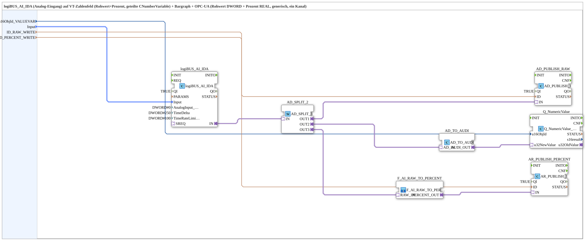

# logiBUS_AI_IDA_OPC

* * * * * * * * * *

## Introduction

`logiBUS_AI_IDA_OPC` connects a physical analog input (`logiBUS_AI_IDA`, raw value 0-4095, see [logiBUS_AI](../../../../hw/logiBUS/index.md) hardware documentation) simultaneously to a VT numeric field (raw value), a second VT numeric field/bargraph (percent), and OPC-UA: the raw value (DWORD) and a linearly converted percent value (REAL) are both published separately via OPC-UA. The percent conversion is done via [`F_AI_RAW_TO_PERCENT_AD`](./F_AI_RAW_TO_PERCENT_AD.md).

## Function Blocks Used

### Sub-blocks: logiBUS_AI_IDA_OPC

- **Type**: SubAppType
- **Internal FBs used**:
    - **logiBUS_AI_IDA**: `logiBUS::io::AI::logiBUS_AI_IDA` — physical analog input, raw value 0-4095 (12-bit), `AnalogInput_hysteresis=DWORD#0`, `TimeDelta=DWORD#250`, `TimeRateLimit=DWORD#100`, `QI=TRUE`.
    - **AD_SPLIT_2** (type `AD_SPLIT_3`): `adapter::events::unidirectional::AD_SPLIT_3` — splits the DWORD adapter value into three independent outputs (`OUT1..OUT3`).
    - **AD_PUBLISH_RAW** (type `AD_PUBLISH_1`): `adapter::net::AD_PUBLISH_1` — publishes the raw value (DWORD) via OPC-UA, target address `ID_RAW_WRITE`, `QI=TRUE`.
    - **Q_NumericValue** (type `Q_NumericValue_AUDI`): `isobus::UT::Q::Q_NumericValue_AUDI` — writes the raw value into the VT numeric field `u16ObjId_VALUEVAR`.
    - **F_AI_RAW_TO_PERCENT** (SubApp, type `F_AI_RAW_TO_PERCENT_AD`): `MyLib::sys::F_AI_RAW_TO_PERCENT_AD` — linearly converts the raw value to percent (see [F_AI_RAW_TO_PERCENT / F_AI_RAW_TO_PERCENT_AD](./F_AI_RAW_TO_PERCENT.md)).
    - **AR_PUBLISH_PERCENT** (type `AR_PUBLISH_1`): `adapter::net::AR_PUBLISH_1` — publishes the percent value (REAL) via OPC-UA, target address `ID_PERCENT_WRITE`, `QI=TRUE`.
    - **AD_TO_AUDI**: `adapter::conversion::unidirectional::AD_TO_AUDI` — converts the DWORD raw value to UDINT for the VT numeric field.
- **Operation**: The raw value is split three ways via `AD_SPLIT_2`: one branch goes directly to the raw-value OPC-UA publication, a second via `AD_TO_AUDI` to the VT raw-value numeric field, and a third via `F_AI_RAW_TO_PERCENT_AD` for percent conversion followed by OPC-UA publication.

## Program Flow and Connections

1. `Input` → `logiBUS_AI_IDA.Input`; `u16ObjId_VALUEVAR` → `Q_NumericValue.u16ObjId`; `ID_RAW_WRITE` → `AD_PUBLISH_RAW.ID`; `ID_PERCENT_WRITE` → `AR_PUBLISH_PERCENT.ID`.
2. `logiBUS_AI_IDA.IN` (adapter) → `AD_SPLIT_2.IN` (adapter).
3. `AD_SPLIT_2.OUT1` → `AD_PUBLISH_RAW.IN` (raw-value OPC-UA branch).
4. `AD_SPLIT_2.OUT2` → `AD_TO_AUDI.AD_IN`; `AD_TO_AUDI.AUDI_OUT` → `Q_NumericValue.u32NewValue` (VT raw-value branch).
5. `AD_SPLIT_2.OUT3` → `F_AI_RAW_TO_PERCENT.RAW_IN`; `F_AI_RAW_TO_PERCENT.PERCENT_OUT` → `AR_PUBLISH_PERCENT.IN` (percent OPC-UA branch).

## Technical Details

- Raw value range 0-4095 (12-bit) — see the verified AI hardware documentation for details.
- The percent conversion is purely linear and uncalibrated (no physical scaling), as explicitly noted in the SubApp definition's comment.
- Three independent consumers (two VT displays + two OPC-UA publications) run in parallel from the same `AD_SPLIT_3` branch, so all values reflect the same acquisition cycle synchronously.

## Application Scenarios

- An analog process value (e.g. level, pressure) that should be shown locally on the VT (raw and percent) and also read by an upstream SCADA system via OPC-UA in both representations (raw and percent).

## Summary

Full VT and OPC-UA integration of a physical analog input with parallel raw-value and percent representations, built from standard adapter blocks and the reusable percent conversion.

---

### 🌐 Related topic subpages on ms-muc-docs.de

- [🌐 Eclipse 4diac IDE & color reference on ms-muc-docs.de](https://www.ms-muc-docs.de/iec-61499/eclipse-4diac/)
