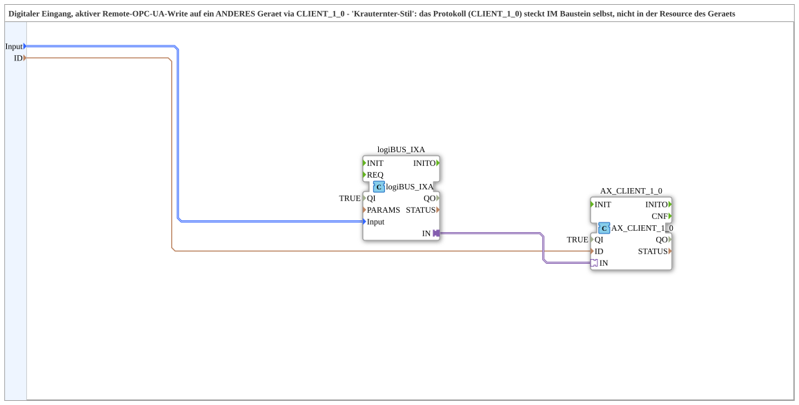

# logiBUS_IXA_TO_CLIENT_OPC

* * * * * * * * * *

## Introduction

`logiBUS_IXA_TO_CLIENT_OPC` reads a digital input (`logiBUS_IXA`) and actively writes the value to ANOTHER device via OPC-UA using `AX_CLIENT_1_0` - "Krauternter style" (per the source comment): the protocol (`AX_CLIENT_1_0`) lives INSIDE the block itself, not in the device's resource, unlike the "SUB style" of the PC_A/PC_B blocks, where trigger/server instances are wired separately in the composite.

## Function blocks used

- **logiBUS_IXA** (`logiBUS::io::DI::logiBUS_IXA`): physical digital input, identified via `Input_I1..I8`.
- **AX_CLIENT_1_0** (`adapter::net::AX_CLIENT_1_0`): actively writes the adapter value to the remote target address `ID` (including the target device's `opc.tcp://` endpoint).

## Summary

Single-block bridge from a physical digital input to an active remote write on another device - counterpart to [`logiBUS_QXA_FROM_SUBSCRIBE_OPC`](./logiBUS_QXA_FROM_SUBSCRIBE_OPC.md) on the receiving side.

---

### 🌐 Related topic subpages on ms-muc-docs.de

- [🌐 Eclipse 4diac IDE & color reference on ms-muc-docs.de](https://www.ms-muc-docs.de/iec-61499/eclipse-4diac/)
