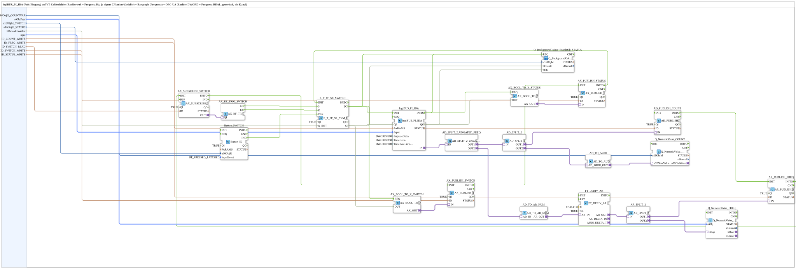

# logiBUS_PI_IDA_OPC

* * * * * * * * * *

## Introduction

`logiBUS_PI_IDA_OPC` connects a physical pulse/counter input (`logiBUS_PI_IDA`) to two independent VT numeric fields (raw counter value and a frequency in Hz derived from it) and to OPC-UA: the raw counter value (DWORD) is published directly, while the frequency is computed from the counter via a time derivative (`FT_DERIV_AR`) and published separately (REAL, physically scaled via `NumericObjectPool_S`).

## Function Blocks Used

### Sub-blocks: logiBUS_PI_IDA_OPC

- **Type**: SubAppType
- **Internal FBs used**:
    - **logiBUS_PI_IDA**: `logiBUS::io::PI::logiBUS_PI_IDA` — physical pulse input, `ImpulseDelta=DWORD#100`, `TimeDelta=DWORD#250`, `TimeRateLimit=DWORD#100`, `QI=TRUE`.
    - **AD_SPLIT_2** (type `AD_SPLIT_3`): `adapter::events::unidirectional::AD_SPLIT_3` — splits the DWORD counter value into three outputs.
    - **AD_PUBLISH_COUNT** (type `AD_PUBLISH_1`): `adapter::net::AD_PUBLISH_1` — publishes the raw counter value via OPC-UA, target address `ID_COUNT_WRITE`.
    - **AD_TO_AUDI**: `adapter::conversion::unidirectional::AD_TO_AUDI` — converts DWORD to UDINT for the VT counter field.
    - **Q_NumericValue_COUNT** (type `Q_NumericValue_AUDI`): `isobus::UT::Q::Q_NumericValue_AUDI` — writes the raw counter value into `u16ObjId_COUNTVAR`.
    - **AD_TO_AR_NUM**: `adapter::conversion::unidirectional::AD_TO_AR_NUM` — numerically correct conversion from the DWORD counter value to REAL for the derivative.
    - **FT_DERIV_AR**: `OSCAT_adapter::Control::FT_DERIV_AR` — time derivative (`K=1.0`, `run=TRUE`), yields the rate of change of the counter value = frequency in Hz.
    - **AR_SPLIT_2**: `adapter::events::unidirectional::AR_SPLIT_2` — splits the frequency value into two outputs.
    - **AR_PUBLISH_FREQ** (type `AR_PUBLISH_1`): `adapter::net::AR_PUBLISH_1` — publishes the frequency via OPC-UA, target address `ID_FREQ_WRITE`.
    - **Q_NumericValue_FREQ** (type `Q_NumericValue_PHYSA`): `isobus::UT::Q::Q_NumericValue_PHYSA` — writes the physically scaled frequency (`stObjFreq`: `r32Scale`, `i32Offset`, `u8Decimals`) into the VT numeric field/bargraph.
- **Operation**: The raw counter value is split three ways: one branch goes directly to OPC-UA publication, a second via `AD_TO_AUDI` to the VT counter field, and a third via `AD_TO_AR_NUM` and `FT_DERIV_AR` to compute the frequency, whose result is in turn split again (OPC-UA publication and VT display).

## Program Flow and Connections

1. `Input` → `logiBUS_PI_IDA.Input`; `u16ObjId_COUNTVAR` → `Q_NumericValue_COUNT.u16ObjId`; `stObjFreq` → `Q_NumericValue_FREQ.stObj`; `ID_COUNT_WRITE` → `AD_PUBLISH_COUNT.ID`; `ID_FREQ_WRITE` → `AR_PUBLISH_FREQ.ID`.
2. `logiBUS_PI_IDA.IN` (adapter) → `AD_SPLIT_2.IN` (adapter).
3. `AD_SPLIT_2.OUT1` → `AD_PUBLISH_COUNT.IN` (raw counter OPC-UA branch).
4. `AD_SPLIT_2.OUT2` → `AD_TO_AUDI.AD_IN`; `AD_TO_AUDI.AUDI_OUT` → `Q_NumericValue_COUNT.u32NewValue` (VT counter branch).
5. `AD_SPLIT_2.OUT3` → `AD_TO_AR_NUM.AD_IN`; `AD_TO_AR_NUM.AR_OUT` → `FT_DERIV_AR.AR_IN`; `FT_DERIV_AR.AR_OUT` → `AR_SPLIT_2.IN` (frequency computation branch).
6. `AR_SPLIT_2.OUT1` → `AR_PUBLISH_FREQ.IN` (frequency OPC-UA branch).
7. `AR_SPLIT_2.OUT2` → `Q_NumericValue_FREQ.rPhys` (frequency VT branch).

## Technical Details

- The frequency is not delivered by the hardware FB itself but computed purely from the time derivative (`FT_DERIV_AR`, `K=1.0`) of the raw, monotonically increasing counter value — the counter itself is never reset.
- `AD_TO_AR_NUM` is deliberately used instead of `AD_TO_AR` to obtain a numerically correct DWORD→REAL conversion rather than a bit reinterpretation (the same pitfall described for [`F_AI_RAW_TO_PERCENT_AD`](./F_AI_RAW_TO_PERCENT_AD.md)).
- Counter value and frequency use independent VT numeric fields (`u16ObjId_COUNTVAR` and `stObjFreq`) with different scaling — the frequency display additionally uses `NumericObjectPool_S` for physical scaling/decimals, the counter does not.

## Application Scenarios

- A flow meter or speed sensor where both the raw (unbounded, ever-increasing) counter value for diagnostic purposes and a derived, immediately interpretable frequency (e.g. Hz, RPM) should be displayed and transmitted.

## Summary

Full VT and OPC-UA integration of a physical pulse input, with a parallel raw counter value and a frequency computed from it via a time derivative.

---

### 🌐 Related topic subpages on ms-muc-docs.de

- [🌐 Eclipse 4diac IDE & color reference on ms-muc-docs.de](https://www.ms-muc-docs.de/iec-61499/eclipse-4diac/)
