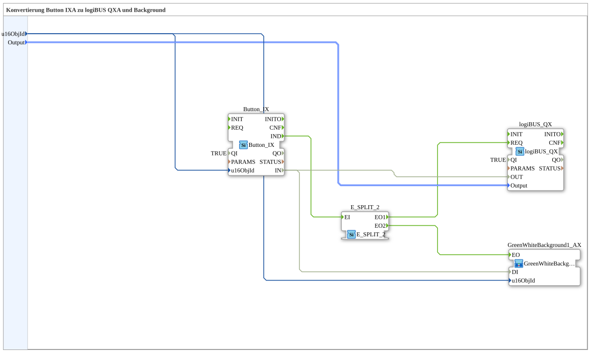

# Button_IX_TO_logiBUS_QX_BG

* * * * * * * * * *

## Introduction

`Button_IX_TO_logiBUS_QX_BG` extends [`Button_IX_TO_logiBUS_QX`](./Button_IX_TO_logiBUS_QX.md) with a VT status color — the test_B counterpart to [`Button_IXA_TO_logiBUS_QXA_BG`](../../MyLib_AX/sys/Button_IXA_TO_logiBUS_QXA_BG.md).

## Function Blocks (FBs) Used

### Sub-blocks: Button_IX_TO_logiBUS_QX_BG

- **Type**: SubAppType
- **Internal FBs used**:
    - **Button_IX**: `isobus::UT::io::Button::Button_IX` — VT button.
    - **logiBUS_QX**: `logiBUS::io::DQ::logiBUS_QX` — physical digital output.
    - **E_SPLIT_2**: `iec61499::events::E_SPLIT_2` — splits the button event.
    - **GreenWhiteBackground1_AX** (SubApp, actually of type `MyLib::sys::GreenWhiteBackground1C` — a compact wrapper around the test_B base variant, see [Background Color Blocks](../../MyLib_AX/sys/Background-Color-Blocks.md)): sets the status color.
- **Functionality**: `Button_IX.IND` is distributed via `E_SPLIT_2` to `logiBUS_QX.REQ` and to the color block; the data value `Button_IX.IN` feeds both `logiBUS_QX.OUT` and `GreenWhiteBackground1_AX.DI`.

## Program Flow and Connections

1. `u16ObjId` → `Button_IX.u16ObjId` and the color block instance's `.u16ObjId`; `Output` → `logiBUS_QX.Output`.
2. `Button_IX.IND` → `E_SPLIT_2.EI` → `E_SPLIT_2.EO1` → `logiBUS_QX.REQ`, `E_SPLIT_2.EO2` → color block `.EO`.
3. `Button_IX.IN` → `logiBUS_QX.OUT` and → color block `.DI`.

## Application Scenarios

- VT button with visual status feedback for test_B, without OPC-UA.

## Summary

test_B counterpart to `Button_IXA_TO_logiBUS_QXA_BG`, using `E_SPLIT_2` instead of `AX_SPLIT_2` and the compact-wrapper variant of the background block.

---

### 🌐 Related topic subpages on ms-muc-docs.de

- [🌐 Eclipse 4diac IDE & color reference on ms-muc-docs.de](https://www.ms-muc-docs.de/iec-61499/eclipse-4diac/)
