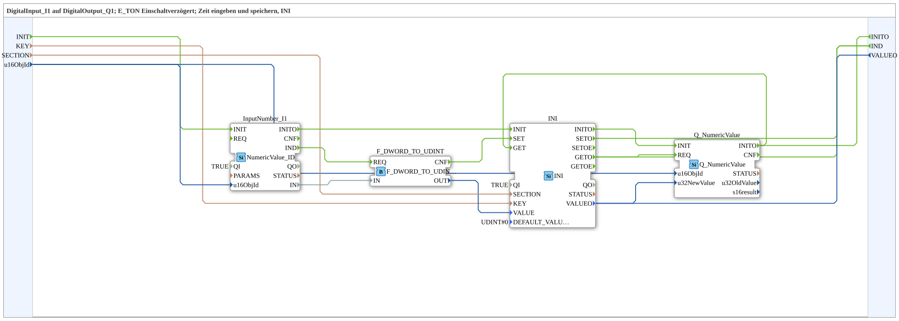

# INI_IN_AND_STORE_UDINT

* * * * * * * * * *

## Introduction

`INI_IN_AND_STORE_UDINT` persistently stores a UDINT value entered via the VT in an INI file and automatically reloads it on deployment. This is the MyLib_B variant of the INI storage family known from MyLib_AX.

For the general pattern, see [INI_IN_AND_STORE / NVS_IN_AND_STORE (shared pattern)](../../MyLib_AX/sys/INI-NVS-Storage-Blocks.md).

## Summary

UDINT variant of the INI storage family (MyLib_B).

---

### 🌐 Related topic subpages on ms-muc-docs.de

* [🌐 Eclipse 4diac IDE & color reference on ms-muc-docs.de](https://www.ms-muc-docs.de/iec-61499/eclipse-4diac/)
