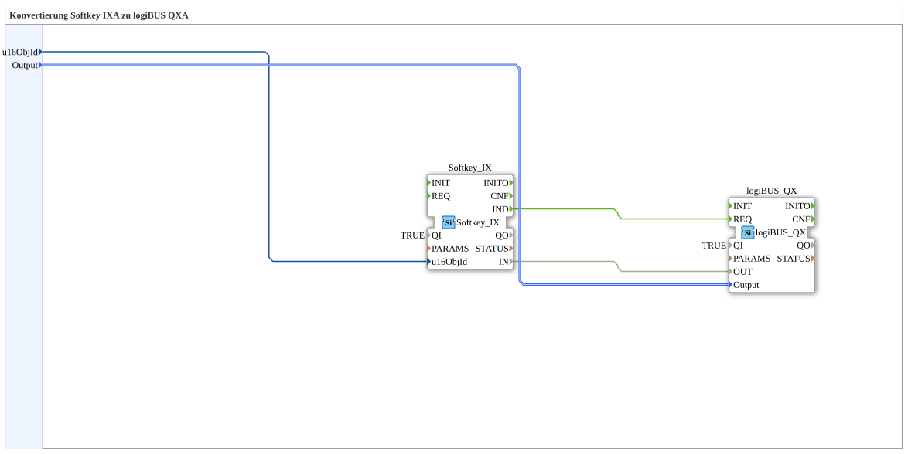

# Softkey_IX_TO_logiBUS_QX

* * * * * * * * * *

## Introduction

`Softkey_IX_TO_logiBUS_QX` is the test_B counterpart to [`Softkey_IXA_TO_logiBUS_QXA`](../../MyLib_AX/sys/Softkey_IXA_TO_logiBUS_QXA.md) — a VT softkey (`Softkey_IX`) directly switches a physical output (`logiBUS_QX`), without adapters.

## Function Blocks (FBs) Used

### Sub-blocks: Softkey_IX_TO_logiBUS_QX

- **Type**: SubAppType
- **Internal FBs used**:
    - **Softkey_IX**: `isobus::UT::io::Softkey::Softkey_IX` — VT softkey (non-adapter variant).
    - **logiBUS_QX**: `logiBUS::io::DQ::logiBUS_QX` — physical digital output.
- **Functionality**: `Softkey_IX.IND` triggers `logiBUS_QX.REQ`; `Softkey_IX.IN` is wired directly to `logiBUS_QX.OUT`.

## Program Flow and Connections

1. `u16ObjId` → `Softkey_IX.u16ObjId`; `Output` → `logiBUS_QX.Output`.
2. `Softkey_IX.IND` → `logiBUS_QX.REQ`; `Softkey_IX.IN` → `logiBUS_QX.OUT`.

## Application Scenarios

- Minimal softkey-to-output block for test_B.

## Summary

test_B counterpart to `Softkey_IXA_TO_logiBUS_QXA`.

---

### 🌐 Related topic subpages on ms-muc-docs.de

- [🌐 Eclipse 4diac IDE & color reference on ms-muc-docs.de](https://www.ms-muc-docs.de/iec-61499/eclipse-4diac/)
