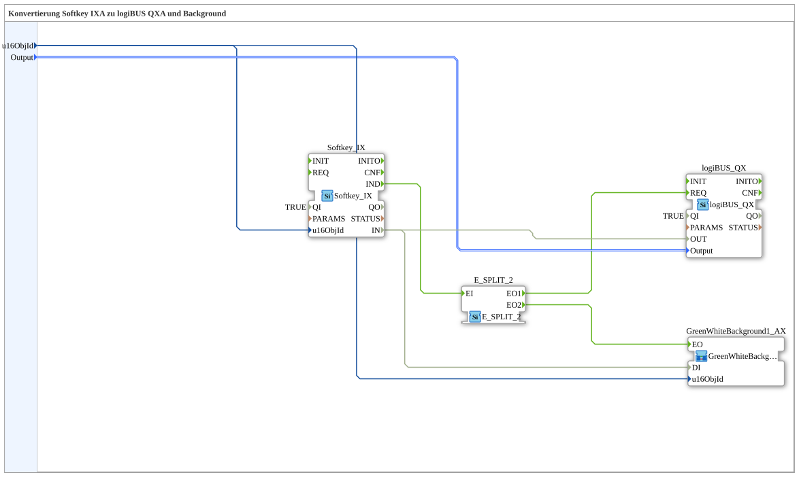

# Softkey_IX_TO_logiBUS_QX_BG

* * * * * * * * * *

## Introduction

`Softkey_IX_TO_logiBUS_QX_BG` extends [`Softkey_IX_TO_logiBUS_QX`](./Softkey_IX_TO_logiBUS_QX.md) with a VT status color — the test_B counterpart to [`Softkey_IXA_TO_logiBUS_QXA_BG`](../../MyLib_AX/sys/Softkey_IXA_TO_logiBUS_QXA_BG.md).

## Function Blocks (FBs) Used

### Sub-blocks: Softkey_IX_TO_logiBUS_QX_BG

- **Type**: SubAppType
- **Internal FBs used**:
    - **Softkey_IX**: `isobus::UT::io::Softkey::Softkey_IX` — VT softkey.
    - **logiBUS_QX**: `logiBUS::io::DQ::logiBUS_QX` — physical digital output.
    - **E_SPLIT_2**: `iec61499::events::E_SPLIT_2` — splits the softkey event.
    - **Color block** (compact background variant, see [Background Color Blocks](../../MyLib_AX/sys/Background-Color-Blocks.md)): sets the status color.
- **Functionality**: `Softkey_IX.IND` is distributed via `E_SPLIT_2` to `logiBUS_QX.REQ` and the color block; `Softkey_IX.IN` feeds `logiBUS_QX.OUT` and the color block.

## Program Flow and Connections

1. `u16ObjId` → `Softkey_IX.u16ObjId` and the color block's `.u16ObjId`; `Output` → `logiBUS_QX.Output`.
2. `Softkey_IX.IND` → `E_SPLIT_2.EI` → `EO1` → `logiBUS_QX.REQ`, `EO2` → color block `.EO`.
3. `Softkey_IX.IN` → `logiBUS_QX.OUT` and → color block `.DI`.

## Application Scenarios

- VT softkey with visual status feedback for test_B, without OPC-UA.

## Summary

test_B counterpart to `Softkey_IXA_TO_logiBUS_QXA_BG`.

---

### 🌐 Related topic subpages on ms-muc-docs.de

- [🌐 Eclipse 4diac IDE & color reference on ms-muc-docs.de](https://www.ms-muc-docs.de/iec-61499/eclipse-4diac/)
