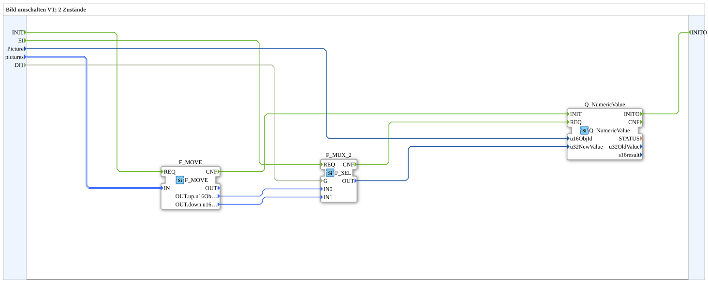

# SwitchPic_2_1

* * * * * * * * * *

## Introduction

`SwitchPic_2_1` switches a VT picture (object pointer) between 2 states (`up`/`down`) based on a boolean selector (`DI1`) — only the regular VT object (`Picture`, via `Q_NumericValue`), no AUX object.

For the general pattern, see [SwitchPic(Col) Blocks (shared pattern)](./SwitchPic-Blocks.md).

## Summary

Variant "1" (regular object only) of the 2-state picture switch.

---

### 🌐 Related topic subpages on ms-muc-docs.de

* [🌐 Eclipse 4diac IDE & color reference on ms-muc-docs.de](https://www.ms-muc-docs.de/iec-61499/eclipse-4diac/)
