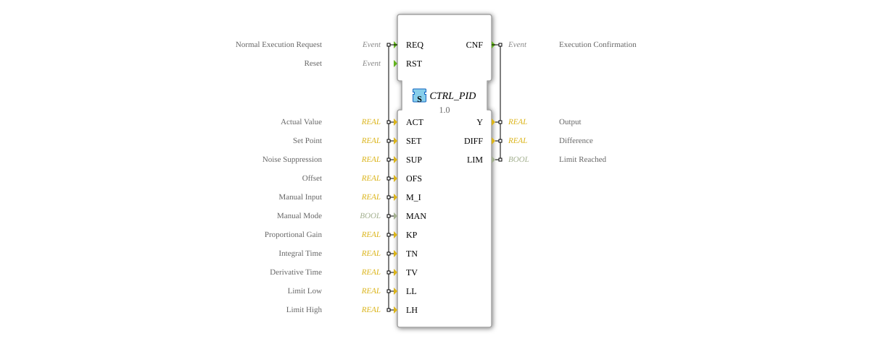

# CTRL_PID

FT_PI is a PI controller with manual functionality.
version 2.0 June 30th 2008
programmer hugo
tested by oscat
The PID controller works according to the fomula Y = e *(KP+ KI * INTEG(e) ) + offset, while e = set_point - actual.
a rst will reset all internal data, while a switch to manual will cause the controller to follow the function Y = manual_in + offset.
limit_h and Limit_l set the possible output range of Y.
The output flags lim will signal that the output limits are active.

## Interface

### Event inputs

| Name | Comment | With |
| :--- | :--- | :--- |
| REQ | Normal Execution Request | ACT, SET, SUP, OFS, M_I, MAN, KP, TN, TV, LL, LH |
| RST | Reset | |

### Event Outputs

| Name | Comment | With |
| :--- | :--- | :--- |
| CNF | Execution Confirmation | Y, DIFF, LIM |

### Input Vars

| Name | Type | Initial Value | Comment |
| :--- | :--- | :--- | :--- |
| ACT | REAL | | Actual Value |
| SET | REAL | | Set Point |
| SUP | REAL | | Noise Suppression |
| OFS | REAL | | offset |
| M_I | REAL | | Manual Input |
| MAN | BOOL | | Manual Mode |
| CP | REAL | 1.0 | Proportional Gain |
| TN | REAL | 1.0 | Integral Time |
| TV | REAL | 1.0 | Derivative Time |
| LL | REAL | -1000.0 | Limit Low |
| LH | REAL | 1000.0 | Limit High |

### Output Vars

| Name | Type | Comment |
| :--- | :--- | :--- |
| Y | REAL | Output |
| DIFF | REAL | Difference |
| LIM | BOOL | Limit Reached |

## 🛠️ Related exercises

* [Uebung_153](../../../../../../../Uebungen/test_B/Uebungen_doc/Uebung_153.md)
