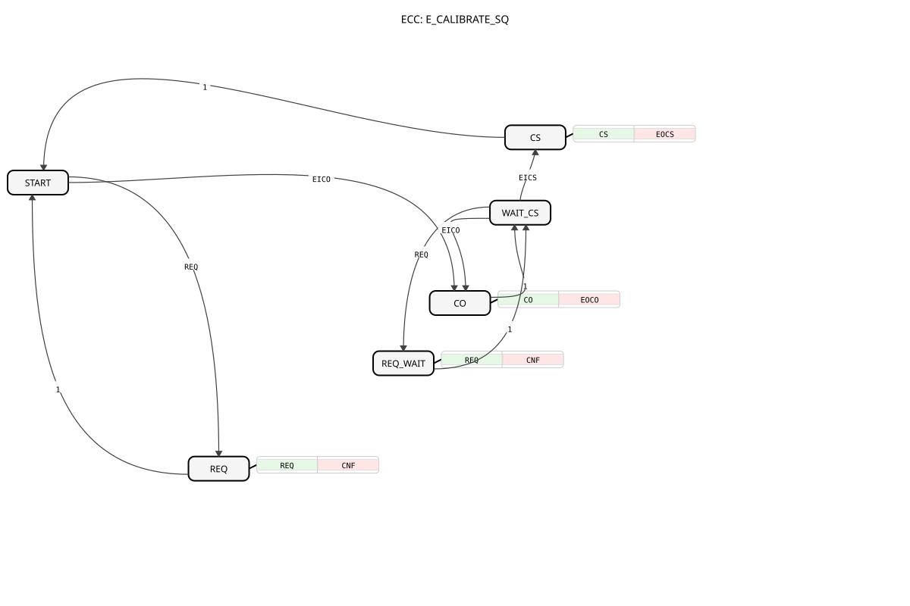

# E_CALIBRATE_SQ




* * * * * * * * * *
## Introduction

`E_CALIBRATE_SQ` is the variant of [E_CALIBRATE](E_CALIBRATE.md) with **enforced ordering**: scale calibration (`EICS`) only becomes reachable after offset calibration (`EICO`) has run at least once. It also uses a more robust formula that computes `Y` correctly after offset calibration regardless of the current `SCALE` value.

## Interface Structure

### **Event Inputs**

- **REQ**: normal execution request -- computes `Y`. Carries `X`, `Y_Offset`, `Y_Scale`, `OFFSET`, `SCALE`.
- **EICO**: calibrates the offset. Carries `X`, `Y_Offset`, `SCALE`.
- **EICS**: calibrates the scale, correcting `OFFSET` based on both reference points. Only reachable after `EICO` has already run. Carries `X`, `Y_Scale`, `OFFSET`.

### **Event Outputs**

- **CNF**: confirms `REQ`, carries `Y`.
- **EOCO**: confirms offset calibration, carries `OFFSET`.
- **EOCS**: confirms scale calibration, carries `SCALE`, `OFFSET`.

### **Data Inputs**

- **X** (REAL): raw input value.
- **Y_Offset** (REAL): target output value at the low reference point.
- **Y_Scale** (REAL): target output value at the high reference point.

### **Data Outputs**

- **Y** (REAL): calibrated output value.

### **In/Out Variables**

- **OFFSET** (REAL, initial `0.0`): stored offset value.
- **SCALE** (REAL, initial `1.0`): stored scale factor.

### **Internal Variables**

- **X_LOW_INT** (REAL): raw value of the low reference point, stored on `EICO` -- used as the second anchor point in the later `EICS` calculation.
- **Y_LOW_INT** (REAL): target value (`Y_Offset`) of the low reference point, stored on `EICO`.

## Functionality

`E_CALIBRATE_SQ` has a start state `START` and models the two-point calibration as an enforced sequence:

- From `START`, `EICO` is reachable (state `CO`): it stores the current raw and target value in `X_LOW_INT`/`Y_LOW_INT` and computes `OFFSET := Y_Offset / SCALE - X` (falling back to `Y_Offset - X` when `SCALE = 0`). Unlike `E_CALIBRATE`, `Y = Y_Offset` holds **always** afterward, regardless of the current `SCALE`.
- After `CO`, the block automatically transitions to `WAIT_CS` -- **only from here is `EICS` reachable**.
- In `WAIT_CS`, `REQ` remains available (via the intermediate state `REQ_WAIT`, which immediately returns to `WAIT_CS`), and `EICO` can be fired again to re-calibrate the offset.
- `EICS` (reachable only from `WAIT_CS`) computes `SCALE := (Y_Scale - Y_LOW_INT) / (X - X_LOW_INT)` from **both** reference points, then corrects `OFFSET := Y_LOW_INT / SCALE - X_LOW_INT` -- the resulting line passes exactly through both calibrated points. The block then returns to `START` (calibration complete).

**Example** (4-20 mA pressure sensor via logiBUS, normalized to `0.0..1.0`, desired output range `0.0..500.0`):

| Step | Action | Result |
|---|---|---|
| 1 | Apply 4 mA (`X=0.0`), `Y_Offset=0.0`, fire `EICO` | `OFFSET = 0/1 - 0 = 0` |
| 2 | Apply 20 mA (`X=1.0`), `Y_Scale=500.0`, fire `EICS` | `SCALE = 500/(1+0) = 500` |

Result: `Y = (X + 0) * 500 = X * 500 = 0..500`.

## Technical Details

- **ECC-enforced ordering**: `EICS` is reachable only from `WAIT_CS`, which is only reached via a successful `EICO` calibration -- unlike `E_CALIBRATE`, where both events fire from `REQ` at any time.
- **`Y` after CO always correct**: `OFFSET := Y_Offset / SCALE - X` makes `Y = Y_Offset` hold after offset calibration regardless of the current `SCALE` value -- unlike `E_CALIBRATE`, where this only holds when `SCALE = 1`.
- **Two-point calculation on CS**: `EICS` doesn't just use the current reference point but computes `SCALE` and `OFFSET` jointly from the values stored on `EICO` (`X_LOW_INT`/`Y_LOW_INT`) and the current point -- the resulting line hits both reference points exactly.
- **Offset re-calibration always possible**: `EICO` is reachable again from `WAIT_CS` too, without needing to restart the sequence from scratch.

## State Overview

```
START   --REQ-----> REQ      --1--> START     (normal operation)
START   --EICO----> CO       --1--> WAIT_CS   (offset calibrated)
WAIT_CS --REQ-----> REQ_WAIT --1--> WAIT_CS   (normal operation with offset)
WAIT_CS --EICO----> CO       --1--> WAIT_CS   (re-calibrate offset)
WAIT_CS --EICS----> CS       --1--> START     (scale calibrated, done)
```

## Application Scenarios

- Calibration workflows where a wrong order (scale before offset) must be reliably ruled out
- Sensors where `Y` needs to be correct right after offset calibration (e.g. for an intermediate display), independent of the not-yet-calibrated `SCALE`
- Guided calibration wizards in a UI that step the user through offset and scale calibration in sequence

## ⚖️ Comparison with Similar Blocks

| Feature | [CALIBRATE](CALIBRATE.md) | [E_CALIBRATE](E_CALIBRATE.md) | `E_CALIBRATE_SQ` |
|---|---|---|---|
| CO formula | `OFFSET := Y_Offset - X` | `OFFSET := Y_Offset - X` | `OFFSET := Y_Offset / SCALE - X` |
| Y after CO | correct only when `SCALE = 1` | correct only when `SCALE = 1` | always correct |
| Order enforced | No (`SimpleFB`) | No (ECC, both from `REQ`) | Yes (ECC: `EICS` only from `WAIT_CS`) |
| Trigger | BOOL inputs (`CO`, `CS`) | Events | Events |

## Conclusion

`E_CALIBRATE_SQ` is the most robust of the four calibration variants: its ECC enforces the correct offset-before-scale order, and the two-point calculation on `EICS` yields a line that passes exactly through both reference points -- fitting anywhere an incorrect calibration order must be reliably prevented.
