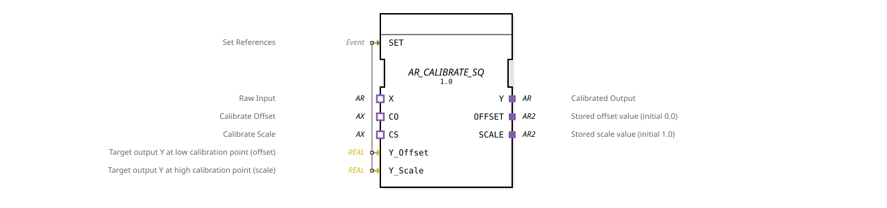

# AR_CALIBRATE_SQ

*(No image available)*

* * * * * * * * * *
## Introduction

The function block `AR_CALIBRATE_SQ` is an adapter-based, sequential block for two-point calibration (offset and subsequent scaling calibration). It ensures that the calibration steps are performed in a precisely defined mathematical and logical sequence. The internal state machine (ECC) enforces that the offset calibration (CO) must be performed before the scaling calibration (CS).

 The calibrated output is calculated using the formula:

$$Y = (X + OFFSET) \cdot SCALE$$

## Interface Structure

### **Event Inputs**

* **SET** (Type: `EInit`): Sets the reference values `Y_Offset` and `Y_Scale` in the function block.

### **Event Outputs**

* *No direct event outputs at the function block level.* (Event control is fully coupled via the adapter interfaces).

### **Data Inputs**

* **Y_Offset** (Type: `REAL`): Desired target output value $Y$ at the low calibration point (offset).
* **Y_Scale** (Type: `REAL`): Desired target output value $Y$ at the high calibration point (scaling).

### **Data Outputs**

* *No direct data outputs at the component level.* (Data is transferred via the adapter interfaces).

### **Adapters**

#### **Plugs (Output-side / Memory Connections)**

* **Y** (Type: `adapter::types::unidirectional::AR`): The calibrated output value.
* **OFFSET** (Type: `adapter::types::bidirectional::AR2`): Connection to the memory of the offset value (default initial value: 0.0).
* **SCALE** (Type: `adapter::types::bidirectional::AR2`): Connection to the memory of the scale value (default initial value: 1.0).

#### **Sockets (Input Side / Sensor Connections)**

* **X** (Type: `adapter::types::unidirectional::AR`): The uncalibrated raw input of the sensor.
* **CO** (Type: `adapter::types::unidirectional::AX`): Command to perform offset calibration ("Calibrate Offset").
* **CS** (Type: `adapter::types::unidirectional::AX`): Command to perform scale calibration ("Calibrate Scale").

## Functionality

The calibration process consists of two main, mathematically decoupled sequential steps:

### 1. Offset Calibration (CO)

1. The sensor is supplied with the low reference value.
2. The desired target value is applied to `Y_Offset`.
3. The trigger `CO.E1` (with `CO.D1` = TRUE) is activated.
4. Offset calculation:

$$\text{OFFSET} := \frac{Y\_Offset}{\text{SCALE}} - X$$

*Note:* After this step, the output $Y$ corresponds exactly to the value `Y_Offset`, regardless of the current scaling value.

### 2. Scaling Calibration (CS)

1. The sensor is supplied with the high reference value.
2. The desired target value is applied to `Y_Scale`.
3. The trigger `CS.E1` (with `CS.D1` = TRUE) is activated.
4. Calculation of Scaling and Offset (based on both reference points):

$$\text{SCALE} := \frac{Y\_Scale - Y\_LOW\_INT}{X - X\_LOW\_INT}$$

$$\text{OFFSET} := \frac{Y\_LOW\_INT}{\text{SCALE}} - X\_LOW\_INT$$

*Note:* After this step, the characteristic curve passes exactly through both calibration points.

## Technical Features

* **ECC-enforced sequence:** The state for scaling calibration (`CS`) can only be reached in the state machine after an offset calibration has taken place in state `CO`. Directly triggering `CS` from the idle state is not possible.
* **Offset Flexibility:** Offset calibration (`CO`) can be repeated at any time in state `WAIT_CS` if zero-point corrections are necessary.
* **Continuous Calculation:** The regular calculation of the output value $Y$ via the raw value input `X.E1` is performed in every state of the function block.
* **Internal Variables:**
* `X_LOW_INT` (REAL): Temporarily stores the uncalibrated raw value during the CO step.
* `Y_LOW_INT` (REAL): Stores the desired target value (`Y_Offset`) during the CO step.

## State Overview

* **IDLE:** Idle state. Waits for raw data or the start of calibration.
* **IDLE:** * **REQ:** Calculates the calibrated output value $Y$ during normal operation.
* **CO:** Performs the offset calibration and saves the intermediate values.
* **WAIT_CS:** State after offset calibration. Calculations continue normally; the system waits for scaling calibration.
* **REQ_WAIT:** Calculates the calibrated output value $Y$ while waiting for scaling calibration.
* **CS:** Performs the final scaling calibration and recalculates the parameters. Then returns to the state `IDLE`.

## Application Scenarios

* **Precise Sensor Calibration:** Ideal for industrial sensors (e.g., scales, pressure sensors, or temperature sensors) that require cyclical manual or automated calibration.

**REQ_WAIT:** Calculates the calibrated output value $Y$ while waiting for scaling calibration. * **Mistake Minimization During Commissioning:** The fixed sequence (first zero point/offset, then slope/scaling) effectively prevents operator miscalibrations.

## Comparison with Similar Function Blocks

| Feature | AR_CALIBRATE | AR_CALIBRATE_SQ |
| :--- | :--- | :--- |
**CO Calculation Formula** | $\text{OFFSET} := Y\_Offset - X$ | $\text{OFFSET} := \frac{Y\_Offset}{\text{SCALE}} - X$ |
**Output Y to CO** | $Y = Y\_Offset \cdot \text{SCALE}$ (only correct for $\text{SCALE} = 1$) | $Y = Y\_Offset$ (always mathematically correct) |
**Sequence Control** | No restrictions (CO and CS can be triggered arbitrarily) | ECC enforced (CO must always precede CS) |

## Conclusion

The `AR_CALIBRATE_SQ` is a mathematically optimized and reliable evolution of classic calibration modules. By linking the offset calculation to the current scaling factor and ensuring the calibration sequence is protected by software, it offers an excellent platform for error-free and highly precise two-point measurement corrections in IEC 61499 applications.