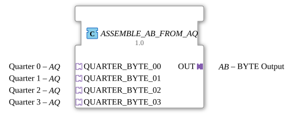

# ASSEMBLE_AB_FROM_AQ

* * * * * * * * * *
## Introduction
The function block **ASSEMBLE_AB_FROM_AQ** combines four **AQ** quarter adapters (quarter bytes) into a single **AB** byte adapter. It encapsulates the logic for assembling a complete byte from four incoming 4-bit values and providing it via a standardized adapter interface. The block is specifically designed for use in distributed automation systems according to IEC 61499.
## Interface Structure

### **Event Inputs**

The block does not have dedicated top-level event inputs.

All incoming events are transmitted via the **adapter sockets**. Each application adapter of type `AQ` has an event output `E1`, which is internally connected to the REQ input of the assembly module.

### **Event Outputs**
- **OUT.E1**: Event output of the byte adapter. It becomes active as soon as a new byte has been fully assembled and clocked via the internal flip-flop.

### **Data Inputs**

Data is read in via the **adapter sockets** in the form of 4-bit values (nibbles):

- **QUARTER_BYTE_00.D1**: Nibble for the least significant bits (bits 0-3)
- **QUARTER_BYTE_01.D1**: Nibble for bits 4-7
- **QUARTER_BYTE_02.D1**: Nibble for bits 8-11
- **QUARTER_BYTE_03.D1**: Nibble for bits 12-15

(Note: The actual bit order may vary depending on the implementation of the internal `ASSEMBLE_BYTE_FROM_QUARTERS` module; usually, the bits are combined in ascending order.)

### **Data Outputs**
- **OUT.D1**: Output of the byte adapter. Returns the fully assembled byte (8 bits) as an integer value.

### **Adapter**

| Type | Direction | Name | Description |

|-----|----------|------|--------------|

| `adapter::types::unidirectional::AQ` | Socket (Input) | `QUARTER_BYTE_00` .. `QUARTER_BYTE_03` | Four quarter adapters, each providing a nibble and an event. |

| `adapter::types::unidirectional::AB` | Plug (Output) | `OUT` | Byte adapter providing the assembled byte and an event. |

## Functionality

The function block operates entirely event-driven. As soon as one of the four connected AQ adapters sends an event on its `E1` output, this event is forwarded to the internal component `ASSEMBLE_BYTE_FROM_QUARTERS` (event `REQ`). Simultaneously, the current nibble values from all four AQ adapter inputs are transferred to the assembly component via data connections.

The assembly component internally combines the four nibbles into an 8-bit value. After successful processing, it sends an acknowledgment event `CNF` to the edge-triggered D flip-flop (`E_D_FF_ANY`). The flip-flop takes the data value (from the assembly output) on a rising edge and passes it to the data output `OUT.D1`. Simultaneously, the output event `OUT.E1` is generated.

Thus, the output is always clock-synchronized: Only when a complete byte has been calculated is it passed through. Multiple events on different quarter inputs lead to repeated calculations, with all four current nibble values being reprocessed each time.

## Technical Features
- **Internal Cascading**: The function block uses two internal blocks – `ASSEMBLE_BYTE_FROM_QUARTERS` for bit combination and `E_D_FF_ANY` for edge-triggered output.
- **Event Synchronization**: Every incoming event triggers the assembly; it is not necessary for all four adapters to deliver an event simultaneously – the block operates with the currently available data.
- **Adapter Interface**: Input and output are exclusively via unidirectional adapters, which simplifies reuse in application networks.
- **No state storage in the function block itself**: The function block is a pure network component that completely delegates logic.

## State Overview

The function block does not have its own state machine. The internal logic is determined by the states of `ASSEMBLE_BYTE_FROM_QUARTERS` and `E_D_FF_ANY`:

1. **Waiting for input event**: After initialization or processing, the function block waits for an event from one of the AQ adapters.

2. **Assembly**: At `REQ`, the nibbles are assembled; the D flip-flop waits for the `CNF` event.

3. **Output**: After the flip-flop is clocked, the result is sent to the OUT adapter. The function block then returns to the wait state.

## Application Scenarios
- **Bus Data Merging**: When four separate 4-bit lines (e.g., from sensors or data sources) need to be combined into a single byte.
- **Adapter-Based Data Integration**: In systems based on IEC 61499 adapter architecture, this function block can serve as a generic "byte assembler" at the network layer.
- **Protocol Conversion**: From a quarter-byte protocol to a full-byte protocol, e.g., in serial communication.
- **Test and Simulation Environments**: For easily connecting test adapters.

## Comparison with Similar Function Blocks
- **ASSEMBLE_BYTE_FROM_QUARTERS** (direct): This function block operates without adapters – it expects four separate data and event inputs. This function block encapsulates this interface in adapters, which increases modularity.
- **ARRAY_TO_BYTE** or similar function blocks: Often implemented using arrays; here specifically for exactly four nibbles and with adapter support.
- **Custom Adapter-Based Assembler**: If needed, `ASSEMBLE_AB_FROM_AQ` can be easily modified for other data widths by adjusting the internal function blocks.

## Conclusion

The **ASSEMBLE_AB_FROM_AQ** function block offers an elegant, adapter-based solution for merging four quarter-byte data streams into a full byte. Thanks to the internal cascading of assembly logic and edge-triggered output, the behavior is deterministic and integrates well into event-driven systems. It is particularly suitable for modular automation projects based on IEC 61499 adapter architecture that require a clean separation of data and event flows.