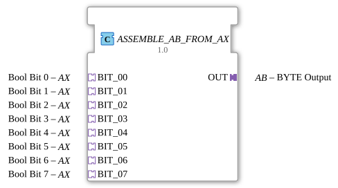

# ASSEMBLE_AB_FROM_AX

* * * * * * * * * *
## Introduction
The **ASSEMBLE_AB_FROM_AX** function block combines eight Boolean signals, provided via AX adapters (unidirectional, Bool), into a single byte and outputs it via an AB adapter (unidirectional, BYTE). It encapsulates the logic for byte generation and provides a modular, adapter-based interface for processing 8 bits.
## Interface Structure

### **Event Inputs**
None. Events are received exclusively via the adapter sockets.

### **Event Outputs**
None. Events are output exclusively via the adapter plug.

### **Data Inputs**
None. All data is transmitted via the adapter sockets.

### **Data Outputs**

None. All data is output via the adapter plug.

### **Adapter**

| Direction | Name | Type | Description |

|----------|------|-----|--------------|

| **Socket** (Input) | `BIT_00` | `adapter::types::unidirectional::AX` | Boolean value for bit 0 (least significant bit) |

| | `BIT_01` | `adapter::types::unidirectional::AX` | Boolean value for bit 1 |

| | `BIT_02` | `adapter::types::unidirectional::AX` | Boolean value for bit 2 |

| | `BIT_03` | `adapter::types::unidirectional::AX` | Boolean value for bit 3 |

| | `BIT_04` | `adapter::types::unidirectional::AX` | Boolean value for bit 4 |

| | `BIT_05` | `adapter::types::unidirectional::AX` | Boolean value for bit 5 |

| | `BIT_06` | `adapter::types::unidirectional::AX` | Boolean value for bit 6 |

| | `BIT_07` | `adapter::types::unidirectional::AX` | Boolean value for bit 7 (most significant bit) |

| **Plug** (output) | `OUT` | `adapter::types::unidirectional::AB` | Composite byte (BYTE) |

Each AX adapter provides the Boolean value via its data input `D1` and the corresponding event via its event input `E1`. The AB adapter provides the byte via its data output `D1` and the acknowledgment event via its event output `E1`.

## Functionality

The function block is implemented as a composite module and consists internally of:

1. **ASSEMBLE_BYTE_FROM_BOOLS** – Receives the eight Boolean values (from `BIT_00` to `BIT_07`) and assembles them into a byte.

2. **E_D_FF_ANY** – A D flip-flop that buffers the calculated byte value and only releases it on a rising edge at the clock input.

Procedure:

- As soon as an event arrives at **one** of the AX adapters (e.g., `BIT_00`), it is forwarded to the `REQ` input of the internal module **ASSEMBLE_BYTE_FROM_BOOLS**.
- The internal component calculates the byte from the current Boolean values of all eight adapters and places it at its data output.
- After the calculation is complete, `ASSEMBLE_BYTE_FROM_BOOLS` sends a `CNF` event, which triggers the clock input (`CLK`) of the D flip-flop **E_D_FF_ANY**.
- The flip-flop receives the current byte value and outputs it at its output `Q`.
- Simultaneously, the flip-flop's event `EO` is passed to the AB adapter's event output `OUT.E1`.

`` This ensures that the output byte is only updated when an input bit changes, and that the output is stable and synchronized.

## Technical Features
- **Adapter-Based Interface** – The component uses only adapters (`AX`/`AB`) instead of individual event and data ports. This allows for easy encapsulation and reuse in modular designs.
- **Internal D Flip-Flop** – The flip-flop prevents intermediate states and only releases the completed byte after the calculation is finished. It also acts as a buffer if multiple input events arrive in quick succession.
- **Efficient Event Control** – Every event at one of the eight AX sockets triggers a recalculation. Unnecessary updates are avoided because the output only occurs after a clock cycle.

## State Overview

The functional block does not have its own state machine; It is structured as a pure network consisting of two sub-modules. Its behavior is entirely determined by the internal logic of **ASSEMBLE_BYTE_FROM_BOOLS** and **E_D_FF_ANY**.

## Application Scenarios
- **Combining 8 digital sensors** – e.g., limit switches, light barriers, or binary inputs of a PLC, whose states are to be transmitted as bytes.
- **Bit-parallel data transmission** – Conversion of an 8-bit parallel signal into a serial byte for another module (e.g., via adapter coupling).
- **Modular automation functions** – Integration into hierarchies where multiple `ASSEMBLE_AB_FROM_AX` blocks are used to assemble larger data words (e.g., WORD, DWORD).

## Comparison with similar modules

| Module | Description | Difference |

|----------|--------------|-------------|

| `ASSEMBLE_BYTE_FROM_BOOLS` | Internal block that generates a byte from 8 Boolean inputs (without adapters) | `ASSEMBLE_AB_FROM_AX` encapsulates this block and uses adapters for connectivity. |

| `eclipse4diac::utils::assembling::ASSEMBLE_BYTE_FROM_BOOLS` | Same function, but with direct event/data ports | `ASSEMBLE_AB_FROM_AX` provides an adapter-based interface and adds a D flip-flop for synchronization. |

| Custom-built byte assembler | Can be implemented as desired, e.g., using the ST algorithm | Adapters `AX`/`AB` are predefined standard types in 4diac that promote reusability and interchangeability. |

## Conclusion

The function block **ASSEMBLE_AB_FROM_AX** is a practical, adapter-based tool for converting eight Boolean signals into one byte. Thanks to the integration of a D flip-flop, it operates reliably and avoids inconsistent intermediate states. Its modular design facilitates reuse in larger project structures, making it a useful component in automation technology with 4diac.

---

### 🌐 Related topic subpages on ms-muc-docs.de
* [🌐 Eclipse 4diac IDE & color reference on ms-muc-docs.de ](https://www.ms-muc-docs.de/iec-61499/eclipse-4diac/)
