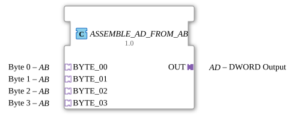

# ASSEMBLE_AD_FROM_AB


* * * * * * * * * *
## Introduction
The function block **ASSEMBLE_AD_FROM_AB** is used to combine four individual byte values, received via unidirectional **AB** adapters (bytes), into a 32-bit **DWORD** value and output it via a unidirectional **AD** adapter. The bytes are combined in the order BYTE_00 (least significant byte) to BYTE_03 (most significant byte). The function block uses an internal combiner and an edge-triggered flip-flop to update the output only after the combination is complete.
## Interface Structure
### **Event Inputs**
The function block does not have direct event inputs. Events are received via the connected **Socket Adapters** (BYTE_00 … BYTE_03).

### **Event Outputs**
There is no direct event output. The output event is provided via the **Plug Adapter** (OUT).

### **Data Inputs**
There are no direct data inputs. All data is received via the **Socket Adapters** (BYTE_00 … BYTE_03).

### **Data Outputs**

There is no direct data output. The merged DWORD value is output via the **Plug Adapter** (OUT).

### **Adapters**

| Name | Type | Direction | Description |

|------|-----|----------|--------------|

| BYTE_00 | `adapter::types::unidirectional::AB` | Socket | Byte 0 (least significant byte) |

| BYTE_01 | `adapter::types::unidirectional::AB` | Socket | Byte 1 |

| BYTE_02 | `adapter::types::unidirectional::AB` | Socket | Byte 2 |

| BYTE_03 | `adapter::types::unidirectional::AB` | Socket | Byte 3 (most significant byte) |

| OUT | `adapter::types::unidirectional::AD` | Plug | 32-bit DWORD output |

```
## Functionality

The component operates entirely within a sub-application network:

1. An event at one of the four socket adapters (BYTE_00 … BYTE_03) triggers the **REQ** input of the internal `ASSEMBLE_DWORD_FROM_BYTES` component via the respective `E1` line.

2. This component reads the current values at its data inputs (`BYTE_00` … `BYTE_03`), combines them into a 32-bit value, and signals this with **CNF**.

3. The **CNF** event triggers the **CLK** input of the internal `E_D_FF_ANY` flip-flop. The flip-flop receives the data value (the merged DWORD) present at its **D** input.

4. The flip-flop's **Q** output is permanently connected to the **D1** data output of the plug adapter **OUT**.

5. Simultaneously, the flip-flop output signal triggers the **E1** event of the plug adapter, informing the receiving side of the new value.

This ensures that the output is only updated when an event has arrived at at least one socket adapter and the merge is complete. The last merged value is retained until a new process is completed.

## Technical Features
- **Event Synchronization**: All four socket events are placed on a common `REQ` of the merge block. This triggers processing anew with each incoming byte event – it is not necessary to update all four bytes simultaneously.
- **Caching**: The built-in `E_D_FF_ANY` prevents output during the merging phase. Only when the result is stable is it passed on to the plug.
- **Adapter-based**: The component has no direct inputs/outputs, but communicates exclusively via standardized unidirectional adapters (`AB` and `AD`). This allows for flexible integration into existing adapter interfaces.

## State Overview
The component itself does not have an explicit state machine. Its behavior is determined by the internal components:

- **Waiting for Event**: No new event is present at the sockets. The output value is static.
- **Summation & Update**: An event occurs → merging is triggered → flip-flop takes on the new value → output is updated.
- **Wait for Next Event**: After a successful update, the state is retained until the next socket event.

## Application Scenarios
- **Data Stream Merging**: Merging four byte-oriented sensor or communication data into a single 32-bit value (e.g., for a fieldbus interface).
- **Protocol Wrapper**: Combining individual bytes from different sources into a complete data word, which is then passed to higher-level logic via an AD adapter.
- **Test and Simulation Environments**: Used as a converter between existing byte adapter components and DWORD adapter components.

## Comparison with Similar Function Blocks
- **Direct Data Type Converter** (e.g., `BYTE_TO_DWORD`): These often work with simple data inputs/outputs without an event log. The `ASSEMBLE_AD_FROM_AB`, on the other hand, integrates event control and is tailored to the adapter interface.
- **Manual Chaining of Adapters**: Instead of four separate `AB` adapters and a manually configured network, this function block offers a pre-built and tested solution that requires less wiring effort.

## Conclusion
The **ASSEMBLE_AD_FROM_AB** is a specialized, adapter-based function block for merging four byte values into a DWORD. Through the internal use of a merger and a flip-flop, reliable, event-driven updates of the output value are achieved. It is ideally suited for systems that rely on standardized unidirectional adapters and require clean, flicker-free data transmission.
