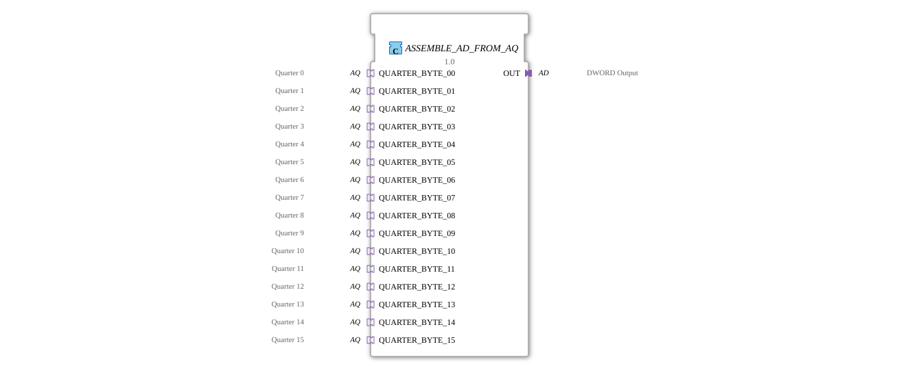

# ASSEMBLE_AD_FROM_AQ

* * * * * * * * * *
## Introduction
The function block `ASSEMBLE_AD_FROM_AQ` is used to combine sixteen separate `AQ` adapters (quarters) into a single `AD` output adapter (DWORD). The term "quarter" indicates that each `AQ` adapter represents part of a 32-bit word—specifically, one byte (8 bits). The block combines these 16 bytes into a complete DWORD and makes it available via a `AD` plug. It is particularly suitable for applications where data arrives in smaller units and only needs to be combined into a larger data type at the receiving end.
## Interface Structure

The function block has no independent event or data inputs/outputs. All input and output is handled exclusively via adapters.

### **Event Inputs**

None.

### **Event Outputs**

None.

### **Data Inputs**

None.

### **Data Outputs**

None.

### **Adapters**

| Direction | Name | Type | Description |

|----------|------|------|-------------|

**Sockets** (Inputs) | QUARTER_BYTE_00 … QUARTER_BYTE_15 | `adapter::types::unidirectional::AQ` | 16 identical adapters, each providing an 8-bit data value (quarter/byte) and a corresponding event (`E1`). |

**Plug** (Output) | OUT | `adapter::types::unidirectional::AD` | Output adapter providing the DWORD (`D1`) composed of the 16 quarter values and an event (`E1`). |

## Functionality

The function block operates entirely event-driven:

1. As soon as one of the 16 `QUARTER_BYTE` sockets receives an event (`E1`), it is forwarded to the internal function block `ASSEMBLE_DWORD_FROM_QUARTERS` (type `eclipse4diac::utils::assembling::ASSEMBLE_DWORD_FROM_QUARTERS`).

2. The internal function block combines the current data of all 16 quarter values into a 32-bit DWORD (bits 0…7 = Quarter 0, bits 8…15 = Quarter 1, … bits 120…127 = Quarter 15).

3. The result is passed to an edge-triggered D flip-flop (`E_D_FF_ANY`).

4. On the next rising edge of its clock input (`CLK`), the flip-flop outputs the assembled DWORD to the `OUT` adapter and generates an event (`EO`), which in turn triggers the output event `E1` of the `OUT` adapter.

The use of the flip-flop ensures that the output is only updated when the data is fully assembled and stable – even if multiple quarter-wave events arrive virtually simultaneously.

## Technical Features
- **No dedicated inputs/outputs:** The component communicates exclusively via adapters, enabling clean encapsulation and reusability in different project contexts.
- **Synchronous Update:** The D flip-flop prevents data inconsistencies if multiple quarters change their values almost simultaneously. The output only changes after all inputs have been evaluated.
- **Autonomous Triggering:** Every quarter event (regardless of the socket) triggers a recalculation. The component always operates with the currently available values of all 16 quarter data.
- **Internal Indirection:** The actual assembly is performed by a specialized sub-component (`ASSEMBLE_DWORD_FROM_QUARTERS`), which keeps the design modular and maintainable.

## State Overview

The function block itself does not have its own state machine. It behaves like combinational logic with downstream synchronization. However, the internal flip-flop `E_D_FF_ANY` has an internal state (the stored DWORD value). This state is only changed when an event arrives at `CLK`.

In the idle state (no event at a quarter socket), the output value of the `OUT` adapter remains unchanged.

## Application Scenarios
- **Distributed Measurement System:** Multiple sensors each deliver one byte; these are combined in a central processing unit to form a complete DWORD.
- **Data Packet Reconstruction:** Fragmented communication frames (e.g., 16-byte payloads) are reassembled.
- **Mediator Structures:** As part of an adapter chain for converting data widths in IEC 61499 applications.
- **Control Word Synthesis:** Multiple 8-bit control channels are combined into a 32-bit command word.

## Comparison with Similar Components

| Component | Number of Inputs | Output | Synchronization | Properties |

|----------|-----------------|---------|----------------|--------------|

| `ASSEMBLE_AD_FROM_AQ` | 16 (AQ adapter) | 1 (AD adapter) | Yes (flip-flop) | For event-driven byte collection. |

| `ASSEMBLE_DWORD_FROM_QUARTERS` (internal) | 16 data inputs (no adapters) | 1 DWORD output | No | Pure data assembly without event synchronization. |

| Simple `MERGE` component (fictional) | 2 … n data inputs | 1 Data Output | Often no | Data concatenation only, no adapter structure. |

This component is characterized by the encapsulation of the adapter interfaces and integrated synchronization, making it particularly suitable for heterogeneous, event-driven environments.

## Conclusion

ASSEMBLE_AD_FROM_AQ` is a specialized adapter component for concatenating 16-byte-wide quarter data into a DWORD. Its purely adapter-based interface makes it flexible in its application, while internal synchronization via a flip-flop ensures data consistency during asynchronous events. It is ideally suited for use in modular IEC 61499 applications where data arrives in smaller units and must be assembled into a complete word at the receiving end.

---

### 🌐 Related topic subpages on ms-muc-docs.de
* [🌐 Eclipse 4diac IDE & Color Reference on ms-muc-docs.de](https://www.ms-muc-docs.de/iec-61499/eclipse-4diac/)

]
