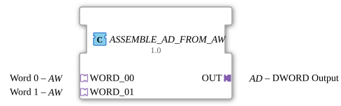

# ASSEMBLE_AD_FROM_AW

* * * * * * * * * *
## Introduction
The function block **ASSEMBLE_AD_FROM_AW** combines two word values (WORD) from a single unidirectional AW adapter into a double word (DWORD), which is output via a unidirectional AD adapter. The block encapsulates the logical combination of two 16-bit inputs into a 32-bit output and stores the result using an edge-triggered D flip-flop.

## Interface Structure

### **Event Inputs**
The function block has no directly visible event inputs. Event control is handled indirectly via the incoming adapters **WORD_00** and **WORD_01**: Each of these adapters provides a signal via its implicit event output (`E1`) that triggers the internal processing sequence.

### **Event Outputs**
There are no direct event outputs here either. The output adapter **OUT** provides the output event via its implicit event input (`E1`), which is triggered after processing is complete and the data value has been transferred.

### **Data Inputs**
Data is read in via the two socket adapters:

| Adapter | Type | Description |

|---------|-----|---------------|

| `WORD_00` | `adapter::types::unidirectional::AW` | First 16-bit word (lower-order part of the double word) |

`WORD_01` | `adapter::types::unidirectional::AW` | Second 16-bit word (higher-order part of the double word) |

Each of these adapters provides a data output (`D1`) containing the actual WORD value.

### **Data Outputs**
The output is via a plug adapter:

| Adapter | Type | Description |

|---------|-----|---------------|

`OUT` | `adapter::types::unidirectional::AD` | Composite 32-bit Double Word (DWORD) |

The adapter `OUT` has one data input (`D1`) that is internally connected to the stored result.

### **Adapters**
The function block provides two incoming adapters (sockets) and one outgoing adapter (plug), all of which are unidirectional:

- **WORD_00**, **WORD_01**: Each returns a WORD and an associated event.

- **OUT**: Receives a DWORD and passes it on with an event.

## Functionality

1. As soon as one of the two input events (`WORD_00.E1` or `WORD_01.E1`) arrives, the internal function block `ASSEMBLE_DWORD_FROM_WORDS` is activated via its event input `REQ`.

2. This internal block assembles the 32-bit double word from the two incoming 16-bit values (`WORD_00.D1` and `WORD_01.D1`). `WORD_00` is interpreted as the lower-order word and `WORD_01` as the higher-order word.

3. After the calculation is complete, `ASSEMBLE_DWORD_FROM_WORDS` signals the clock signal for an edge-triggered D flip-flop (`E_D_FF_ANY`) with the event `CNF`.

4. The flip-flop receives the calculated DWORD value at its data input `D` and outputs it at its output `Q`.

5. The stored value is transmitted via the data connection to the adapter `OUT.D1`. Simultaneously, the adapter's event input `OUT.E1` is activated via the flip-flop's output event (`EO`).

... This ensures that the output value is only updated when there are actual changes or valid new inputs and remains stable until the next event.

## Technical Features

- The module uses an internal function block (`ASSEMBLE_DWORD_FROM_WORDS`) for word combination and an edge-triggered D flip-flop (`E_D_FF_ANY`) for output storage.

- Event processing is asynchronous: Each incoming event at either of the two AW adapters triggers a new calculation and subsequent output. The state of the input events is not stored – the flip-flop always uses the last calculated DWORD.

- Word composition is performed at the hardware level: WORD_00 = low-order 16-bit word (bits 0-15), WORD_01 = high-order 16-bit word (bits 16-31).

## State Overview
The function block itself does not have an explicit state machine. However, its internal process can be characterized by the states of the D flip-flop:

| State | Description |

|---------|--------------|

| **Waiting for Event** | The flip-flop holds the last calculated value; no new input event is pending. |

| **Calculation Active** | An event from WORD_00 or WORD_01 triggers the merge, and the flip-flop is clocked. |

| **Output Active** | After the clock cycle, the new value is passed to `OUT`, and the output event is sent. |

The state transitions occur strictly according to the event chain.

## Application Scenarios

- **Data Format Conversion**: Combining two 16-bit sensor values (e.g., from two separate analog input modules) into a 32-bit data word for a higher-level controller.

- **Adapter Integration**: Integrating AW-based components (e.g., word adapters from bus systems) into systems that expect an AD adapter (DWORD).

- **Interface Adaptation**: Simplifying wiring when two logically related 16-bit channels need to be combined into a double word.

## Comparison with Similar Function Blocks

- **ASSEMBLE_DWORD_FROM_WORDS** (internal FB): Offers the same data merging, but without adapter interfaces and without output storage. `ASSEMBLE_AD_FROM_AW` extends this functionality with adapter encapsulation and a D flip-flop.

- **SPLIT_AD_TO_AW**: Performs the reverse operation (splitting a DWORD into two words) and provides the values via an AW adapter.

- **MUX_WORDS_TO_DWORD**: An alternative function block for word combination that typically operates without an adapter or edge-triggered storage.

## Conclusion
`ASSEMBLE_AD_FROM_AW` is a specialized function block for cleanly encapsulating word-to-double-word conversion in an adapter-based environment. The combination of a pure arithmetic unit and edge-triggered storage ensures stable output values despite changing input events. This function block is particularly suitable for modular automation solutions that rely on unidirectional adapter interfaces.