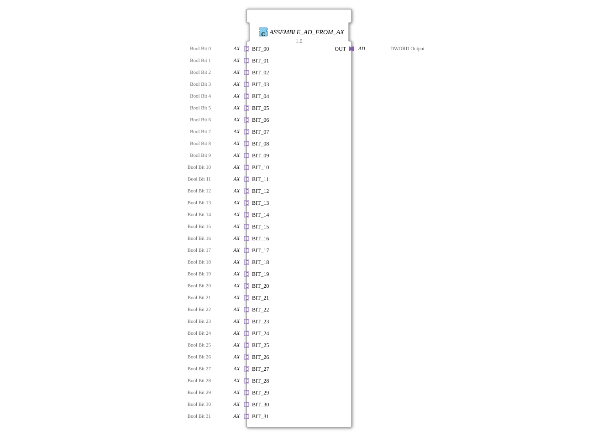

# ASSEMBLE_AD_FROM_AX

* * * * * * * * * *
## Introduction

The function block **ASSEMBLE_AD_FROM_AX** is used to combine up to 32 Boolean signals, provided via AX adapters (type: `adapter::types::unidirectional::AX`), into a 32-bit double word (DWORD) and output it via an AD adapter (type: `adapter::types::unidirectional::AD`). This enables the compact transmission of multiple discrete binary signals over a single data connection.
## Interface Structure

The function block has only **adapter interfaces** (sockets and plugs). There are no direct event or data inputs/outputs at the top level.

## **Event Inputs**

No explicit event inputs. Events are received implicitly via the AX adapters:

- Each of the 32 AX adapters (`BIT_00 … BIT_31`) provides an event output (`E1`) that is activated when the value of the associated BOOL signal changes.

### **Event Outputs**

No explicit event outputs. The AD output adapter (`OUT`) triggers an event (`E1`) as soon as the composite DWORD assumes a new value.

### **Data Inputs**

No explicit data inputs. The Boolean input values are obtained via the data ports (`D1`) of the AX adapters:

- `BIT_00.D1` … `BIT_31.D1`: each a **BOOL** (bit 0 … bit 31 of the resulting DWORD).

### **Data Outputs**

No explicit data outputs. The composite DWORD is output via the data port (`D1`) of the AD adapter:

- `OUT.D1`: **DWORD** (the 32-bit word composed from the 32 BOOL inputs).

### **Adapters**

| Type | Name | Direction | Description |
|-----|------|----------|--------------|
| `adapter::types::unidirectional::AX` | `BIT_00` … `BIT_31` | Socket (Input) | 32 Boolean individual signals, each with its own event (data change) |
| `adapter::types::unidirectional::AD` | `OUT` | Plug (Output) | Output of the compound double word with update event |

## Functionality

1. **Event Receipt**: As soon as one of the 32 AX adapters reports a change in its Boolean value (event `E1`), the event is forwarded to the internal block `ASSEMBLE_DWORD_FROM_BOOLS.REQ`.
2. **Data Assembly**: The internal block `ASSEMBLE_DWORD_FROM_BOOLS` combines all 32 Boolean values (from `BIT_00.D1` to `BIT_31.D1`) into a single DWORD. Bit 0 corresponds to `BIT_00`, bit 1 to `BIT_01`, and so on.
3. **Storage and Output**: The resulting DWORD is passed to the next internal block, `E_D_FF_ANY`. This edge-triggered flip-flop stores the value and outputs it at its output `Q`. Simultaneously, it generates an event (`EO`) that is signaled externally via the AD adapter (`OUT.E1`) indicating that a new DWORD value is present.
4. **Buffering**: The flip-flop ensures that the output value is only updated when actual changes occur and does not output the same value multiple times in succession for each individual bit event.

## Technical Features

- **Adapter-based Interface**: The function block uses only adapters (AX, AD) and no direct input/output pins. This allows for flexible coupling with other adapters in a service-oriented architecture.
- **Event Synchronization**: The integrated `E_D_FF_ANY` (arbitrary-edge E-D flip-flop) acts as a debouncing and synchronization stage. It prevents multiple output events from being generated when several bits are changed simultaneously – the output is updated only once per change cycle.
- **Bit Order**: Bit 0 (LSB) corresponds to adapter `BIT_00`, and bit 31 (MSB) corresponds to adapter `BIT_31`. A consistent assignment must be observed when wiring.
- **Type Hash**: The function block contains an attribute `eclipse4diac::core::TypeHash`, which is used to validate the block definition.

## State Overview

The function block itself does not have an explicit state machine. The internal function block `E_D_FF_ANY` implements a simple memory state:

- **State 0**: Flip-flop output `Q` contains the last loaded DWORD value.
- **State Transition**: Upon an event at `ASSEMBLE_DWORD_FROM_BOOLS.CNF`, the new DWORD value is transferred to the flip-flop, and the output is updated.

## Application Scenarios

- **Digital Input Summarization**: In a controller, 32 discrete sensors (e.g., limit switches, light barriers) are read via AX adapters. The function block summarizes their states in a DWORD, which can be transmitted as a compact data word via a fieldbus or other interface.
- **Parallel-to-Serial Conversion**: Preparation of parallel binary data for serial transmission, where the DWORD is sent as a single telegram.
- **Status Query**: A central function block (FB) regularly queries the output adapter and receives the current overall status of all 32 binary digits at once.

## Comparison with Similar Function Blocks

- **ASSEMBLE_DWORD_FROM_BOOLS**: This function block has direct BOOL inputs and a DWORD output, but no adapter interface. `ASSEMBLE_AD_FROM_AX` encapsulates this logic in an adapter-based component and adds flip-flop memory.
- **AD_TO_AX_SPLITTER**: The reverse process—splitting a DWORD into individual BOOL signals—is enabled by a corresponding splitter function block.
- **Direct Bit Manipulation**: In some environments, the bits could also be assembled using logical operations. However, the FB described here offers a standardized, reusable, and event-driven solution.

## Conclusion

The `ASSEMBLE_AD_FROM_AX` is a useful building block for efficiently bundling a large number of binary signals into a single data word. The use of adapters allows for loose coupling and facilitates integration into service-oriented automation architectures. Integrated flip-flop synchronization prevents unnecessary output events and ensures a stable, up-to-date overall value. Its clear structure makes it particularly suitable for applications where many discrete signals need to be centrally acquired and processed.

---

### 🌐 Related topic subpages on ms-muc-docs.de

* [🌐 Eclipse 4diac IDE & color reference on ms-muc-docs.de ](https://www.ms-muc-docs.de/iec-61499/eclipse-4diac/)
