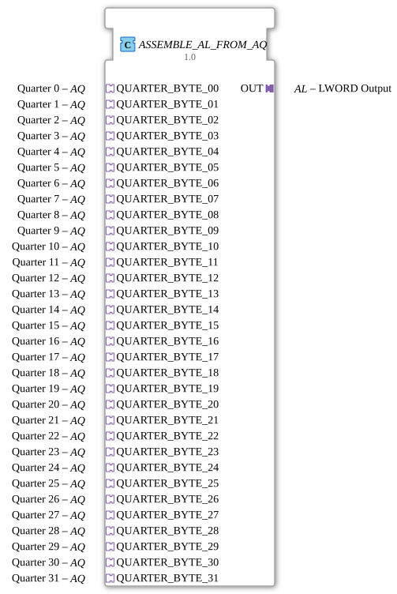

# ASSEMBLE_AL_FROM_AQ

* * * * * * * * * *
## Introduction

The function block `ASSEMBLE_AL_FROM_AQ` is used to combine 32 unidirectional AQ adapters ("quarters") into a single AL adapter (LWORD).
It is implemented as a pure composition block without its own event or data ports at the top level and uses internal sub-function blocks to combine the incoming quarter data into a 64-bit word and stabilize it on the output side.

## Interface Structure

### **Event Inputs**

The block has **no** its own event inputs at its top level.

Event control is handled exclusively via the integrated AQ adapters (sockets) and the internal wiring.

### **Event Outputs**

There are **no** event output ports.

The output signal is transmitted externally via the AL plug adapter (E1) in an event-driven manner.

### **Data Inputs**

There are **no** directly accessible data inputs.

Data is fed into the module via the 32 AQ adapters (sockets).

### **Data Outputs**

There are **no** directly accessible data outputs.

The composite LWORD is output via the AL plug adapter (D1).

### **Adapters**

| Type | Name | Direction | Description |
|-----|------|----------|--------------|
| `adapter::types::unidirectional::AQ` | `QUARTER_BYTE_00` … `QUARTER_BYTE_31` | Socket (Input) | 32 identical adapters, each providing a 2-bit value (“quarter”). Each socket has an event output (E1) and a data output (D1). |
| `adapter::types::unidirectional::AL` | `OUT` | Plug (Output) | Output adapter that passes a 64-bit LWORD (D1) and an associated event (E1). |

## Functionality

1. **Data Acquisition** – Each of the 32 `QUARTER_BYTE_xx` sockets provides its data value (D1) upon receiving an incoming event (E1).
2. **Assembly** – The event is forwarded to the internal sub-function block `ASSEMBLE_LWORD_FROM_QUARTERS` (all 32 events are connected to the same `REQ` input). Simultaneously, all 32 quarter data values are routed to the corresponding inputs of this sub-block.
3. **Internal Processing** – `ASSEMBLE_LWORD_FROM_QUARTERS` combines the 32 2-bit quarters into a 64-bit LWORD. Its output signal is then routed through an edge-triggered D flip-flop (`E_D_FF_ANY`).
4. **Output Stabilization** – The flip-flop is clocked by the completion event (`CNF`) of `ASSEMBLE_LWORD_FROM_QUARTERS`. It holds the combined value until a new assembly cycle is complete. The flip-flop's output feeds the data port `OUT.D1` of the AL plug adapter, and the corresponding event `OUT.E1` is triggered after the clock signal.

## Technical Features

* **Pure Adapter Composition** – The component has no conventional input/output ports at the top level, but uses only adapters. This enables modular encapsulation and easy reuse in different contexts.
* **Internal Data Aggregation** – The 32 quarter values (2 bits each) are combined into a 64-bit LWORD. This fully utilizes the LWORD capacity.
* **Edge-Triggered Output Synchronization** – The D flip-flop prevents flickering or incomplete data words at the output by only passing the value after the aggregation is complete and on a rising clock edge.
* **No Internal State Logic** – The component does not contain an ECC (Execution Control Chart); the logic is entirely derived from the interconnection of the sub-blocks.

## State Overview

The component does not have its own state machine.

The state logic is implemented by the internal blocks `ASSEMBLE_LWORD_FROM_QUARTERS` (data-driven) and `E_D_FF_ANY` (event-driven).

## Application Scenarios

* **Combining Bit Subwords** – In industrial control engineering, data from multiple sensors or subsystems (e.g., 32 switching states, each encoding 2 bits) often needs to be combined into a single, coherent data word.
* **Querying Parallel Data Sources** – If 32 independent modules each deliver a 2-bit signal via adapters, `ASSEMBLE_AL_FROM_AQ` can combine these into a 64-bit word in one step and provide it in an event-driven manner.
* **Platform-Independent Adapter Interfaces** – Thanks to its pure adapter usage, this component is suitable for use in heterogeneous systems where data types are abstracted by the adapter definitions.

## Comparison with Similar Components

| Component | Operating Principle | Number of Inputs | Output Type | Special Feature |
|----------|------------------|----------------|-------------|--------------|
| `ASSEMBLE_AL_FROM_AQ` | Adapter-Based Composition | 32 × 2-Bit (AQ) | 1 × LWORD (AL) | Edge-Triggered Output, Pure Composition |
| `ASSEMBLE_LWORD_FROM_QUARTERS` (internal) | Data-Oriented Composition | 32 × 2-Bit (direct) | LWORD (Data) | No adapters, no flip-flop |
| Classic multiplexer (e.g., MUX) | Input selection via control line | n inputs, 1 selection | Simple data type | Requires dedicated address signals |

Compared to a multiplexer, `ASSEMBLE_AL_FROM_AQ` offers the advantage that *all* quarter values are combined in parallel and without selection logic to form a complete word. The additional flip-flop ensures clean, event-driven output.

## Conclusion

The `ASSEMBLE_AL_FROM_AQ` function block provides an elegant and modular solution for combining 32 2-bit quarter data values into a 64-bit LWORD using adapters. The strict separation of data and event paths, as well as the internal use of an edge-triggered flip-flop, ensures reliable and deterministic output signal generation. Due to its purely compositional structure, it is particularly suitable for use in IEC 61499 systems that rely on adapter-based interfaces.
