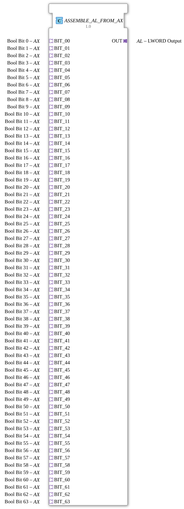

# ASSEMBLE_AL_FROM_AX
(Image of the function block is displayed here in the IDE – shows a function block with 64 sockets (left) and one plug (right))

* * * * * * * * * *
## Introduction
The function block **ASSEMBLE_AL_FROM_AX** is used to combine up to 64 Boolean signals from **AX adapters** (type: `adapter::types::unidirectional::AX`) into a single **LWORD** value and output it via an **AL adapter** (type: `adapter::types::unidirectional::AL`). The block encapsulates the logic for bit combination and provides the result stably as soon as one of the input bits returns an event.

## Interface Structure

### **Event Inputs**

The function block does not have traditional event inputs (EVENT). Event control is handled indirectly via the **AX adapters (sockets)**. Each socket `BIT_00` … `BIT_63` can receive a triggering event (E1).

| Name | Type | Description |
|------|-----|--------------|
| `BIT_00` … `BIT_63` | AX adapter | Event from an external Boolean source that triggers the assembly of the LWORD |

### **Event Outputs**

No traditional event outputs. The output of the assembled LWORD is event-driven via the **AL adapter (plug)** `OUT`.

| Name | Type | Description |
| Name | Type | Description |
| |------|-----|--------------|
| `OUT` | AL Adapter | Provides the composite LWORD when the internal flip-flop is clocked |

### **Data Inputs**

Each AX adapter carries a Boolean data value (D1). These are used as input bits for the LWORD.

| Name | Type | Description |
|------|-----|---------------|
| `BIT_00.D1` … `BIT_63.D1` | BOOL (via adapter) | Boolean signal for bits 0 … 63 |

### **Data Outputs**

The combined result is output as a 64-bit word via the AL adapter.

| Name | Type | Description |
|------|-----|--------------|
| `OUT.D1` | LWORD (via adapter) | Combined LWORD from the 64 Boolean inputs |

### **Adapter**

| Type | Direction | Name | Description |
|-----|----------|------|--------------|
| `adapter::types::unidirectional::AX` | Socket (input) | `BIT_00` … `BIT_63` | Boolean Input Adapter |
| `adapter::types::unidirectional::AL` | Plug (Output) | `OUT` | LWORD Output Adapter |

## Functionality

1. **Event Reception**: As soon as an event arrives at one of the 64 AX adapters (sockets) (at its E1), an internal REQ event is sent to the function block `ASSEMBLE_LWORD_FROM_BOOLS`.

2. **Bit Assembly**: The internal function block `ASSEMBLE_LWORD_FROM_BOOLS` receives the 64 Boolean values from the data ports `BIT_00.D1` … `BIT_63.D1` and assembles them into an LWORD value. Each input is assigned a corresponding bit (0 for BIT_00, 1 for BIT_01, ... 63 for BIT_63).

3. **Central Storage (Flip-Flop)**: The assembled LWORD is passed to the data input of an **E_D_FF_ANY** (flip-flop). The result event (CNF) of `ASSEMBLE_LWORD_FROM_BOOLS` clocks the flip-flop. This sets the current LWORD value at the flip-flop's output Q.

4. **Output**: The stored value is made available as an LWORD via the AL plug `OUT`. Simultaneously, an event is generated at the flip-flop's output (EO), which triggers the connected AL adapter input (E1).

The logic operates **event-driven**: The output is only updated when any input bit changes (via the event). This saves processing power and ensures a stable output.

## Technical Features
- **Full Bit Mapping**: All 64 bits of an LWORD are derived from individual Boolean adapters. Exactly 64 sockets are required – no gaps.
- **Event Synchronization**: An event from *any* bit adapter triggers a complete recalculation of the LWORD. It is not necessary to update all inputs simultaneously.
- **Flip-Flop Buffering**: The composite value is buffered, so the output remains stable even if the inputs fluctuate during processing.
- **Adapter-based interface**: The inputs and outputs are implemented as standardized 4diac adapters, enabling easy chaining with other adapter-based function blocks.
- **Packages**: The function block is organized in the package `adapter::assembling`.

## State overview

The function block does not have an explicit state machine. The internal logic operates as a combination of two components:

- **ASSEMBLE_LWORD_FROM_BOOLS**: Stateless – executes the assembly on every request.
- **E_D_FF_ANY**: Has two states: stored value (Q) and current data input (D). The state changes on every rising edge at the CLK input.

Event-driven behavior:

- **Wait for event**: No calculation is performed; the output remains unchanged.
- **Event Arrived**: Flip-flop assembly + clocking → output is updated.

## Application Scenarios
- **Parallel Digital Inputs**: Combines 64 digital sensors or switches into a machine-readable LWORD for easy further processing.
- **Bit-Oriented Controls**: In applications where many binary status messages (e.g., error bits, position feedback) need to be bundled.
- **Fieldbus Communication**: An LWORD can be efficiently transmitted via PROFINET, EtherCAT, or similar; this function block converts the individual bits into the compact data format.
- **Adapter-Based Module Libraries**: In modular control architectures based on standardized adapters, this function block can serve as a universal "bit collector."

## Comparison with Similar Function Blocks

| Function Block | Number of Inputs | Output Type | Special Feature |
|----------|----------------|-------------|--------------|
| **ASSEMBLE_AL_FROM_AX** | 64 BOOL (AX) | LWORD (AL) | Adapter-based with flip-flop buffering |
| `ASSEMBLE_DWORD_FROM_BOOLS` | 32 BOOL | DWORD | Classic data input/output, without adapter |
| `ASSEMBLE_WORD_FROM_BOOLS` | 16 BOOL | WORD | As above, for 16-bit word |
| `DISASSEMBLE_AL_TO_AX` | 1 LWORD (AL) | 64 AX | Counterpart: Decomposes an LWORD into individual BOOL adapters |

The key difference lies in the **adapter interface** and the **buffer buffering** provided by the flip-flop, which ensures robust behavior in event-driven environments.

## Conclusion

The **ASSEMBLE_AL_FROM_AX** function block is a powerful tool for creating a compact 64-bit LWORD from 64 distributed Boolean signals. Its adapter-based interface and internal flip-flop buffering make it particularly suitable for clean, event-driven, and modular automation solutions. Full bit coverage without scaling issues makes it a universal solution for applications that need to bundle many digital inputs.

---

### 🌐 Related topic subpages on ms-muc-docs.de
* [🌐 Eclipse 4diac IDE & color reference on ms-muc-docs.de](https://www.ms-muc-docs.de/iec-61499/eclipse-4diac/)
