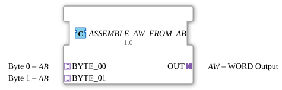

# ASSEMBLE_AW_FROM_AB

* * * * * * * * * *
## Introduction
The function block **ASSEMBLE_AW_FROM_AB** is used to combine two unidirectional byte adapters (type `AB`) into a unidirectional word adapter (type `AW`). It combines the data from two byte inputs into a word output, with event logic ensuring that output occurs only when the information is updated.
## Interface Structure

The function block has no direct event or data inputs/outputs, but communicates exclusively via adapter interfaces:

### **Adapter (Plugs – Output)**

| Name | Type | Direction | Description |
|------|-----|----------|--------------|
| OUT | `adapter::types::unidirectional::AW` | Plug | WORD output (16-bit) |

### **Adapter (Sockets – Inputs)**

| Name | Type | Direction | Description |
|------|-----|----------|--------------|
| BYTE_00 | `adapter::types::unidirectional::AB` | Socket | Byte 0 (low-order byte) |
| BYTE_01 | `adapter::types::unidirectional::AB` | Socket | Byte 1 (higher-order byte) |

**Note:** Adapters of type `AB` and `AW` are unidirectional. Each adapter contains the signals `E1` (socket/plug event output – internally connected) and `D1` (data signal).

## Functionality

The function block (FB) is based internally on two sub-components:

1. **`ASSEMBLE_WORD_FROM_BYTES`** – a predefined assembler that combines two input bytes into a WORD.

2. **`E_D_FF_ANY`** – a D flip-flop that temporarily stores the combined value and passes it on at a clock event.

**Process:**

- Each incoming event (`E1`) from a BYTE adapter (BYTE_00 or BYTE_01) triggers the assembler (`REQ`).
- The assembler combines the current data from both BYTE inputs into a WORD.

The following applies:

OUT.WORD = (BYTE_01.D1 << 8) | BYTE_00.D1`

- After successful combination, the assembler sends an acknowledgment event (`CNF`).
- This event clocks the D flip-flop (`CLK`), which takes the current WORD value.
- The flip-flop output (`Q`) is continuously passed to the OUT adapter (`D1`).
- The flip-flop's output event (`EO`) activates `OUT.E1`, informing the receiving component about the updated WORD output.

**Important feature:**

Since both BYTE events lead to the same `REQ` input in the assembler, assembly is re-executed with each event from either input. The output value is therefore always generated from the currently present byte values. The D flip-flop ensures a stable output until the next assembly event arrives.

**Important feature:**
**Since both BYTE events lead to the same `REQ` input in the assembler, the assembly is re-executed with each event from either input.**
## Technical Features

- **Pure Adapter Communication:** The function block (FB) has no conventional input/output variables; all data and event transmission occurs via unidirectional adapters.
- **Event Synchronization:** The single-step assembly process avoids race situations, as the flip-flop only updates the output after successful computation.
- **Reusability:** The FB can be embedded in any environment that supports unidirectional `AB`/`AW` adapters.

## State Overview

The FB does not have an explicit state diagram, as its internal logic operates purely event-driven. Essentially, the following operating states can be distinguished:

- **Ready:** No event is pending; the output holds the last stored WORD value.
- **Assemble:** An incoming event from a BYTE adapter starts the calculation.
- **Output:** After successful assembly, the new WORD value is transferred to the flip-flop, and the output event is triggered.

## Application Scenarios
- **Protocol Conversion:** Combining two serial byte streams into a WORD data word for a subsequent processing module.
- **Sensor Fusion:** Combining two 8-bit sensor data (e.g., temperature and humidity) into a 16-bit value.
- **Hardware Control:** Generating a 16-bit output signal from two separate 8-bit register values.

## Comparison with Similar Function Blocks
- **`ASSEMBLE_WORD_FROM_BYTES`** – pure assembler without memory. It expects discrete data inputs and outputs the result immediately (provided the event and data are supplied synchronously).
- **`SPLIT_BYTE_FROM_WORD`** – inverse function (WORD -> two BYTEs); symmetrically structured, also uses unidirectional adapters.
- **Custom Function Block with Memory:** This function block integrates the flip-flop, so the output remains stable until new data arrives – unlike function blocks that recalculate with each event but offer no intermediate storage.

## Conclusion

The **ASSEMBLE_AW_FROM_AB** function block offers a reliable and elegant way to combine two unidirectional BYTE adapters into a WORD output. The combination of assembly and flip-flop logic creates a stable output that is only updated when data actually changes. Its simple adapter interface makes it flexible for use in modular control architectures according to IEC 61499.
