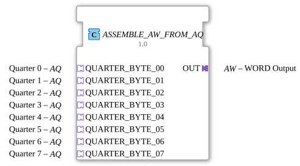

# ASSEMBLE_AW_FROM_AQ

* * * * * * * * * *
## Introduction
The function block `ASSEMBLE_AW_FROM_AQ` combines eight individual **AQ (Quarter)** adapters into a single **AW (Word)** adapter. Each quarter represents a 4-bit data packet (half a byte). The block assembles these eight quarter data packets—a total of 32 bits—into a complete word (WORD, 32 bits) and makes it available via a single AW output adapter. Typical applications include the reconstruction of wide data buses from serially or partially arriving fragments.
## Interface Structure

The function block has only **adapter interfaces**: There are no direct event or data inputs/outputs at the top level. All communication takes place via the connected adapters.

### **Event Inputs**
- No direct event inputs.
- Events are received via the sockets of the **AQ adapters** (each AQ adapter provides an event output `E1`).

### **Event Outputs**
- No direct event outputs.
- The output event is provided via the **AW adapter** (plug `OUT`) as event `E1`.

### **Data Inputs**
- No direct data inputs.
- The data to be processed is read in via the **AQ adapters** as data input `D1` (4 bytes each).

### **Data Outputs**
- No direct data outputs.
- The compound word (4 bytes) is output via the **AW adapter** as data output `D1`.

### **Adapter**

| Name | Type | Direction | Comment |
|-------------------|-----------------------|----------|-----------------------------|
| `OUT` | adapter::AW | Plug | Word output (4 bytes) |
| `QUARTER_BYTE_00` | adapter::AQ | Socket | Quarter 0 (least significant)|
| `QUARTER_BYTE_01` | adapter::AQ | Socket | Quarter 1 |
| `QUARTER_BYTE_02` | adapter::AQ | Socket | Quarter 2 |
| `QUARTER_BYTE_03` | adapter::AQ | socket | Quarter 3 |
| `QUARTER_BYTE_04` | adapter::AQ | socket | Quarter 4 |
| `QUARTER_BYTE_05` | adapter::AQ | socket | Quarter 5 |
| `QUARTER_BYTE_06` | adapter::AQ | socket | Quarter 6 |
| `QUARTER_BYTE_07` | adapter::AQ | socket | Quarter 7 (highest value)|

## Functionality

The FB contains two internal function blocks:

1. **`ASSEMBLE_WORD_FROM_QUARTERS`**: A specialized assembler that combines the data from all eight quarter-time inputs (4 bytes each) in the order 00 (LSB) to 07 (MSB) into a 32-bit word.

2. **`E_D_FF_ANY`**: An edge-triggered D flip-flop that buffers the assembled word and outputs it at `Q`.

Process:

- As soon as a connected AQ adapter sends an event at its output `E1`, this event is forwarded to the `REQ` input of the assembler. All eight AQ adapters are connected to the same `REQ`, so each incoming event (regardless of the sender) triggers a new processing step.
- The assembler processes the current data from all eight quarters and places the result at the data output.
- After the calculation is complete, the assembler sends an acknowledgment event (`CNF`), which triggers the clock input (`CLK`) of the D flip-flop.
- The flip-flop receives the calculated value and passes it stably to `Q`. The OUT adapter then makes both the event `E1` and the data value `D1` available on the output side.
- After the calculation is complete, the assembler sends an acknowledgment event (`CNF`), which triggers the clock input (`CLK`) of the D flip-flop. This structure ensures that the output word is only updated after a complete calculation has been performed—regardless of which quarter was updated last.

## Technical Features
- **Flip-Flop Intermediate Storage**: The use of a D flip-flop prevents glitches or incomplete data transmission if multiple quarters are updated in rapid succession. The output only changes when the assembler has calculated a new, valid value.
- **Adapter-Based Interface**: All inputs and outputs are handled via adapters, making the function block particularly suitable for modular, typed data flow architectures in 4diac.
- **Synchronous Processing**: Processing is triggered by each incoming event of a quarter, but only generates an output event when the calculation is complete.
- **Adapter-Based Interface**:
## Status Overview

The function block (FB) does not have its own execution control chart (ECC) – the internal logic is implemented entirely by the included function blocks `ASSEMBLE_WORD_FROM_QUARTERS` and `E_D_FF_ANY`. The function block therefore behaves like a combinational circuit with an edge-triggered memory stage.

## Application Scenarios
- **Reconstruction of Wide Data Paths**: In automation technology, data is often transmitted in small packets ("nibbles"), e.g., across multiple parallel I/O modules. The FB reassembles these into a complete 32-bit value.
- **Serial-Parallel Conversion**: If a sensor or actuator delivers its data in 4-bit quads (e.g., via asynchronous interfaces), the FB can buffer the incoming fragments and combine them into a consistent total value.
- **Data Consolidation**: In hierarchical control systems where multiple sub-modules each provide a quarter value, this function block (FB) can centrally consolidate the values.

## Comparison with Similar Function Blocks
- **`ASSEMBLE_BYTE_FROM_NIBBLES`**: Combines two half-bytes into one byte (8 bits). This FB operates at the next higher level with 8 quarters (32 bits).
- **Simple Data Converters**: Converters like `WORD_TO_BYTE` or `BYTE_TO_NIBBLE` usually operate without intermediate storage and event handling. `ASSEMBLE_AW_FROM_AQ` offers event-driven, stable forwarding with optional storage.

## Conclusion

The function block `ASSEMBLE_AW_FROM_AQ` provides a robust and flexible solution for generating a consistent 32-bit word from eight independent quarter data points (4 bits each). Thanks to its adapter-based interfaces and integrated D flip-flop, it is particularly well-suited for real-time applications where data packets arrive asynchronously and must be reliably combined into a single value.

---

### 🌐 Related topic subpages on ms-muc-docs.de
* [🌐 Eclipse 4diac IDE & color reference on ms-muc-docs.de ](https://www.ms-muc-docs.de/iec-61499/eclipse-4diac/)
