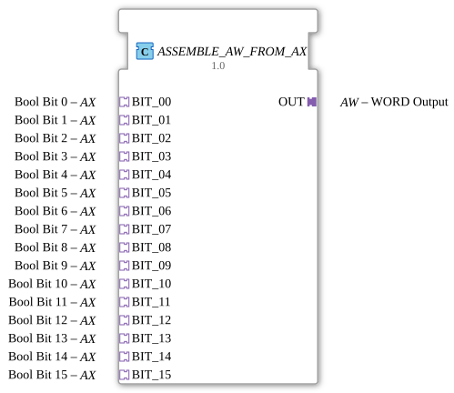

# ASSEMBLE_AW_FROM_AX

* * * * * * * * * *
## Introduction
The function block `ASSEMBLE_AW_FROM_AX` combines 16 Boolean signals, provided by separate AX adapters, into a 16-bit word (WORD) and outputs it via an AW adapter. It enables the conversion of a discrete group of digital signals into a uniform data word value for further processing.
## Interface Structure
### **Event Inputs**

No direct event inputs. Events are received via the 16 AX adapters (sockets): Each AX adapter triggers an event (`E1`) upon a data change, which initiates processing.

### **Event Outputs**

No direct event outputs. The compound word is output via the AW adapter (Plug). The output adapter releases the data value as soon as it receives an event (`E1`) from the internal flip-flop.

### **Data Inputs**
No direct data inputs. The 16 individual values (BOOL) are read in via the AX adapters (data output `D1`).

### **Data Outputs**

No direct data outputs. The resulting 16-bit word (WORD) is output via the AW adapter (data input `D1`).

### **Adapters**

| Type | Name | Description |
|------|------|--------------|
**Socket (Input)** | `BIT_00` | AX Adapter, Bool Bit 0 |
**Socket (Input)** | `BIT_01` | AX Adapter, Bool Bit 1 |
**Socket (Input)** | `BIT_02` | AX Adapter, Bool Bit 2 |
**Socket (Input)** | `BIT_03` | AX Adapter, Bool Bit 3 |
**Socket (Input)** | `BIT_04` | AX Adapter, Bool Bit 4 |
**Socket (Input)** | `BIT_05` | AX Adapter, Bool Bit 5 |
**Socket (Input)** | `BIT_06` | AX Adapter, Bool Bit 6 |
**Socket (Input)** | `BIT_07` | AX Adapter, Bool Bit 7 |
**Socket (Input)** | `BIT_08` | AX Adapter, Bool Bit 8 |
**Socket (Input)** | `BIT_09` | AX Adapter, Bool Bit 9 |
**Socket (Input)** | `BIT_10` | AX Adapter, Bool Bit 10 |
| **Socket (Input)** | `BIT_11` | AX Adapter, Bool Bit 11 |
**Socket (Input)** | `BIT_12` | AX Adapter, Bool Bit 12 |
**Socket (Input)** | `BIT_13` | AX Adapter, Bool Bit 13 |
**Socket (Input)** | `BIT_14` | AX Adapter, Bool Bit 14 |
**Socket (Input)** | `BIT_15` | AX Adapter, Bool Bit 15 |
**Plug (Output)** | `OUT` | AW Adapter, WORD Output |

## Functionality

1. **Input Signal Acquisition**: Each of the 16 AX adapters (`BIT_00` to `BIT_15`) provides a Boolean value via its data channel (`D1`). As soon as the value of one of these adapters changes, it sends an event via its output `E1`.

2. **Combination**: The events from all 16 adapters are fed to the input `REQ` of an internal module `ASSEMBLE_WORD_FROM_BOOLS`. This module reads the current Boolean values from all 16 channels and combines them into a 16-bit word (WORD).

3. **Synchronization**: The completed word is passed to an edge-triggered D flip-flop (`E_D_FF_ANY`). The flip-flop receives the value at its D input as soon as it receives a clock signal (from the output `CNF` of the merge block).

4. **Output**: After successful transfer, the flip-flop outputs a clock signal at its output `EO` and places the stored word at its Q output. This event triggers the AW adapter `OUT`, which makes the WORD available on its data channel (`D1`).

## Technical Features
- **Use of a flip-flop**: Output occurs only after a complete merge cycle. This prevents inconsistent or fluctuating data – the output remains stable until a new event occurs.
- **No state machine**: The function block is purely event-driven and has no inherent state; its behavior is determined by the internal function blocks `ASSEMBLE_WORD_FROM_BOOLS` and `E_D_FF_ANY`.
- **Adapter interface**: Both the inputs and the output are implemented as adapters. This allows for flexible reuse and encapsulation of the signal types.

## State overview
The function block does not contain an explicit state machine. The internal D flip-flop `E_D_FF_ANY` has two states (`Q = 0` or `Q = 1`) that store the current data value. The flip-flop's output is updated only on a rising edge at the clock input.

## Application Scenarios
- **Bundling of Discrete Signals**: In automation technology, 16 individual digital sensors or switches (e.g., limit switches, pushbuttons) are often required. This function block combines these into a single word, which can be used via a fieldbus or as an input for a higher-level controller.
- **Data Preparation for Communication**: Before transmission via a network adapter (e.g., PROFINET, EtherCAT), multiple binary signals must be packed into a single data word.
- **Signal Register**: The component can be used as a simple 16-bit register that buffers the current state of all inputs and updates them only when changes occur.

## Comparison with Similar Components
- **Classic Boolean-to-WORD Components**: Standard components often combine Boolean inputs directly into an integer type, but without an adapter interface. `ASSEMBLE_AW_FROM_AX` uses an adapter, which enables clearly separated signal and event transmission and simplifies reuse in modular architectures.
- **Adapter-Based Alternatives**: Similar components exist for other word sizes (e.g., BYTE, DWORD) or with additional filtering capabilities. This component focuses on the essentials and uses a flip-flop output for clean synchronization.

## Conclusion

The `ASSEMBLE_AW_FROM_AX` function block offers a clean, synchronized way to combine 16 Boolean signals (via AX adapter) into a 16-bit word (via AW adapter). The combination of the merging block and the edge-triggered flip-flop ensures stable output and is particularly suitable for use in time-critical or signal processing environments.
